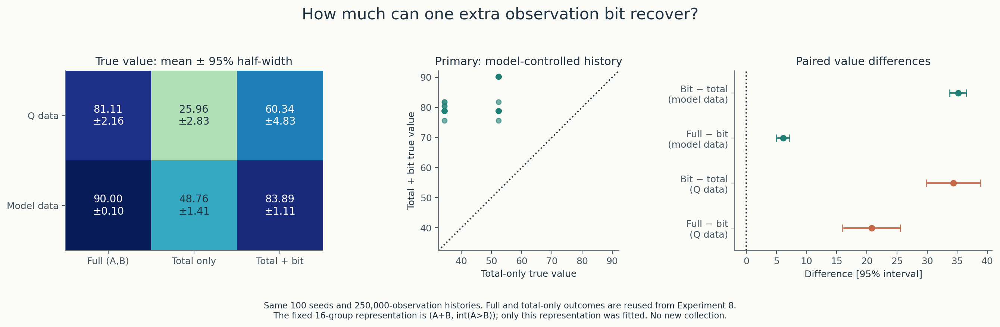

# Learning to leave something for tomorrow

**How much can one extra observation bit recover?**

Experiment 9 adds **`A>B`** to total food stock. **The bit recovers much of both
policy value and prediction accuracy, but leaves meaningful failures.** With
model-controlled histories, true value rises from **48.76 to 83.89**: paired gain
**35.13 [33.75, 36.51]** across 100 seeds. Every seed improves. This recovers
**85.2% of the mean value gap** between Experiment 8’s total-only and full-state
policies. A gap of **6.10 [5.02, 7.18]** to full-state policies remains.



We reuse the same **250,000-observation Experiment 5 histories per seed**, from
Q-controlled and unpenalized model-controlled collection. Both historical
collectors observed full `(A,B)`. Only the new representation is fitted:
`(A+B, int(A>B))`, with **16 reachable groups**. Experiment 8’s full-state and
total-only policies, predictions and evaluations are reused unchanged.
No experience is recollected and no Q-learning is repeated.

| History and representation | True value [95% interval] | Mean absolute prediction error | Seeds ≥90% of full-state oracle |
| --- | ---: | ---: | ---: |
| Q · total only | 25.96 [23.13, 28.79] | 58.56 | 0/100 |
| Q · total + bit | 60.34 [55.51, 65.17] | 34.97 | 25/100 |
| Q · full `(A,B)` | 81.11 [78.95, 83.27] | 23.28 | 63/100 |
| Model · total only | 48.76 [47.35, 50.18] | 49.59 | 0/100 |
| Model · total + bit | 83.89 [82.78, 85.01] | 7.65 | 47/100 |
| Model · full `(A,B)` | 90.00 [89.90, 90.10] | 0.38 | 100/100 |

Values are exact `Vπ(4,4)` at γ=0.99 in the original world, without exploration.
The oracle value is **90.2235**. Mean intervals use variation across historical
training seeds; comparisons are paired within seed. The recovery percentage is a
ratio of mean gaps. **This follow-up reuses histories and is not an independent
replication.** The bit was hand-designed after Experiment 8, then fixed before
this run; it was not learned or selected by searching alternatives.

**Prediction accuracy improves, without reaching full-state accuracy.** With
model-controlled data, the new model predicts **91.31** while achieving **83.89**.
Its absolute prediction error is lower than total-only by **41.94 [40.72, 43.16]**,
with all 100 seeds improving. Its error remains **7.27 [5.97, 8.56]** above the
full-state model’s. Better decisions and more accurate predictions are related
outcomes, not interchangeable measurements.


Q-controlled histories give a more mixed result. Adding the bit gains
**34.38 [29.92, 38.85]** in mean value, but **5 seeds worsen** and 5 tie.
Absolute prediction error falls by **23.60 [17.52, 29.67]** on average while
**18 seeds become less accurate**. The remaining value gap to full-state policies
is **20.77 [16.00, 25.54]**. All failures and individual outcomes are saved.

**The bit restores a useful distinction.** The first prespecified pair, `(4,3)`
and `(3,4)`, now maps to `(7,1)` and `(7,0)`. All 100 model-history policies choose
harvest A at `(4,3)` and harvest B at `(3,4)`, matching the full-state oracle.
Total-only policies had to choose the same action at both and chose B.

**A different conflict remains.** The second pair, `(3,3)` and `(2,4)`, still
shares observation `(6,0)`. Their optimal actions are rest and harvest B.
Even after the same rest action, their true successor laws differ: the chance of
remaining at `(6,0)` is **0.4106 versus 0.8350**. The observation therefore still
omits information needed to predict transitions.


At the merged observation, **56 model-history seeds choose B** and **44 choose
rest**. The latter 44 reach oracle value from `(4,4)`; their policy can still be
wrong elsewhere. In the preselected seed-0 example, the new policy rests at both
`(3,3)` and `(2,4)`. Its fitted model predicts **87.39** for either, while their
actual values are **88.09 and 84.43**. From `(4,4)`, this policy stays among the four
states with both stocks at least three, so its wrong action at `(2,4)` does not
reduce this particular starting-state value. Good value from one start does not
establish Markov sufficiency or accuracy everywhere.

[Seed-0 policy maps and coverage](results/one_bit_observation/policies_and_coverage.png)
show the recovered distinctions and remaining ties. Splitting observations also
splits evidence: the new representation has 48 observation-action rows, versus
27 for total-only and 75 for full state. With Q-controlled data, it averages
**8.15 rows with fewer than ten visits**; with model-controlled data, **1.75**.
Both representation and the collected evidence matter.

**Chapter 3 connection:** the state representation determines what a policy can
distinguish and whether rewards and successors can be predicted from the current
observation and action. A small added distinction can improve decisions without
making the representation Markov. Here the empirical transition model remains a
fitted surrogate whose rows depend on the collector’s hidden-state mixtures.
Policy iteration is a **Chapter 4 preview**. The [chapter map](notes/chapter_map.md)
separates those concepts from Q-learning’s Chapter 6 preview, model-guided
interaction’s Chapter 8 preview, and our research extensions. It also retains the
worked explanation of genuine termination versus a 1,000-step collection cutoff.

This is one fixed representation, one planner and reused data from fully observing
collectors. We have not found the best policy under partial observation, learned a
representation, or isolated a single cause of every failure. The evidence supports
asking next whether a short observation history can resolve the remaining
`(3,3)` / `(2,4)` ambiguity without revealing another full-state feature. That
experiment has not run.

The [Experiment 9 notes](notes/one_bit_observation.md) contain the protocol, all
paired uncertainty and failures, true and fitted mechanism distributions,
archive layout and reproduction command. The analysis ran once in **3.44 s**;
no new environmental transitions were generated. Rebuild figures from saved data:

```bash
python run_one_bit_observation.py --plot-only
```

Previous experiments and original environment defaults are preserved:

| Experiment | Question and measured result |
| --- | --- |
| [1: Supplied model](notes/experiments_1_to_5.md#exact-results-when-preferences-change) | At γ=0.99, planning reaches value 90.22 versus myopic 23.72 in the original world. |
| [2: Q-learning](notes/experiments_1_to_5.md#experiment-2-learning-from-transitions) | Long-horizon learning reaches value 72.10; 7/100 seeds reach 90% of oracle. |
| [3: Same experience, learned model](notes/experiments_1_to_5.md#experiment-3-same-experience-learned-world-model) | Planning from Q’s observations gains 5.97 [3.12, 8.82], with large overprediction. |
| [4: Count penalty](notes/experiments_1_to_5.md#experiment-4-does-caution-about-scarce-evidence-improve-model-based-decisions) | Fixed caution gains 3.48 [0.91, 6.05] on average, but worsens 40 seeds. |
| [5: Model-guided collection](notes/experiments_1_to_5.md#experiment-5-can-a-world-model-improve-through-its-own-actions) | Adaptive model collection gains 8.89 [6.73, 11.05] over Q collection with the same final planner. |
| [6: Replanning ablation](notes/replanning_ablation.md) | Most of that improvement survives fixed initial behavior; adaptation adds 1.30 [0.14, 2.47]. |
| [7: Outdated world model](notes/changing_regeneration.md) | Forgetting reduces the changed-world tracking gap by 36.56, but adds 0.312 to the stable-world gap. |
| [8: Incomplete state](notes/state_representation.md) | Better data helps both representations; full-state value exceeds total-only by 41.23 [39.91, 42.56] with model-controlled histories. |
| [9: One extra bit](notes/one_bit_observation.md) | The fixed bit recovers 85.2% of that mean value gap and greatly reduces prediction error, without restoring state sufficiency. |

The [original world definition](notes/experiments_1_to_5.md#the-world-harvest-first-then-regenerate)
and earlier protocols remain available. This NumPy project follows Sutton and Barto,
second edition, and our [Chapter 2 bandit experiments](https://github.com/ReloadLightly/rl-changing-worlds).
