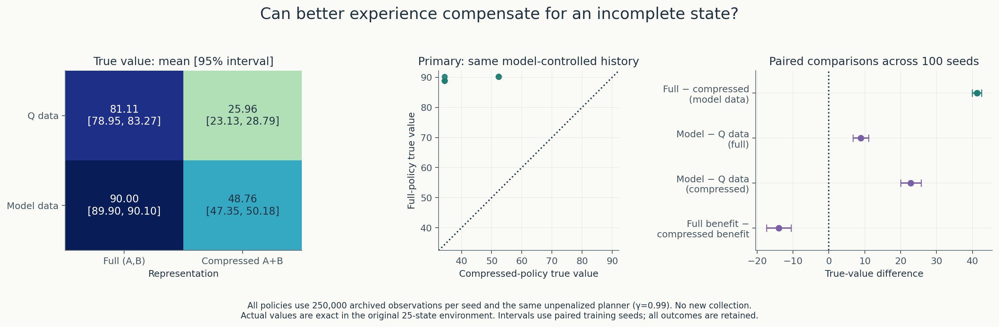
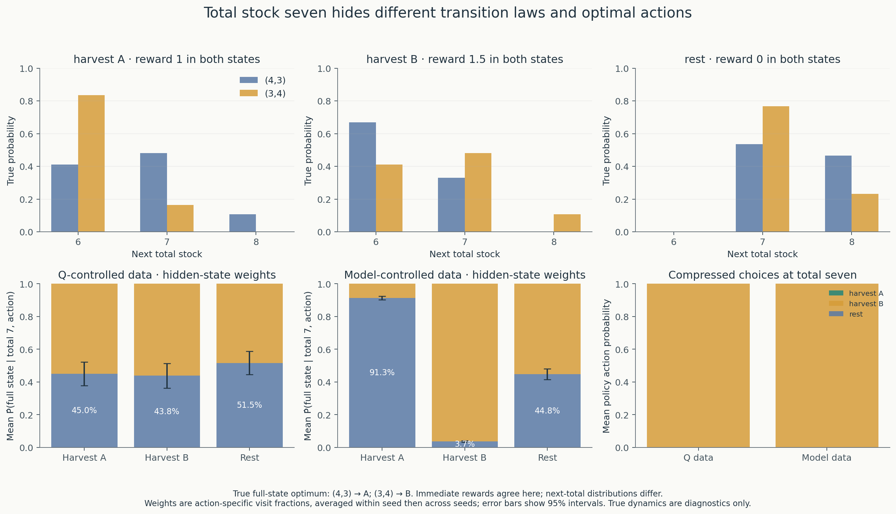
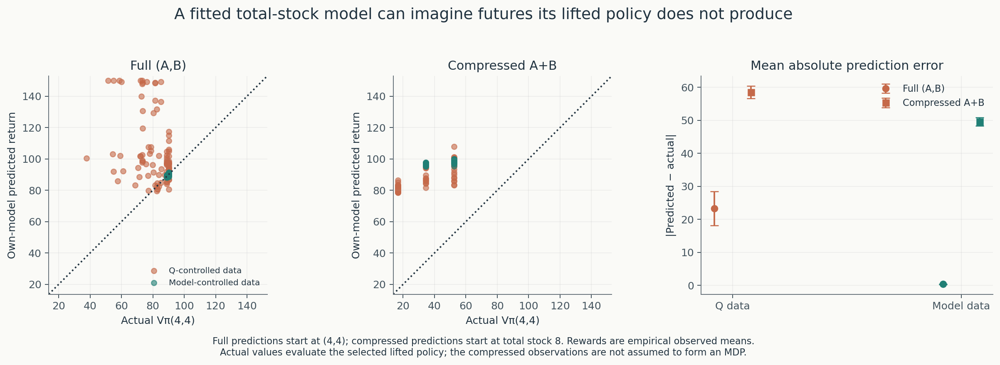

# Learning to leave something for tomorrow

**Can better experience compensate for an incomplete state?**

Experiment 8 hides the distinction between patches A and B, leaving only their
total stock. **Model-guided experience helps both representations, but does not
close the gap caused by compression in this fitted-model planning procedure.**
With model-controlled histories, full-state policies achieve value **90.00**;
total-stock policies achieve **48.76**. The primary paired full-minus-compressed
difference is **41.23 [39.91, 42.56]**, positive in all 100 seeds.



We reuse Experiment 5’s final **250,000 observations per seed**, from both
Q-controlled and unpenalized model-controlled collection. No histories were
recollected and no Q-learning was repeated. Each dataset is fitted twice: a
25-state model of `(A,B)`, and a 9-observation model of `A+B`. Counts and reward
sums are aggregated exactly, preserving action identities. Both use the same
unpenalized planner and γ=0.99. True dynamics enter only after policies are selected.

| Collection history | Full `(A,B)` value [95% interval] | Total `A+B` value [95% interval] | Seeds ≥90% of oracle: full / total |
| --- | ---: | ---: | ---: |
| Q-controlled | 81.11 [78.95, 83.27] | 25.96 [23.13, 28.79] | 63 / 0 |
| Model-controlled | 90.00 [89.90, 90.10] | 48.76 [47.35, 50.18] | 100 / 0 |

Values are exact returns from `(4,4)` in the original world, without exploration.
The full-state oracle is **90.2235**. Intervals use the 100 independent training
seeds; contrasts are paired within seed. All failures are retained.

Better experience is especially useful to the compressed planner. Switching from
Q-controlled to model-controlled histories gains **22.80 [19.95, 25.66]** under
compression, versus **8.89 [6.73, 11.05]** with full state. The difference between
these benefits, **full minus compressed**, is **−13.92 [−17.33, −10.50]**.
This is evidence that useful experience survives compression, not that it repairs
the missing state information. Both historical collectors themselves observed
full `(A,B)`; this experiment does not test collection by a partially observing agent.

**Why does the missing distinction matter?** The preselected states `(4,3)` and
`(3,4)` both have total seven. Their immediate rewards agree for each action, but
their next-total distributions differ. After harvest B, for example, the chances
of next total six, seven, and eight are **(0.670, 0.330, 0)** from `(4,3)`, versus
**(0.411, 0.481, 0.108)** from `(3,4)`. The optimal full-state actions are harvest A
and harvest B, respectively. A policy using only total stock must choose the same
action distribution in both states.



The fitted model also mixes these states differently for different actions.
Within total seven, model-controlled histories draw **91.29%** of harvest-A
observations from `(4,3)` and **96.28%** of harvest-B observations from `(3,4)`
(mean conditional fractions across seeds). Those are favorable locations for the
respective harvests. A compressed planner cannot recover that distinction when
acting. All 100 compressed policies from each collector choose B at total seven.
This pair illustrates a mechanism; it does not isolate the entire value loss.

**More observations do not guarantee accurate imagined futures.** With
model-controlled data, the full model predicts **90.03**, close to its policies’
actual **90.00**. The compressed model predicts **98.35**, while its policies
actually achieve **48.76**. Mean absolute prediction error is **0.38 versus 49.59**.
All 27 compressed observation-action rows have at least ten observations in every
model-controlled dataset. Pooling removes sparse rows while discarding information.



[Seed-0 policy maps and coverage](results/state_representation/policies_and_coverage.png)
show the action constraints imposed by compression. The model-controlled
compressed policies’ 10th-percentile value is **34.42**, versus **88.89** with full
state. The result concerns this particular empirical surrogate and planner:
**it is not a bound on the best possible policy under partial observation**.
Memory, different fitting methods, and other compressed representations were not
tested. Large counts cannot by themselves establish the Markov property.

**Chapter 3 connection:** a state should retain the information needed to predict
rewards and successors given an action. The same total can hide different
transition laws and different useful decisions. Moreover, the collection policy
changes which hidden states enter each fitted row. A learned world model estimates
these dynamics and rewards; a learned Q table estimates action returns directly.

| Learning connection | Where it appears |
| --- | --- |
| Chapter 3: states, actions, rewards, transition probabilities, policies, discounted returns and value functions | The original foraging world, exact policy comparisons, and this representation experiment |
| Chapter 3: continuing tasks, state sufficiency and stationarity | Collection cutoffs, merged observations here, and Experiment 7’s hidden dynamics change |
| Chapter 4 preview | Exact policy evaluation, value iteration and policy iteration |
| Chapter 6 §6.5 preview | Q-learning from observed transitions |
| Chapter 8 preview | Model-guided interaction and replanning; this implementation is not Dyna-Q |
| Our research extensions | Matched experience, count penalties, collector comparisons, forgetting and observation compression |

The [chapter map](notes/chapter_map.md) includes a worked distinction between
**genuine termination** and our **1,000-step collection cutoff**. In the latter,
the final actual successor is counted and continuation value remains; resetting
the next rollout creates no extra transition.

An evidence-based next question is whether adding just the bit **`A>B`** to total
stock recovers much of the lost value. It separates the two illustrative states
while remaining compressed. It would not automatically make every observation
Markov. That analysis has not been run.

The [Experiment 8 notes](notes/state_representation.md) contain the fixed protocol,
uncertainty tables, all three action distributions, count weights, limitations,
archive layout and reproduction commands. The analysis ran once in **3.35 s**,
with **zero new environmental transitions**. Rebuild figures from saved results:

```bash
python run_state_representation.py --plot-only
```

Previous experiments and original environment defaults are preserved:

| Experiment | Question and measured result |
| --- | --- |
| [1: Supplied model](notes/experiments_1_to_5.md#exact-results-when-preferences-change) | At γ=0.99, planning reaches value 90.22 versus myopic 23.72 in the original world. |
| [2: Q-learning](notes/experiments_1_to_5.md#experiment-2-learning-from-transitions) | Long-horizon learning reaches value 72.10; 7/100 seeds reach 90% of oracle. |
| [3: Same experience, learned model](notes/experiments_1_to_5.md#experiment-3-same-experience-learned-world-model) | Planning from Q’s observations gains 5.97 [3.12, 8.82], with large overprediction. |
| [4: Count penalty](notes/experiments_1_to_5.md#experiment-4-does-caution-about-scarce-evidence-improve-model-based-decisions) | Fixed caution gains 3.48 [0.91, 6.05] on average, but worsens 40 seeds. |
| [5: Model-guided collection](notes/experiments_1_to_5.md#experiment-5-can-a-world-model-improve-through-its-own-actions) | Adaptive model collection gains 8.89 [6.73, 11.05] over Q collection with the same final planner. |
| [6: Replanning ablation](notes/replanning_ablation.md) | Most of that improvement survives fixed initial behavior; adaptation adds 1.30 [0.14, 2.47]. |
| [7: Outdated world model](notes/changing_regeneration.md) | Forgetting reduces the changed-world tracking gap by 36.56, but adds 0.312 to the stable-world gap. |
| [8: Incomplete state](notes/state_representation.md) | Better data helps both representations; full-state value exceeds compressed by 41.23 [39.91, 42.56] with model-controlled histories. |

The [original world definition](notes/experiments_1_to_5.md#the-world-harvest-first-then-regenerate)
and earlier protocols remain available. This NumPy project follows Sutton and Barto,
second edition, and our [Chapter 2 bandit experiments](https://github.com/ReloadLightly/rl-changing-worlds).
