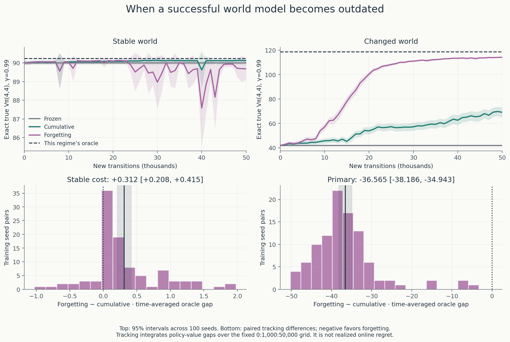
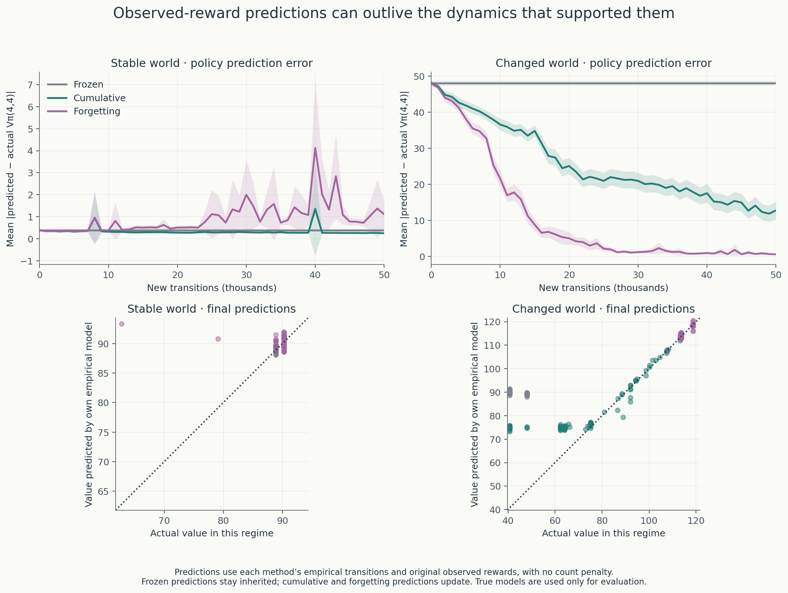
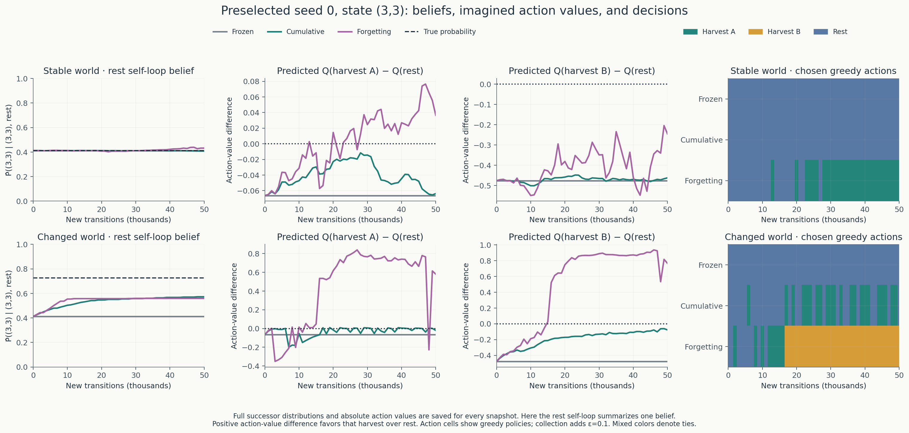

# Learning to leave something for tomorrow

**When a successful world model becomes outdated, does forgetting help?**

Experiment 7 starts from 100 successful learned-model agents and asks them to
continue in either the original world or an unannounced reversal of regeneration
dynamics. **Discounting older evidence substantially improves adaptation, but
sacrifices reliability when the world stays unchanged.**

In the changed world, forgetting reduces the time-averaged oracle-value gap from
**63.63 to 27.07**: paired reduction **36.56 [34.94, 38.19]** across 100 seeds.
Every seed improves on this prespecified tracking measure. In the stable world,
forgetting instead **increases** the gap by **0.312 [0.208, 0.415]**, with 83 seeds
worse, 12 better, and 5 tied. The evidence half-life was fixed at 5,000 new
transitions before the run and was not tuned afterward.



The tracking measure integrates exact policy-value gaps at **0, 1,000, …, 50,000**
new transitions and divides by 50,000. Lower is better. It measures how well the
current greedy policy tracks the relevant oracle; **it is not realized online
regret**. Intervals describe uncertainty across training seeds. The upper panels
use different vertical scales so the smaller stable-world cost remains visible.

All methods inherit the same **250,000-observation Experiment 5 histories** and
policies, then receive **50,000 additional observations per seed per world**,
for **300,000 total**. Frozen retains its model and policy. Cumulative gives old
and new observations equal weight. Forgetting multiplies its accumulated evidence
by **ρ=2^(−1000/5000)** before each rollout, then adds observations with unit weight.
Both learning methods replan every 1,000 steps. Exploration remains ε=0.1.

This is **blockwise exponential forgetting**; individual historical ages are not
reconstructed. The identical decay schedule runs in both worlds, without a regime
label or change notification. Actual counts are recorded separately from evidence
weights. Positive weights below one are normalized by their actual weight.

| World and method | Time-averaged oracle gap | Final true value [95% interval] | ≥90% of this world’s oracle |
| --- | ---: | ---: | ---: |
| Stable · frozen | 0.227 | 90.00 [89.90, 90.10] | 100/100 |
| Stable · cumulative | 0.155 | 90.12 [90.05, 90.19] | 100/100 |
| Stable · forgetting | 0.466 | 89.68 [89.10, 90.26] | 98/100 |
| Changed · frozen | 76.715 | 41.99 [41.45, 42.54] | 0/100 |
| Changed · cumulative | 63.632 | 69.10 [64.97, 73.23] | 6/100 |
| Changed · forgetting | 27.067 | 114.22 [113.88, 114.57] | 100/100 |

Values are exact $V_\pi(4,4)$ at γ=0.99. Separate oracle values are **90.2235**
for the stable world and **118.7088** for the changed world. The final
forgetting-minus-cumulative value difference is **45.12 [41.01, 49.24]** after
the change. In the stable world it is **−0.44 [−1.03, 0.15]**; that interval spans
zero, while the prespecified tracking measure shows a cost over the full period.
No favorable checkpoint was selected.

**What changed in the world?** After harvesting, regeneration below capacity
changes from $g_i(0.1+0.9m/4)$ to $g_i(1-0.9m/4)$, with $g=(0.3,0.6)$.
Regeneration is still zero at capacity four. Rewards, actions, and event order
stay the same. Low stocks now regenerate faster, so keeping stocks high can
preserve an outdated behavior rather than a good strategy. This is a **stylized
regime reversal**, not an ecological claim. Original environment defaults and
all completed experiments remain unchanged.

**What was sacrificed?** In the stable world, forgetting causes about **35.97
state-level policy changes per seed**, versus **4.28** for cumulative memory.
Across the fixed snapshots, **37 seeds fall below 90% of oracle at least once**,
versus **2** with cumulative memory. Both transient and final failures are retained.
Forgetting also reduces actual stable-world interaction reward by
**0.00494 [0.00315, 0.00674] per decision**, paired across seeds.



After the change, mean absolute prediction error falls from **12.77** with
cumulative memory to **0.56** with forgetting. In the stable world it rises
from **0.25 to 1.11**. These predictions use each agent’s own empirical dynamics
and the original observed rewards; there is no planning penalty. All true-model
access and oracle computation happen after interaction and policy selection. The
unchanged inherited model predicts only **25.47** for the final changed-world
forgetting policies, while their actual value is **114.22** and their updated
models predict **114.40**. These original-model predictions are saved separately.

**The preselected seed-0 example shows both adaptation and its limits.** At
`(3,3)`, the inherited model favors rest. The changed world’s oracle favors
harvest B. Forgetting settles on harvest B from +17,000 onward; cumulative memory
keeps alternating between rest and harvest A and finishes on rest. In the stable
world, forgetting instead leaves the correct rest action and ends on harvest A.



Forgetting does not make every belief accurate. In the changed world, seed 0’s
estimated rest self-loop probability finishes at **0.5595**, versus the true
**0.7265**. It gets no new observations of that row after +30,000; decay shrinks
the row’s weight without changing its normalized probabilities. The resulting
policy can improve while part of its model remains outdated. Full successor
probabilities, action values, and counts are saved for every snapshot.

Actual changed-world interaction reward averages **0.872 per decision** with
forgetting versus **0.563** with cumulative memory: paired gain
**0.309 [0.297, 0.322]**. Average stock B falls from **2.931 to 1.536**. Under this
reversed rule, lower stocks are not automatically evidence of worse decisions.
[Reward, stock, and depletion curves](results/changing_regeneration/interaction_resources.png)
show both environmental conditions. These trajectories include exploration;
the exact policy-value curves evaluate greedy behavior without it.

**Chapter 3 connection:** each constant regime defines its own finite MDP.
Across the hidden change, stock-only observations do **not** have one stationary
transition law. Cumulative memory mixes evidence from two different dynamics;
forgetting gives recent evidence more influence. A learned world model estimates
successor probabilities and rewards, then plans through those estimates; a Q table
estimates action returns directly. Policy iteration previews Chapter 4, and
online model-guided adaptation previews Chapter 8. This is not Dyna-Q.

The result concerns one small world, one abrupt reversal, these histories, and
one fixed half-life. It does not show that forgetting always helps, that its
half-life is optimal, or that its full model becomes accurate. Its final effective
evidence weight is only **7,961.62**, despite **300,000 actual observations**.
A useful next question is whether evidence from prediction errors can guide
forgetting without an oracle change signal, while avoiding the stable-world
instability measured here. That experiment has not been run.

Detailed uncertainty tables, the protocol, runtime, archive layout, and
reproduction commands are in the [Experiment 7 notes](notes/changing_regeneration.md).
The single run collected **30 million new transitions** in **39.42 s**, with
**3.18 s** for planning. Figures can be rebuilt without rerunning the experiment:

```bash
python run_changing_regeneration.py --plot-only
```

Earlier results remain available in the linked notes:

| Experiment | Question and measured result |
| --- | --- |
| [1: Supplied model](notes/experiments_1_to_5.md#exact-results-when-preferences-change) | At γ=0.99, planning reaches value 90.22 versus myopic 23.72 in the original world. |
| [2: Q-learning](notes/experiments_1_to_5.md#experiment-2-learning-from-transitions) | Long-horizon learning reaches value 72.10; 7/100 seeds reach 90% of oracle. |
| [3: Same experience, learned model](notes/experiments_1_to_5.md#experiment-3-same-experience-learned-world-model) | Planning from Q’s observations gains 5.97 [3.12, 8.82], with large overprediction. |
| [4: Count penalty](notes/experiments_1_to_5.md#experiment-4-does-caution-about-scarce-evidence-improve-model-based-decisions) | Fixed caution gains 3.48 [0.91, 6.05] on average, but worsens 40 seeds. |
| [5: Model-guided collection](notes/experiments_1_to_5.md#experiment-5-can-a-world-model-improve-through-its-own-actions) | Adaptive model collection gains 8.89 [6.73, 11.05] over Q collection with the same final planner. |
| [6: Replanning ablation](notes/replanning_ablation.md) | Most of that improvement survives fixed initial behavior; adaptation adds 1.30 [0.14, 2.47]. |
| [7: Outdated world model](notes/changing_regeneration.md) | Forgetting reduces the changed-world tracking gap by 36.56, but adds 0.312 to the stable-world gap. |

The [original world definition](notes/experiments_1_to_5.md#the-world-harvest-first-then-regenerate)
and earlier protocols are preserved. This NumPy project follows Sutton and Barto,
second edition, and our [Chapter 2 bandit experiments](https://github.com/ReloadLightly/rl-changing-worlds).
