# Learning to leave something for tomorrow

**When does preserving resources beat taking the largest immediate reward?**

This small NumPy project explores Sutton and Barto, second edition, **Chapter 3:
Finite Markov Decision Processes**. It follows our
[Chapter 2 bandit experiments](https://github.com/ReloadLightly/rl-changing-worlds).
Here an action changes the resources available for future decisions. Experiment 1
plans with a **supplied, exact model**. Experiment 2 learns action values from
observed transitions using **Q-learning**, a preview of Section 6.5, in the same world.
Experiment 3 estimates a **transition model from those same observations** and
plans with it, a Chapter 4 preview. Experiment 4 keeps that model fixed and
penalizes actions supported by fewer observations during planning. Experiment 5
lets model-planned policies collect new experience and update their own models.

**Latest result, experiment 5:** after **50,000 additional transitions** from
the same learned histories, model-controlled collection produces better data
for unpenalized planning than continued Q-controlled collection: final true
value **90.00 versus 81.11**, paired gain **8.89 [6.73, 11.05]**. Both use
**250,000 total transitions**. All 100 model-controlled seeds reach 90% of the
oracle. Seed 0 corrects its apparent rewarding loop through new observations;
Q-controlled collection leaves that particular belief unchanged.
[Jump to model-guided collection](#experiment-5-can-a-world-model-improve-through-its-own-actions).

**Experiment 4 result:** a fixed count penalty raises mean final true
value from **78.07 to 81.55**, paired gain **3.48 [0.91, 6.05]**, and reduces
mean absolute prediction error from **27.22 to 7.40**. The lower tail improves,
but **40 seeds worsen** relative to unpenalized planning. Seed 0 avoids an
illusory rewarding loop yet loses actual value: caution can reject useful
actions too.
[Jump to the caution experiment](#experiment-4-does-caution-about-scarce-evidence-improve-model-based-decisions).

**Experiment 3 result:** planning with an empirical model learned from
Q's own experience raises mean final policy value from **72.10 to 78.07**:
paired gain **5.97 [3.12, 8.82]**. **51/100** planned policies reach 90% of the
oracle, versus **7/100** Q policies. But planning hurts **28 seeds**, and its
models overpredict value by **26.98** on average. More useful policies do not
necessarily mean accurate imagined futures.
[Jump to the learned-model experiment](#experiment-3-same-experience-learned-world-model).

**Experiment 2 result:** after 200,000 transitions per seed, Q-learning with training
discount 0.99 achieves mean frozen-policy value **72.10 [70.86, 73.34]**, versus
**25.58 [25.28, 25.88]** with training discount 0. Both policies are evaluated at
discount 0.99. Only **7/100** long-horizon seeds reach 90% of the oracle value:
learning helps substantially, but does not reliably recover the optimal policy.
[Jump to the learning experiment](#experiment-2-learning-from-transitions).

| Chapter connection | What we have implemented |
| --- | --- |
| Chapter 2, preceding repository | Action values, exploration, gradient policies, and contextual bandits. |
| Chapter 3, this world | Observed states, action-dependent transitions, continuing discounted returns, and Bellman equations. |
| Chapter 4 preview, experiment 1 | Exact policy evaluation and value iteration using a supplied model. |
| Section 6.5 preview, experiment 2 | Q-learning from sampled transitions; the exact model is reserved for evaluation. |
| Chapter 3 dynamics + Chapter 4 preview, experiment 3 | Empirical transition/reward estimates from Q's observations; policy iteration (§4.3) in that learned model. Q-learning remains a §6.5 preview. |
| Chapter 3 rewards, policies, and values + Chapter 4 preview, experiment 4 | Fixed count penalties change policy selection; separate internal planning scores, original-reward predictions, and true returns. |
| Chapter 3 framework + Chapters 4 and 8 previews, experiment 5 | Planned policies collect observations, update empirical models, and replan; collection and final planning rules are compared separately. This is not Dyna-Q. |

**Experiment 1 result:** myopic harvesting is optimal at discounts 0 and 0.5.
At 0.9 the optimal policy changes which patch it harvests. At 0.99 it also
waits to preserve productive stocks: its expected discounted return from
`(4,4)` is **90.2235**, versus **23.7206** for myopic harvesting. Resting is
strictly best in nine states, despite paying no immediate reward.

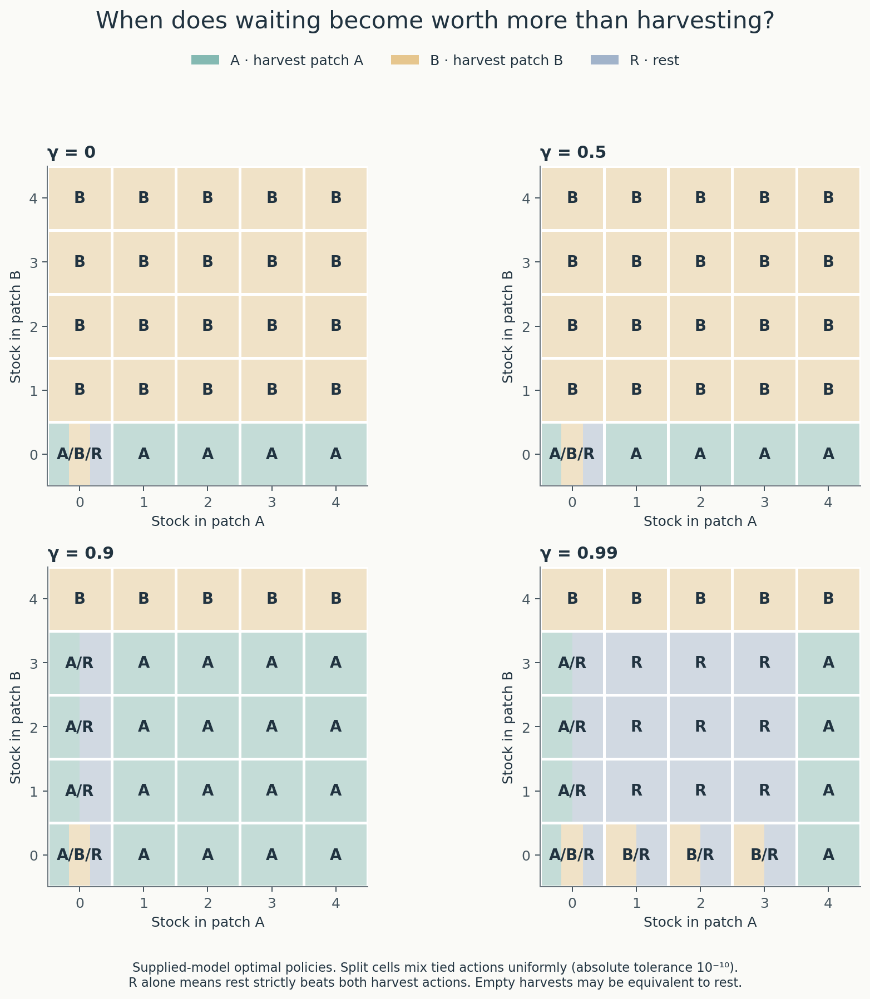

This is **our original foraging MDP**, not a reproduction of a textbook
environment or an empirically calibrated ecological model. The environment
was fixed before the experiment and was not adjusted to obtain these results.

## Run it

From this repository, using Python 3.10 or newer:

```bash
python3 -m venv .venv
source .venv/bin/activate
python -m pip install -r requirements.txt
python checks.py
python run_experiment.py
```

The final command solves the four discount settings and simulates all three
policies at the requested scale. It overwrites `results/first_world/`;
`--output PATH` selects a different directory. To regenerate the figures
without rerunning planning or simulation:

```bash
python run_experiment.py --plot-only
```

The recorded run used Python **3.10.12**, NumPy **1.26.4**, and Matplotlib
**3.10.9** on a WSL CPU. It took **5.15 seconds** including saving and plotting:
**0.105 s** for planning and **1.606 s** for **6 million simulated decisions**.
No GPU or paid API is used. Runtime depends on the machine.

Open this project in a separate WSL VS Code window:

```bash
code -n /home/roland/projects/rl-foraging-worlds
```

## The world: harvest first, then regenerate

The observed state is $s=(n_A,n_B)$, with each stock in $\{0,1,2,3,4\}$:
**25 states**. Every trajectory starts at **$(4,4)$**. All three actions are
available in every state:

| Action | Stock change before regeneration | Immediate reward |
| --- | --- | --- |
| Harvest A | Remove one unit from A if nonempty | 1 if successful; otherwise 0 |
| Harvest B | Remove one unit from B if nonempty | 1.5 if successful; otherwise 0 |
| Rest | Remove nothing | 0 |

There are no extra bonuses, costs, or penalties. After harvesting, let the
remaining stock in patch $i$ be $m_i$. **Both patches then regenerate
independently**, including the patch just harvested:

$$
p_i(m_i)=g_i\left(0.1+0.9\frac{m_i}{4}\right),\quad m_i<4,
\qquad g_A=0.3,\quad g_B=0.6.
$$

With this probability, add exactly one unit; otherwise add none. A full patch
stays at 4. The implementation uses probability zero for adding to a full
patch, so stocks never exceed capacity.

The **event order** is:

1. Observe $(n_A,n_B)$ and choose an action.
2. Remove a unit if possible and receive its reward.
3. Compute regeneration probabilities from the **remaining** stocks.
4. Draw the two independent regeneration outcomes to produce the next state.

For example, harvesting A at stock 1 leaves stock 0, so its regeneration
chance that step is **0.03**, not the **0.0975** chance it would have retained
at stock 1. An empty harvest pays zero even if regeneration adds a unit
afterward. At post-harvest stock 3, regeneration probabilities are **0.2325**
for A and **0.465** for B; at stock 0 they are **0.03** and **0.06**.

This is a stylized rule: depleted patches recover slowly, retaining stock
supports faster regeneration, and recovery from zero remains possible. It
does not imply that actual food patches follow this formula.

The process **continues indefinitely**. Step 1,000 is an observation cutoff,
not a terminal state, death, or reset. The state after that step remains an
ordinary stock pair that could generate further rewards.

## Chapter 3: why this is an MDP

The state has the **Markov property** under our assumptions: given current
stocks and the chosen action, the distribution of the next stocks and reward
does not require earlier history. Independent regeneration draws and fixed
parameters make the stock pair sufficient. Hidden weather, patch age, or
other unmodeled dependencies would change that claim.

The exact model stores $P(s'\mid s,a)$ in a **25 × 3 × 25** array and expected
immediate rewards $r(s,a)$ in a **25 × 3** array. Here immediate rewards are
deterministic given state and action. For each state/action pair we enumerate
the four possible combinations of patch regeneration and multiply their
independent probabilities. Zero-probability outcomes at capacity are omitted.

A **policy** $\pi(a\mid s)$ specifies action probabilities at a state. Its
discounted return is

$$
G_t=R_{t+1}+\gamma R_{t+2}+\gamma^2R_{t+3}+\cdots,
\qquad 0\leq\gamma<1.
$$

$V_\pi(s)$ is the expected return starting in state $s$ and following that
policy. $Q_\pi(s,a)$ is the expected return after taking action $a$ first and
then following the policy. Given a continuation value $V$, the action values
are

$$
Q(s,a)=r(s,a)+\gamma\sum_{s'}P(s'\mid s,a)V(s').
$$

The first term values today's harvest. The second values the opportunities
left after that harvest and regeneration. Averaging over the policy gives
the **Bellman expectation equation**:

$$
V_\pi=r_\pi+\gamma P_\pi V_\pi,\qquad
V_\pi=(I-\gamma P_\pi)^{-1}r_\pi.
$$

The code uses `numpy.linalg.solve`, not an explicit matrix inverse.
$P_\pi(s,s')=\sum_a\pi(a\mid s)P(s'\mid s,a)$ and
$r_\pi(s)=\sum_a\pi(a\mid s)r(s,a)$.

The **Bellman optimality equation** replaces the policy average with a maximum:

$$
V_*(s)=\max_a\left[r(s,a)+\gamma\sum_{s'}P(s'\mid s,a)V_*(s')\right].
$$

Our short value-iteration solver is a **Chapter 4 preview** used to explore
this Chapter 3 equation. It repeatedly applies the right side, extracts the
policy, and evaluates that policy with the linear solve. The largest recorded
optimality residual is **$1.43\times10^{-14}$**. These values are numerical
solutions of the supplied model, not estimates learned from the trajectories.

In the preceding bandits, actions affected rewards and observations but did
not control the next situation. Here harvesting changes both next stock and
regeneration probability. Choosing the largest current payoff can damage
future returns. That action-dependent transition is the central new ingredient.

## Policies, ties, and discount objectives

We compare uniform random actions, a **myopic** policy maximizing $r(s,a)$,
and the **optimal discounted policy** computed separately at each gamma.
The myopic policy takes B whenever B is nonempty, otherwise A if possible.

Policy extraction mixes uniformly over actions within an **absolute tolerance
of $10^{-10}$** of the largest action value; relative tolerance is zero.
Split cells in the policy maps show those ties. At `(0,0)`, all three actions
have identical rewards and transitions, so both myopic and optimal policies
mix all three. At other empty-patch states, harvesting that empty patch can
be equivalent to resting. Such ties are not counted as **strictly** optimal
rest: we require $Q_*(s,\mathrm{rest})$ to exceed **both** harvest values by
more than the tolerance.

Larger gamma weights later rewards more heavily. The sums of discount weights
$1/(1-\gamma)$ are 1, 2, 10, and 100 for our settings; these are not hard
episode lengths. **Compare policies within the same gamma.** Raw values at
different discounts represent different objectives and cannot themselves
establish that one planning horizon is better.

## Exact results: when preferences change

Expected **infinite-horizon discounted return from $(4,4)$**, with each policy
evaluated at the gamma in its row:

| Gamma | Uniform random | Myopic | Optimal at this gamma | Optimal − myopic | Strict rest states |
| --- | ---: | ---: | ---: | ---: | ---: |
| 0 | 0.8333 | 1.5000 | 1.5000 | 0.0000 | 0 |
| 0.5 | 1.6644 | 2.9684 | 2.9684 | 0.0000 | 0 |
| 0.9 | 7.2331 | 9.3041 | 10.8164 | 1.5123 | 0 |
| 0.99 | 34.2907 | 23.7206 | 90.2235 | 66.5029 | 9 |

These are deterministic calculations under the specified model; sampling
confidence intervals do not apply to them.

At **gamma 0 and 0.5**, the optimal and myopic policies agree in all 25 states.
Preservation has no advantage for these discounted objectives.

At **gamma 0.9**, action sets change in **15 states**: whenever B has stock
1–3, the policy harvests A if available, sacrificing the larger immediate
payoff to preserve B. If A is empty it mixes empty-A harvest and rest. There
are no states where rest strictly beats both harvest actions. Waiting can
be optimal through a tie without being uniquely best.

At **gamma 0.99**, action sets differ from myopic in **18 states** and from
gamma 0.9 in **12 states**. Its rule can be read directly from the map:

- Harvest B when B is full.
- Otherwise harvest A when A is full.
- Otherwise wait; at empty-patch states, empty harvests may tie with rest.

Rest is strictly best at exactly **$\{1,2,3\}\times\{1,2,3\}$**. At $(3,3)$:

| First action, then follow the gamma 0.99 optimal policy | Immediate reward | $Q_*(3,3,a)$ |
| --- | ---: | ---: |
| Harvest A | 1 | 87.9964 |
| Harvest B | 1.5 | 87.6621 |
| Rest | 0 | **88.0949** |

An unrewarded rest action has positive value because harvesting remains
possible later. This is different from **resting forever**, whose value is
zero in every state. Positive value alone also does not make rest optimal:
at gamma 0.5, resting at $(3,3)$ is worth 1.4674, but harvesting B is worth
2.9054. At $(4,4)$, harvesting B remains optimal at every tested discount.

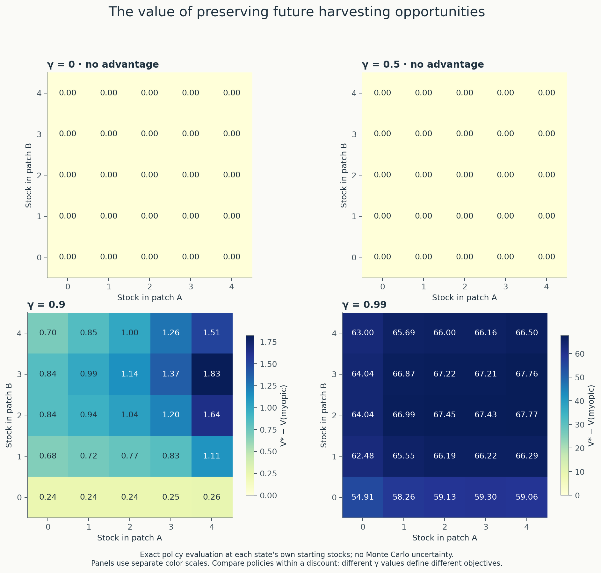

The planning advantage is zero in every state at gamma 0 and 0.5. At 0.9 it
ranges from **0.2380 to 1.8264**; at 0.99 from **54.9056 to 67.7655**. All
25 differences per gamma are saved. A state's action can agree with myopic
while its value is higher because the policies behave differently later.

## Simulations: finite-window returns and resources

We simulate **2,000 independent trajectories per policy**, each for **1,000
decisions** from `(4,4)`, using random, myopic, and the fixed **gamma 0.99
optimal policy**. Discounted simulation returns also use **gamma 0.99**.

Each paired trajectory shares the same two independent uniform regeneration
draws per step across policies. Each policy compares those draws with the
probabilities from **its own post-harvest stocks**. Thus opportunities are
paired while realized growth and stocks can differ. Policy sampling has
separate stable random streams, independent of regeneration.

Intervals below are **mean ± 1.96 SEM across independent trajectories**.
Paired comparisons subtract corresponding trajectory outcomes first. Plot
bands use within-trajectory bin summaries before calculating SEMs; steps
within one trajectory are not treated as independent samples. Intervals are
pointwise and unadjusted for multiple comparisons.

| Policy | Simulated discounted return (95% CI) | Exact 1,000-step expectation | Exact infinite-horizon value |
| --- | ---: | ---: | ---: |
| Uniform random | 34.4244 [34.1210, 34.7278] | 34.2898 | 34.2907 |
| Myopic | 23.8809 [23.7306, 24.0312] | 23.7201 | 23.7206 |
| Planned, gamma 0.99 | 90.2000 [89.9665, 90.4336] | 90.2197 | 90.2235 |

The paired planned-minus-myopic difference is **66.3191 [66.0876, 66.5506]**.
The myopic sample mean lies **2.10 SEM** above its exact truncated expectation,
just outside its marginal 95% interval. An individual 95% interval need not
cover its expectation; the exact model supplies a useful independent check.

The simulated return is $G_0^{(T)}=\sum_{t=0}^{T-1}\gamma^tR_{t+1}$.
Since rewards are between 0 and 1.5, the omitted tail is bounded on **every
possible trajectory** by

$$
0\leq G_0-G_0^{(1000)}\leq
\frac{1.5(0.99)^{1000}}{1-0.99}=\mathbf{0.006476}.
$$

The exact expected omitted tails are **0.000912** (random), **0.000519**
(myopic), and **0.003846** (planned). The finite-window calculation truncates
a sum of rewards; it does not introduce a terminal state or optimize a policy
that knows a terminal deadline is coming.

### Harvest and resource outcomes

All resource statistics use **pre-action stocks** at decisions 0–999.
Depletion means stock zero. Rest and unsuccessful-harvest percentages use
**all decisions** as their denominator; conditional failure rates among
harvest attempts are saved separately.

| Outcome | Uniform random | Myopic | Planned, gamma 0.99 |
| --- | ---: | ---: | ---: |
| Cumulative harvested reward (95% CI) | 228.16 [226.57, 229.76] | 132.73 [132.17, 133.29] | **891.60 [890.52, 892.67]** |
| Mean reward per decision | 0.2282 | 0.1327 | 0.8916 |
| Mean stock A | 0.2117 | 0.0676 | 3.3634 |
| Mean stock B | 0.9209 | 0.0754 | 3.4651 |
| Either patch depleted | 94.79% | 99.21% | 0% |
| Both patches depleted | 55.20% | 90.00% | 0% |
| Rest decisions | 33.36% | 30.00% | 34.10% |
| Unsuccessful harvest decisions | 49.99% | 60.00% | 0% |

All outcomes have trajectory-level uncertainty in the saved summary. Planned
minus myopic cumulative reward is **758.87 [757.80, 759.94]**. Resource stocks
and average reward are **secondary outcomes**: the discounted solver does not
automatically optimize either one as a separate objective.

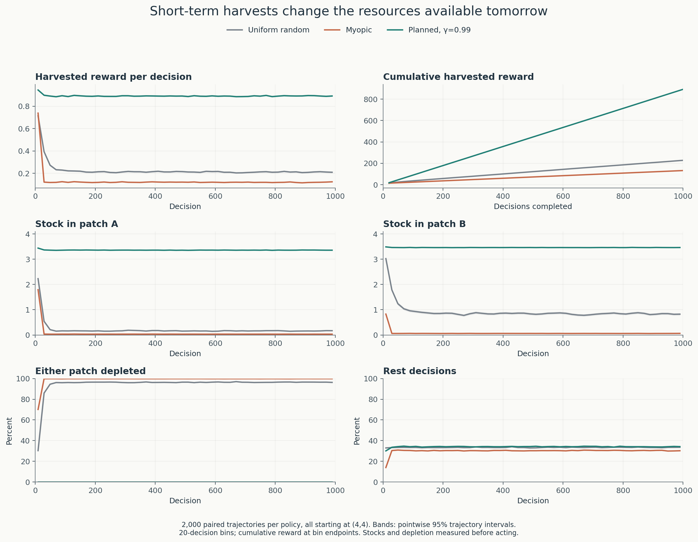

The mechanism is visible in the stock curves. Starting at `(4,4)`, the planned
policy harvests only a full patch, leaving at least 3 units. Regeneration
cannot reduce that stock, so **both stocks stay in $\{3,4\}$ under this policy**.
Its zero depletion and failure frequencies follow from that invariant, not
only from a lucky finite sample. Myopic harvesting consumes newly recovered
units, leaving patches near zero where growth is slow.

Rest frequency alone is misleading. Random and planned policies rest at
similar overall rates, but achieve very different harvests. Myopic resting
occurs only at `(0,0)`, where all immediate rewards tie; two thirds of those
zero-payoff decisions are recorded as empty harvests instead. The planned
policy waits **before** stocks become depleted. When and where it waits
matter more than simply counting rest actions.

Random actions beat myopic harvesting at gamma 0.99, despite choosing actions
without a plan. This does not make random behavior generally superior:
myopic has higher exact value at the three shorter discounts. The optimal
policy also keeps taking immediate rewards when stocks justify doing so.

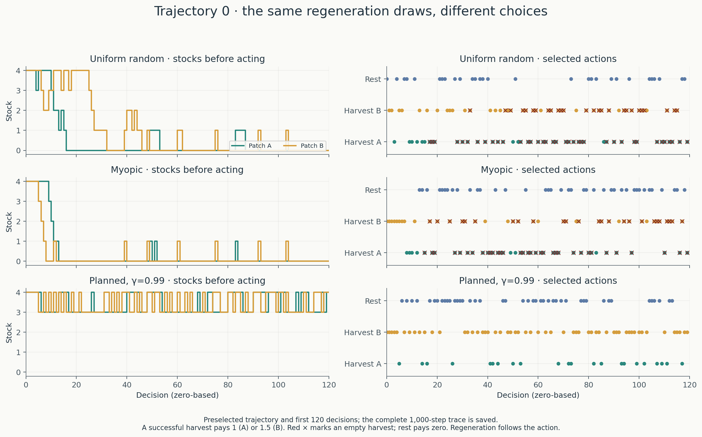

Trajectory **0** and its **first 120 decisions** were selected before examining
outcomes. The full trace is saved. Red crosses show empty harvests; the stock
and action panels show how the same regeneration draws lead to different
futures. This single trajectory illustrates the mechanism, while the
2,000-trajectory summaries provide the population evidence.

## Code, results, and limits

Start with [foraging.py](foraging.py): `harvest` and `step` specify event order;
`exact_model` enumerates transitions; `policy_evaluation` solves the Bellman
system; `value_iteration` supplies the optimal reference. The explicit time
loop in [run_experiment.py](run_experiment.py) vectorizes across trajectories.
[figures.py](figures.py) only needs saved arrays. [checks.py](checks.py) checks
transition normalization, event order, recovery from zero, ties, and Bellman
calculations; it is deliberately short.

The approximately **1.0 MiB** of outputs in [results/first_world/](results/first_world/)
include:

| File | Contents |
| --- | --- |
| `model.npz` | State/action labels, exact transitions and rewards, policies and values for all four gammas, optimal action values, iteration counts and residuals. |
| `planning_summary.json` | Initial values, advantages at all 25 states, action sets, strict-rest states, and changes between discounts. |
| `simulation.npz` | `task_outcomes` indexed by policy × trajectory × outcome, labeled axes, curve means/SEMs, final stocks, and trajectory-0 states/actions/rewards/shared regeneration draws. |
| `simulation_summary.json` | Means, SEMs, intervals, trajectory variability, paired differences, exact truncated expectations, and tail bounds. |
| `manifest.json` | World parameters, configuration, seeds, library versions, source hashes, event order, tie rule, measurement definitions, and runtime. |
| Four PNG figures | Policy maps, value advantages, resource/harvest curves, and trajectory 0. |

Open archives with `numpy.load(path, allow_pickle=False)`. There is no full
population trajectory-by-time-by-state cube. Source hashes identify the code
used for the run; the regeneration-stream hash records the shared exogenous
draws. Seeds use NumPy `SeedSequence` with explicit stable stream IDs.

This model has fixed growth parameters, full observation, no movement cost,
no resource spoilage, no seasonal change, and no other foragers. Its exact
policy thresholds are consequences of these assumptions and rewards, not
ecological recommendations. Parameter uncertainty is not included in the
simulation intervals. In experiment 1, no transition model is learned and
simulated experience does not update any policy. Experiment 2 below learns Q
from experience, while still learning no transition model. The preceding
Chapter 2 repository remains intact.

**Question raised by experiment 1:** does planning still help when the supplied regeneration
rates are wrong? Keep this world fixed, plan under misspecified growth rates,
and evaluate those policies in the true world. That would separate the value
of looking ahead from the cost of trusting an inaccurate model. That proposed
model-misspecification study has not been run; our next completed study instead
adds experience-based learning to the unchanged world.

## Experiment 2: learning from transitions

**Can an agent discover the value of preserving resources without being given
the transition model?** We compare Q-learning with $\gamma_{train}=0.99$ and
$\gamma_{train}=0$. All stocks, rewards, regeneration rules, and event order
are exactly those of experiment 1. No reward shaping or parameter tuning was
used. The first experiment's source world and saved results were preserved.

### From Bellman equations to experience

The learner sees only $(S_t,A_t,R_{t+1},S_{t+1})$. It maintains a table with
one estimate per state/action pair and applies

$$
Q(S_t,A_t)\leftarrow Q(S_t,A_t)+\alpha\left[
R_{t+1}+\gamma_{train}\max_a Q(S_{t+1},a)-Q(S_t,A_t)\right].
$$

The target combines an observed payoff with an estimate of later opportunity.
This is **bootstrapping**: one estimate helps update another. Q-learning is
**off-policy** because its target uses a greedy future action even while its
behavior explores. With $\gamma_{train}=0$, the future term disappears; the
learner only estimates immediate rewards. This follows Sutton and Barto's
[Section 6.5, Q-learning](https://web.stanford.edu/class/psych209/Readings/SuttonBartoIPRLBook2ndEd.pdf)
(linked author-text copy is a second-edition draft).

**Alpha** controls how much each new target changes Q. **Epsilon** controls
how often an action is selected uniformly for exploration. **Gamma** controls
how much future reward matters in the target. They perform different jobs.
Unlike the first experiment's planner, the learner neither enumerates possible
successors nor knows their probabilities. It has no growth parameters,
counterfactual rewards, oracle values, or other seeds' observations.

### Fixed protocol and frozen-policy evaluation

| Setting | Value |
| --- | --- |
| Independent training seeds | 100 per learner |
| Transitions | 200,000 per learner per seed; **40 million total** |
| Collection rollouts | 200 rollouts of 1,000 transitions, each starting at `(4,4)` |
| Q initialization / learning rate | All zeros / constant $\alpha=0.1$ |
| Training exploration | Constant $\epsilon=0.1$, uniform among all three actions on exploration steps |
| Training discounts | 0.99 and 0 |
| Checkpoints | Before training, then every 10,000 transitions, fixed in advance |
| Primary evaluation | Frozen **final** Q tables; no updates; $\epsilon=0$; exact value at $\gamma_{eval}=0.99$ |
| Greedy ties | Uniform mixing within absolute tolerance $10^{-10}$, relative tolerance zero |

At every rollout cutoff, **the final real transition still bootstraps from its
actual next stock state**. Only then does collection restart at `(4,4)`,
retaining Q and all visit counts. The reset creates no transition, reward, or
terminal state. These rollouts are a data-collection procedure for the same
continuing MDP; they change which states are sampled, not its transition law.

Within a training seed, the two methods share exogenous uniform regeneration
draws. Each uses probabilities from its own post-harvest stocks. Each learner
has a separate stable action-selection stream, and seeds are independent.
We vectorize across seeds and retain an explicit time loop. Draws are generated
one rollout at a time rather than stored for every transition.

The evaluator extracts each frozen greedy policy from Q and solves
$(I-0.99P_\pi)V_\pi=r_\pi$ using the already saved exact model. The reported
value is **$V_\pi(4,4)$, not $\max_a Q(4,4,a)$**, and is an infinite-horizon
expectation. No evaluation rewards train the learner. No finite-horizon
Monte Carlo estimate or tail correction is needed for this linear solve.
Checkpoint evaluation has no effect on training or stopping. We report the
scheduled **200,000-transition endpoint**, without selecting the best earlier
checkpoint. A secondary evaluation freezes the same tables while retaining
$\epsilon=0.1$ to show behavior with continued exploration.

### Final outcomes: a substantial but incomplete improvement

All rows below use the **same evaluation discount, 0.99**. Mean intervals are
mean ± 1.96 SEM over **100 independent training seeds**; a seed, not a transition
or checkpoint, is the sampling unit. Exact evaluation removes rollout sampling
noise, but learned policies still vary with training experience.

| Training discount | Mean final frozen-policy value (95% CI) | Seed SD | Mean share of oracle | Seeds ≥90% of oracle (Wilson 95% CI) |
| --- | ---: | ---: | ---: | ---: |
| 0.99 | **72.1011 [70.8602, 73.3420]** | 6.3311 | 79.91% | **7/100 = 7% [3.43%, 13.75%]** |
| 0 | **25.5764 [25.2768, 25.8759]** | 1.5283 | 28.35% | **0/100 = 0% [0%, 3.70%]** |

The supplied-model oracle is **90.2235**; 90% of it is **81.2011**. The myopic
reference is **23.7206**, and uniform random actions yield **34.2907**. These
reference values come from the saved first experiment and were not rerun.

The paired value improvement for training discount 0.99 over 0 is
**46.5247 [45.2247, 47.8247]**. Every one of the 100 matched seed pairs improved,
but high performance was not reliable: **93/100** long-horizon seeds fell below
the 90% threshold. Their final values range from **52.6203 to 90.2235**; the
10th, 50th, and 90th percentiles are **64.0113, 73.7827, and 79.0947**. The best
seed is included in the range, not used as the reported policy or as a reason
to change the protocol.

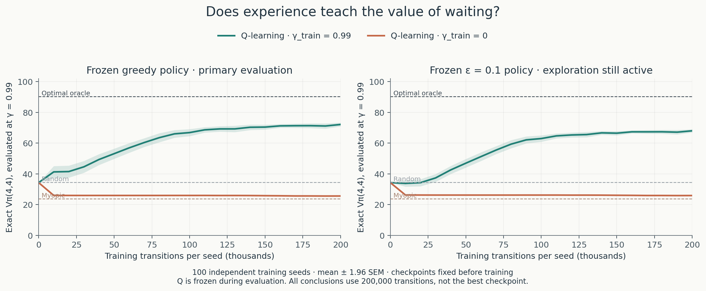

The learning curve shows gradual improvement for discount 0.99 and a plateau
well below the oracle. The small late fluctuations are retained. With frozen
$\epsilon=0.1$ policies, mean final value is **67.9862 [66.9521, 69.0204]** for
the long-horizon learner and **25.8744 [25.5932, 26.1556]** for the immediate
learner. Continuing random exploration can damage productive stocks, although
for the poorer policy it can also interrupt damaging repeated harvesting.
These are evaluations of the same tables, not another training experiment.

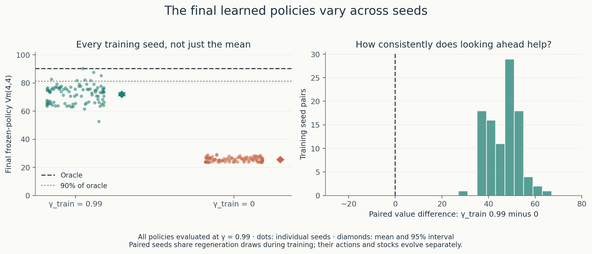

The discount-zero learner is **not exactly the known myopic policy** after a
finite run: some state/action pairs have little or no experience. Its final
value differs from 23.7206 accordingly. Immediate rewards in this world are
deterministic, so its estimate after $N(s,a)$ visits satisfies
$Q(s,a)=r(s,a)[1-0.9^{N(s,a)}]$. We checked that identity against the saved
tables. Underestimating rarely tried harvest actions can change which action
looks best; an incomplete immediate-reward table can incidentally wait or
harvest another patch. Its modest advantage over exact myopic harvesting
therefore does **not** show that $\gamma_{train}=0$ learned delayed value.

### What was learned, and what was missed?

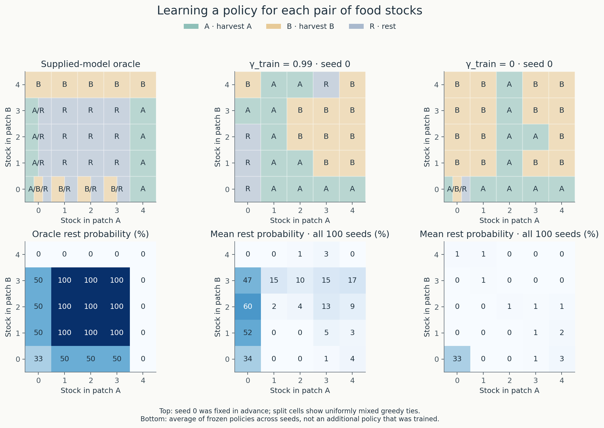

The top row uses **seed 0, chosen before training**, whose final values are
65.3646 and 23.7334. It is an illustration, not a representative seed selected
afterward. The bottom row shows the average resting probability in each state
across all seeds. Empty harvests can be equivalent to rest, so resting
probability alone is not a complete measure of waiting or policy quality.

The learned long-horizon policies often wait when A is depleted and B is
recovering, rather than consuming every new B unit. But they rarely reproduce
the oracle's full pattern of waiting while **both** patches still have stock.
For example, at `(3,3)` the oracle always rests, whereas only **15%** of final
long-horizon policies rest. It is more accurate to say that they learned some
valuable delayed consequences than that they learned the optimal conservation
strategy.

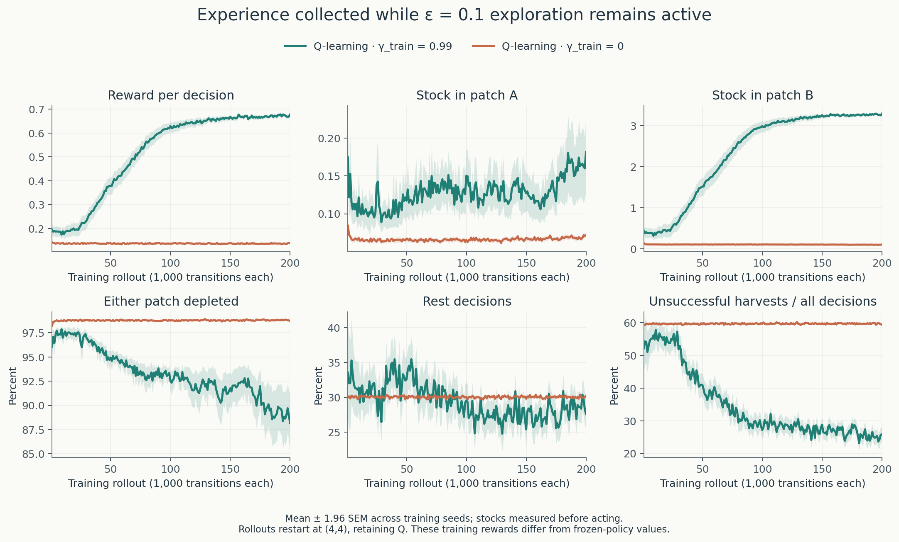

The final ten training rollouts, with exploration and learning still active,
make this partial success concrete:

| Training measurement, last 10 rollouts | $\gamma_{train}=0.99$ | $\gamma_{train}=0$ |
| --- | ---: | ---: |
| Reward per decision | 0.6734 [0.6693, 0.6775] | 0.1367 [0.1359, 0.1376] |
| Mean stock A | 0.1642 [0.1229, 0.2056] | 0.0688 [0.0672, 0.0703] |
| Mean stock B | 3.2757 [3.2574, 3.2940] | 0.0972 [0.0950, 0.0994] |
| Either patch depleted | 89.06% [86.75%, 91.37%] | 98.81% [98.75%, 98.86%] |

These are measurements during training, not frozen-policy simulations or
values. The long-horizon agent maintains B far more successfully, while A
usually remains depleted. Better discounted performance does not imply that
both resources were preserved. Average reward and resource stocks remain
secondary outcomes.

Coverage is uneven despite 200,000 transitions per seed: the long-horizon
learner leaves a mean **5.20 of 75 state/action pairs unvisited**, and only
**8/100 seeds** visit all 75 pairs. The immediate learner leaves **8.77 pairs**
unvisited on average; none of its seeds visits every pair. Epsilon explores
actions **in encountered states**; it does not guarantee good coverage of
states that the policy rarely reaches. This is evidence of a coverage problem,
but does not establish that coverage alone caused the performance gap.

Constant alpha, finite data, bootstrapped targets, and state visitation could
all matter. This run does not isolate their contributions or demonstrate
convergence. No settings were tuned after seeing the shortfall. The exact-model
oracle has access to information the learner lacks and serves as an upper
reference, not an equal-information competitor. Q-learning learned values and
a policy, **not a transition model or a planning system**.

### Reproduction and saved learning outputs

After installing the same requirements above:

```bash
source .venv/bin/activate
python check_q_learning.py
OPENBLAS_NUM_THREADS=1 python run_q_learning.py
# Rebuild the four figures using existing results, without training:
python run_q_learning.py --plot-only
```

The runner reuses completed results when present, and resumes from the latest
checkpoint when a run is incomplete. To intentionally repeat the experiment,
use `--output results/q_learning_repeat`; this keeps the published run intact.
The model is read from `results/first_world/model.npz` **only by evaluation**.
Neither its arrays nor its reference values enter the learner's updates.

The measured run took **56.53 seconds for training** (collection and updates)
and **61.78 seconds for the completion invocation**, including evaluation,
checkpoint saving, and plotting. It used the same Python 3.10.12, NumPy 1.26.4,
and Matplotlib 3.10.9 WSL CPU environment, with one OpenBLAS thread. These are
wall-clock measurements, not estimates from transition counts.

[results/q_learning/](results/q_learning/) contains approximately **10.3 MiB**:

| File | Contents |
| --- | --- |
| `checkpoint_000000.npz` through `checkpoint_200000.npz` | All Q tables and visit counts, exact greedy and ε=0.1 values for all states, rollout summaries so far, training time, and RNG states; every 10,000 transitions. |
| `results.npz` | Final Q/counts/policies/values, all checkpoint value curves, and per-rollout measurements for each training seed; oracle and reference values for plotting. |
| `summary.json` | Seed-level uncertainty, paired differences, coverage statistics, final training-window summaries, and 90%-oracle fractions with Wilson intervals. |
| `manifest.json` | Fixed configuration, complete per-seed stream IDs, world parameters, source/model hashes, versions, runtime, and evaluation protocol. |
| `run.log` and four PNGs | Recorded checkpoint progress and regenerated scientific figures. |

In `results.npz`, final tables use **method × seed × state × action**, checkpoint
values use **checkpoint × method × seed × state**, and rollout measurements
use **method × rollout × seed × metric**. Methods are training discounts
`[0.99, 0]`; metric names are saved. There is no full transition history cube.
Open with `numpy.load(path, allow_pickle=False)`.

Read [q_learning.py](q_learning.py) for the learner, [run_q_learning.py](run_q_learning.py)
for collection and frozen evaluation, and [q_learning_figures.py](q_learning_figures.py)
for plots. Brief checks cover the update equation, gamma zero, uniform ties,
and the actual-successor bootstrap. Saved visit totals, the discount-zero
closed form, and agreement with the existing single-policy evaluator were
also checked. The experiment was run once, with no rerun of experiment 1.

**Next scientific question:** would deliberately broader state coverage during
training improve the final policy at the same transition budget? A future
matched comparison could vary collection starting states while holding the
world, update rule, and evaluation from `(4,4)` fixed. That study has not been run.

## Experiment 3: same experience, learned world model

**Can planning with an empirical model learned from the Q-learner's own
observations produce a better policy than its learned Q table?** Our hypothesis
was that estimating dynamics and then planning could extract more value from
the fixed data. This is our extension, not a textbook reproduction. The world,
completed experiments, and all previous result files remain unchanged.

### A Q table and a transition model remember different things

A **Q table** estimates how much discounted reward an action is worth in a
state. The Q-learner updates that estimate from one observed reward and the
current estimated value of its actual successor. It does not retain a table
of possible successors and their probabilities.

A **learned transition model** instead remembers what happened: how often
each action in each state led to each successor, and the rewards received.
For every seed separately, we accumulate $N(s,a,s')$, $N(s,a)$, and reward
sums. For visited rows,

$$
\widehat P(s'\mid s,a)=\frac{N(s,a,s')}{N(s,a)},\qquad
\widehat r(s,a)=\frac{\sum_{\text{observations of }(s,a)}R_{t+1}}{N(s,a)}.
$$

The planner can then revisit the estimated consequences without taking more
environmental actions. It uses **policy iteration**: evaluate a policy in its
learned model, improve it using $\widehat r+0.99\widehat P V$, and repeat until
the policy is unchanged. Each checkpoint starts with a uniform policy; ties
mix uniformly within absolute tolerance $10^{-10}$, with zero relative
tolerance. The largest observed optimality residual was **$8.53\times10^{-14}$**.
Solving the estimated model accurately does not make the estimates accurate.

An **unvisited** row is explicitly marked unknown and assigned **zero reward
and a self-loop**. This is an assumption, not knowledge about that action.
There is no smoothing, uncertainty penalty, or borrowing between seeds or
neighboring states. The planner receives no regeneration parameters, true
transition probabilities, counterfactual rewards, oracle values, or Q table.
The state/action labels and observed transitions suffice to construct its model.

This connects **Chapter 3 dynamics** to discounted **returns and value
functions**: $\widehat P$ and $\widehat r$ estimate the one-step world;
$V_\pi$ describes the accumulated consequences of a policy. Planning here is
explicitly a **Chapter 4 preview, §4.3 policy iteration**; the collector's
Q-learning remains a **§6.5 preview**. See the
[second-edition chapter outline](https://mitpress.ublish.com/book/reinforcement-learning-an-introduction-2).

### Matched collection, fixed endpoint

We replayed **only** the original long-horizon collection: **100 seeds,
200,000 transitions per seed, $\gamma_{train}=0.99$, $\alpha=0.1$,
$\epsilon=0.1$, zero initial Q**, and 200 collection rollouts of 1,000 steps
from `(4,4)`. The original environment and action-selection seeds, draw shapes,
and Q update order are reused. This adds the missing transition counts; it is
not another baseline comparison or a repeat of the discount-zero experiment.

**Q alone controls collection.** The complete observation-count archive is
saved before planning begins. Every last real transition in a rollout is
counted and bootstrapped from its actual successor. Restarting collection
creates **no observed transition**, reward, or terminal event.

The replay's Q tables and visit counts match the baseline **exactly at all
21 checkpoints**, including the final checkpoint: maximum absolute differences
are both **zero**. Final environment/action RNG states also match. These checks
support replaying the original experience; the old archives do not contain a
transition-by-transition record for a direct trace comparison.

At zero experience and every **10,000 transitions**, each seed's model is
estimated independently and planned at $\gamma=0.99$. Frozen Q and planned
policies are evaluated in the **true environment** by the existing Bellman
linear-solve calculation. True-model arrays are loaded only in this separate
evaluation stage and never enter either learner. The oracle is the saved
experiment-1 reference; it was not replanned or simulated again.

The primary outcome was fixed at **200,000 transitions**:
**exact infinite-horizon $V_\pi(4,4)$ at $\gamma=0.99$**. We neither selected
a favorable checkpoint nor changed settings after seeing the results.
Intervals are **mean ± 1.96 SEM over the 100 training seeds**; paired differences
are calculated within seed first. Threshold fractions use Wilson 95% intervals.
Checkpoint bands and secondary intervals are pointwise, without multiplicity
adjustment. They describe seed variability in this fixed world, not uncertainty
about whether the world is a realistic ecological model.

### Final value: a mean improvement with substantial failures

| Policy | Mean final value (95% CI) | Seed SD | Seeds ≥90% of oracle (Wilson 95% CI) |
| --- | ---: | ---: | ---: |
| Matched frozen Q | **72.1011 [70.8602, 73.3420]** | 6.3311 | **7/100 = 7% [3.43%, 13.75%]** |
| Learned-model planning | **78.0710 [75.4439, 80.6980]** | 13.4033 | **51/100 = 51% [41.35%, 60.58%]** |
| True-model oracle | **90.2235** | — | Reference, not a learned seed population |

The paired learned-model-minus-Q difference is **5.9699 [3.1173, 8.8225]**.
Planning improves **71 seeds**, worsens **28**, and ties **1** within the
established numerical tolerance. Individual paired differences range from
**−35.9929 to +30.0928**. The planned policies reach **86.53%** of oracle value
on average, compared with **79.91%** for Q, but their final values range from
**37.3557 to 90.2235**. The oracle threshold is **81.2011**.

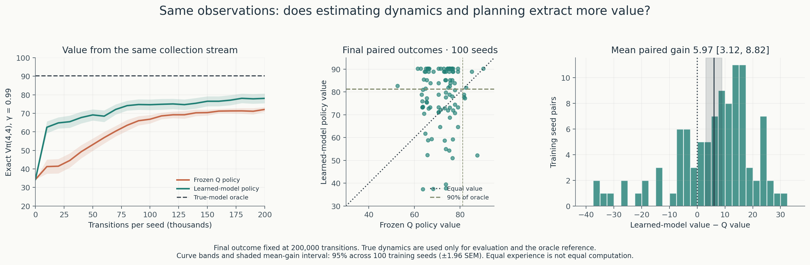

This is evidence that **model estimation plus planning extracted more value
on average from these observations**. The planner was neither reliably better
for every seed nor close to the oracle for every seed. Equal environmental
experience also does not mean equal computation.

### Did the model imagine the right future?

For each learned-model policy, we evaluate the **same policy** in its own model
and in the true environment, using $\gamma=0.99$ in both:

| Final diagnostic | Mean across seeds (95% CI) |
| --- | ---: |
| Predicted value in its own model | **105.0460 [100.8014, 109.2906]** |
| Actual value in the true environment | **78.0710 [75.4439, 80.6980]** |
| Paired prediction − actual value | **26.9751 [21.2637, 32.6864]** |
| Absolute prediction error | **27.2236 [21.5582, 32.8889]** |

The prediction RMSE is **39.6013**. **93/100** models overpredict their planned
policy's value. These are errors in predicted expected return, not discrepancies
between noisy simulation returns. The actual policy values use exact true-model
evaluation. Predicted values can exceed the true oracle because the estimated
dynamics describe a different world.

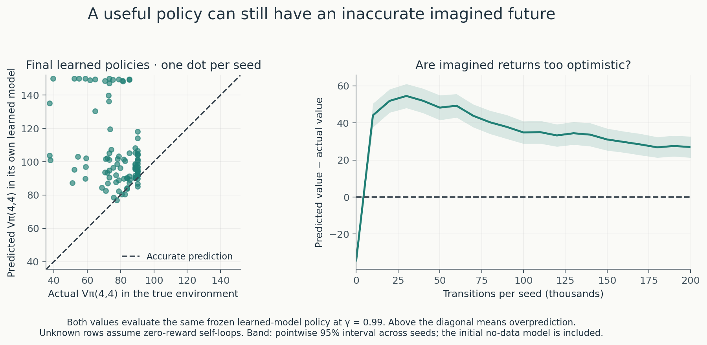

Coverage remains uneven: a mean **5.20 of 75 state/action rows** are unknown.
Even a visited row can have too little evidence. In preselected **seed 0**, the
action **harvest B at `(3,4)` was observed only once**, returning to `(3,4)` with
reward 1.5. Its estimated row therefore promises that reward and successor
forever, yielding imagined value **150** at that state. The planner's predicted
value from `(4,4)` is **149.2537**, but its actual value is **85.1536**; the same
seed's Q policy achieves **65.3646**. The rewarding self-loop is an observed
small-sample estimate, distinct from the **zero-reward** default for unknown
rows. This illustrates an optimistic model error; it does not establish that
this particular mechanism explains every seed's error or the whole Q gap.

### Frozen behavior: resources and harvest after learning stops

We ran **20 independent 1,000-step trajectories per training seed per final
policy**: 2,000 per policy and **4 million evaluation transitions** in total.
All start at `(4,4)`, with Q updates and epsilon exploration off. Greedy ties
retain the established uniform mixture. Each matched trajectory pair shares
regeneration uniforms and action-sampling uniforms, but applies them to its
own stocks and policy. These streams are independent of collection.

Stocks and depletion use **pre-action** states, and depletion means stock zero.
We first average the 20 trajectories within each training seed, then calculate
uncertainty across the 100 seed means. Neither the 2,000 trajectories nor their
individual time steps are treated as independent training replicates.

| Frozen-policy outcome | Q policy: mean (95% CI) | Learned-model policy: mean (95% CI) |
| --- | ---: | ---: |
| Mean stock A | **0.4510 [0.2668, 0.6353]** | **2.6442 [2.4917, 2.7966]** |
| Mean stock B | **3.4170 [3.3910, 3.4430]** | **2.9158 [2.7637, 3.0679]** |
| Either patch depleted | **76.77% [69.45%, 84.10%]** | **4.50% [1.37%, 7.62%]** |
| Both patches depleted | **0.68% [0.47%, 0.88%]** | **0% [0%, 0%]** |
| Harvested reward over 1,000 decisions | **725.88 [718.08, 733.68]** | **755.83 [726.63, 785.04]** |
| Reward per decision | **0.7259 [0.7181, 0.7337]** | **0.7558 [0.7266, 0.7850]** |

The paired stock-A increase is **2.1931 [1.9501, 2.4362]**, while stock B falls
by **0.5012 [0.3439, 0.6585]**. Either-patch depletion falls by **72.28
[64.44, 80.11] percentage points**. These policies distribute preservation
differently. Zero observed joint depletion is a finite-sample result, not a
general guarantee. Normal mean intervals are left untruncated in the saved
summary, so a rare per-patch depletion metric can have a negative lower bound.

The paired **undiscounted** harvest gain is **29.95 [−0.27, 60.17]** reward
over 1,000 steps: this interval includes zero. Thus the primary discounted-value
improvement does not establish a clear improvement in this secondary harvest
outcome. Saved results also include per-patch depletion, successful A/B
harvests, rests, failures, and finite-window discounted returns.

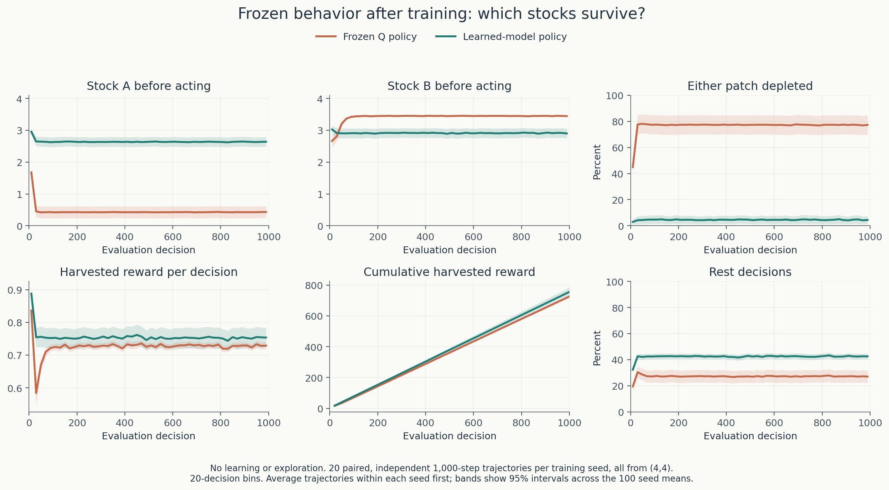

These are **frozen-policy outcomes**, not the exploratory training behavior
reported in experiment 2. The seed-0 policy maps and trajectory below were
chosen in advance, with **trajectory 0 and its first 120 decisions** fixed
before the run. The full 1,000-step illustration is saved; population claims
come from all seeds.

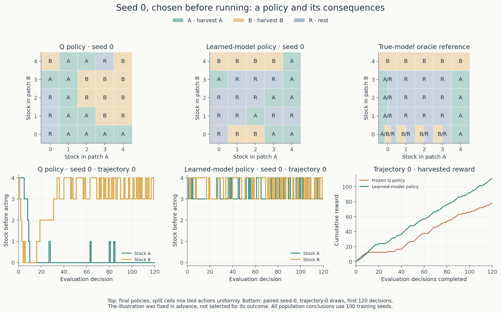

### Runtime, saved evidence, and reproduction

On the existing Python 3.10.12 / NumPy 1.26.4 / Matplotlib 3.10.9 WSL CPU
environment, using one OpenBLAS thread:

| Phase | Measured wall time |
| --- | ---: |
| Collection, Q updates, and count/reward accumulation | **28.253 s** |
| Empirical estimation and planning, all 21 checkpoints | **0.226 s** |
| Final checkpoint's estimation/planning alone | **0.0108 s** |
| True-model checkpoint policy evaluation | **0.0415 s** |
| Frozen trajectory generation and aggregation | **1.877 s** |
| Complete experiment invocation, including checks, saving, and initial plotting | **35.308 s** |

Collection time excludes snapshot copies and archive I/O. Planning includes
normalization checks, policy evaluation in the estimated model, and policy
improvement; models needed **1–12** policy-iteration rounds. These are batched
NumPy CPU timings, not general complexity claims. The Q collector incurs no
model-planning cost; the additional planner uses the same experience with
additional storage and computation. Later figure-only regeneration is excluded
from the recorded experiment invocation.

```bash
source .venv/bin/activate
python check_learned_world_model.py
OPENBLAS_NUM_THREADS=1 python run_learned_world_model.py
# Rebuild the four figures without collection, planning, or evaluation:
python run_learned_world_model.py --plot-only
# An intentional independent reproduction preserves the completed outputs:
OPENBLAS_NUM_THREADS=1 python run_learned_world_model.py --output results/learned_world_model_repeat
```

The default invocation reuses completed outputs. If collection has been saved
but later stages are incomplete, it reuses that archive after checking source
hashes and configuration. The checks use a tiny synthetic model to verify
counts, separate seed data, unknown defaults, analytic values, and agreement
with the established value-iteration utility; they do not collect additional
foraging data. Runtime checks confirm normalization, count totals, residuals,
and agreement with the existing true-policy evaluator. **The full experiment
was run once**, with no sweeps or settings changed afterward.

[results/learned_world_model/](results/learned_world_model/) contains about
**4.5 MiB**:

| File | Contents |
| --- | --- |
| `collection.npz` | At all 21 checkpoints: Q, $N(s,a,s')$, $N(s,a)$, reward sums, cumulative collection runtime; final collection RNG states. |
| `results.npz` | Both policies and exact values at every checkpoint, own-model predictions, final estimated transition/reward arrays and unknown mask, final Q/counts, planning rounds/residuals/times, unchanged oracle reference. |
| `frozen_behavior.npz` | Per-trajectory metrics, within-training-seed averages and binned curves, all evaluation seed IDs, complete seed-0/trajectory-0 stocks/actions/rewards and shared draws. |
| `summary.json` | Mean/paired uncertainty, oracle-threshold fractions, replay comparisons, model-prediction errors, coverage, and frozen behavior. |
| `manifest.json` | Fixed configuration, collection seeds and evaluation-seed recipe, information boundaries, source/baseline hashes, versions, runtime, and reproduction commands. |
| `run.log` and four PNG figures | Single-run progress and figures regenerated from the saved arrays. |

Use `numpy.load(path, allow_pickle=False)`. Collection arrays start with
**checkpoint × seed**; successor counts add **state × action × next state**.
Policy/value arrays start with **checkpoint × method × seed**, where methods
are `[Q-learning, learned-model planning]`. Predicted values start with
**checkpoint × seed**. Frozen trajectory metrics use **method × seed ×
trajectory × metric**; seed curves use **method × seed × bin × metric**.
Axes and metric names are saved, and checkpoint models can be reconstructed
from their counts without replaying experience.

Read [learned_world_model.py](learned_world_model.py) for the estimator and
planner, [run_learned_world_model.py](run_learned_world_model.py) for collection
and separate evaluation, and
[learned_world_model_figures.py](learned_world_model_figures.py) for plotting.
Existing environment, learner, numerical summaries, and plotting utilities
are reused without modifying their source.

### Interpretation and one next hypothesis

The improvement shows that **empirical model estimation plus planning extracted
more value from this fixed experience on average**. It does **not** isolate one
cause of Q-learning's shortfall. Finite data, uneven state coverage, constant
alpha, noisy bootstrap targets, different ways of reusing observations, and
additional computation remain entangled. Nor does it establish that model-based
methods always win: this run contains large losses as well as gains.

**Next hypothesis:** treating rarely observed transitions as uncertain, instead
of planning as if their observed frequencies were exact, would reduce optimistic
prediction errors and severe policy failures on the **same saved data**. A future
comparison could fix a conservative planning rule in advance, then test its
calibration and final true-policy value without collecting more experience.
That follow-up has not been run; there is no guarantee that reducing optimism
would improve value rather than make the planner too cautious.

## Experiment 4: does caution about scarce evidence improve model-based decisions?

**Hypothesis:** a fixed penalty for poorly observed actions will reduce reliance
on scarce evidence, overprediction, and severe policy failures. It may also
make the chosen policy excessively cautious. This is our heuristic extension
of experiment 3, not a calibrated uncertainty method or a textbook result.

We used **all 100 seeds and all 21 saved checkpoints** in
`results/learned_world_model/collection.npz`. There was **no new collection,
Q-learning, or baseline planning**. Each seed retains its own counts, empirical
transition probabilities, and observed reward averages. No data are pooled.
All existing code, environment rules, and result files remain unchanged.

### One fixed intervention; three different values

For planning only, with coefficient **1.0 fixed in reward units before running**:

$$
c(s,a)=\frac{1.0}{\sqrt{\max(N(s,a),1)}},\qquad
\widetilde r(s,a)=\widehat r(s,a)-c(s,a).
$$

The coefficient was not tuned against the true model, and no alternatives
were swept. This is a **count-based heuristic, not a calibrated confidence
bound**. Negative planning rewards are retained without clipping. For an
unknown row, the empirical model still assumes zero reward and a self-loop;
its **planning** reward becomes −1. That default remains an assumption rather
than observed knowledge. The actual world still pays 1 for a successful A
harvest, 1.5 for a successful B harvest, and zero otherwise.

We reuse policy iteration at **$\gamma=0.99$**, starting each model from a
uniform policy and mixing ties within absolute tolerance $10^{-10}$, with
zero relative tolerance. All policies are selected and saved **before loading
the true model**. For each new policy $\pi$, we distinguish:

| Quantity | Transitions | Immediate reward | Meaning |
| --- | --- | --- | --- |
| **A: internal planning score** | Empirical $\widehat P$ | Penalized $\widetilde r$ | Objective used to choose the policy |
| **B: predicted harvest return** | Same empirical $\widehat P$ | Original empirical $\widehat r$ | What that model predicts the policy will earn |
| **C: actual harvest return** | True $P$ | True environmental $r$ | Exact value of the frozen policy in the real experiment world |

All three solve the corresponding Bellman policy-evaluation equation. **B − C
is the prediction error.** A smaller A does not establish better prediction.
For a fixed policy, B − A equals its expected discounted sum of penalties in
the empirical model; we check that reward-accounting identity numerically.

The estimated dynamics have **not become more accurate**. The intervention
changes the policy selected from the same model. In Chapter 3 terms, dynamics,
rewards, policies, and value functions are distinct: changing the reward used
by a planner can change its policy, while the true reward and true dynamics
stay fixed. **Policy iteration is a Chapter 4 preview (§4.3)**. Q-learning,
the earlier §6.5 preview, is not run in this experiment.

### Primary endpoint: improved average and lower tail, with losses retained

The primary endpoint is **exact true-environment $V_\pi(4,4)$ at $\gamma=0.99$**
using the fixed **200,000-transition checkpoint**. Q and unpenalized policies
and values are loaded from experiment 3. The oracle is the saved experiment-1
reference. Earlier checkpoints supply descriptive curves only; the slightly
higher penalized mean at 190,000 transitions is not substituted for the endpoint.

Mean intervals are **mean ± 1.96 SEM across 100 independent training seeds**.
Differences are paired within training seed before calculating uncertainty.
Fractions use Wilson 95% intervals; the 10th percentiles are descriptive sample
quantiles. Intervals are pointwise and unadjusted for multiple comparisons.

| Policy | Mean final true value (95% CI) | 10th percentile | Seeds ≥90% of oracle (Wilson 95% CI) |
| --- | ---: | ---: | ---: |
| Frozen Q | **72.1011 [70.8602, 73.3420]** | **64.0113** | **7/100 = 7% [3.43%, 13.75%]** |
| Unpenalized model | **78.0710 [75.4439, 80.6980]** | **58.8210** | **51/100 = 51% [41.35%, 60.58%]** |
| Count-penalized model | **81.5510 [80.3566, 82.7455]** | **75.7780** | **49/100 = 49% [39.42%, 58.65%]** |
| Saved true-model oracle | **90.2235** | — | Reference, not a learned seed population |

| Paired final comparison | Mean value difference (95% CI) | Improved / worsened / tied seeds |
| --- | ---: | ---: |
| Penalized − Q | **9.4499 [7.9959, 10.9040]** | **96 / 2 / 2** |
| Penalized − unpenalized | **3.4800 [0.9065, 6.0536]** | **42 / 40 / 18** |

Improved/worsened uses the established $10^{-10}$ absolute tolerance; “tied”
means tied in evaluated value, not necessarily the same policy in every state.
Penalized values range from **57.9985 to 90.2235**, compared with **37.3557 to
90.2235** for unpenalized planning. Their seed SD falls from **13.4033 to 6.0941**.
The worst penalized-minus-unpenalized difference is still **−14.8991**, while
the largest gain is **+52.7030**. Relative to Q, the worst difference is
**−15.2840**. No failing seed was removed.

The higher mean and 10th percentile support improved decisions and a less
severe lower tail at this setting. They do not imply uniform improvement:
**40 policies lose value**, the median falls from **81.6812 to 80.9850**, and
the fraction above the **81.2011** oracle threshold falls from 51% to 49%.
That small fraction difference is descriptive, not evidence of a reliable
population decline in threshold attainment.

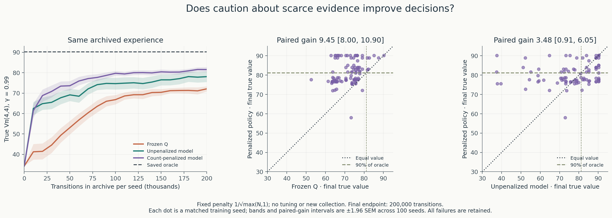

### Prediction error falls without improving the transition estimates

For the new policies, the final population means are:

| Value from `(4,4)` | Mean (95% CI) |
| --- | ---: |
| A: penalized planning score | **78.6835 [77.8940, 79.4730]** |
| B: original empirical-reward prediction | **88.6364 [85.6120, 91.6607]** |
| C: true-environment return | **81.5510 [80.3566, 82.7455]** |

The expected discounted penalty B − A averages **9.9529 [7.3515, 12.5543]**.
It is an objective adjustment, not a correction to model probabilities.
Calibration comparisons use each method's selected policy and its **original
empirical rewards**:

| Prediction diagnostic | Unpenalized policy | Count-penalized policy |
| --- | ---: | ---: |
| Mean B − C (95% CI) | **26.9751 [21.2637, 32.6864]** | **7.0854 [3.9365, 10.2342]** |
| Mean absolute error (95% CI) | **27.2236 [21.5582, 32.8889]** | **7.3987 [4.2779, 10.5195]** |
| Root mean squared error | **39.6013** | **17.4851** |
| Seeds with overprediction | **93/100** | **79/100** |

The paired change in B − C is **−19.8897 [−25.0111, −14.7683]**; the paired
change in absolute error is **−19.8249 [−24.8747, −14.7751]**. Both support
smaller prediction errors for the selected policies. Nevertheless, the largest
remaining error is **78.2585**. The heuristic does not eliminate optimistic
model exploitation or provide a guarantee that A bounds C.

These are differences between expected values, not noisy single-trajectory
returns. Better predictions for a changed set of policies do not imply that
any transition or reward estimate was repaired. The policy can avoid parts
of an inaccurate model while that model remains unchanged.

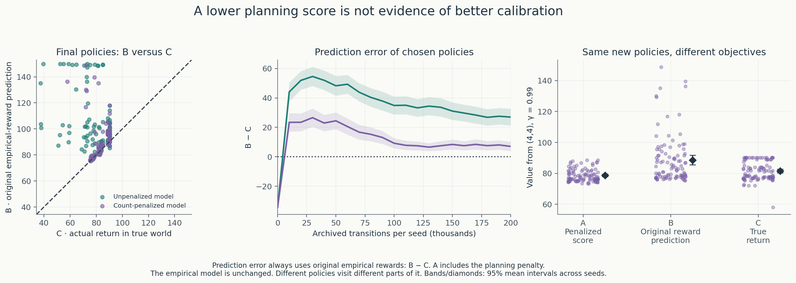

### Frozen resources: more harvest, but more depletion than unpenalized planning

Only the **new final policies** were simulated: **20 independent trajectories
per training seed, 1,000 steps each**, from `(4,4)`, with learning and epsilon
exploration off. Existing baseline outcomes were reused. The saved experiment-3
seed IDs generate exactly the same regeneration and action-sampling uniforms;
each policy applies them to its own stocks and action probabilities. The saved
seed-0 trace uniforms also match exactly.

We average each seed's 20 trajectories **before** estimating uncertainty
across seeds. Stocks and depletion are measured before acting; depletion means
stock zero. Harvested reward is the unchanged environmental reward, with no
penalty subtracted. The following intervals use the same 100 training seeds
as the primary comparison, not 2,000 independent learned-policy replicates.

| Frozen outcome | Q: mean (95% CI) | Unpenalized: mean (95% CI) | Penalized: mean (95% CI) |
| --- | ---: | ---: | ---: |
| Mean stock A | **0.4510 [0.2668, 0.6353]** | **2.6442 [2.4917, 2.7966]** | **1.3830 [1.1324, 1.6336]** |
| Mean stock B | **3.4170 [3.3910, 3.4430]** | **2.9158 [2.7637, 3.0679]** | **3.3975 [3.3447, 3.4503]** |
| Either patch depleted | **76.77% [69.45%, 84.10%]** | **4.50% [1.37%, 7.62%]** | **37.22% [28.24%, 46.19%]** |
| Both patches depleted | **0.68% [0.47%, 0.88%]** | **0% [0%, 0%]** | **0% [0%, 0%]** |
| Harvested reward over 1,000 steps | **725.88 [718.08, 733.68]** | **755.83 [726.63, 785.04]** | **788.56 [774.58, 802.54]** |
| Rest decisions | **27.13% [22.44%, 31.83%]** | **42.32% [40.24%, 44.39%]** | **33.88% [30.36%, 37.40%]** |

Paired penalized-minus-unpenalized harvest improves by **32.73 [3.71, 61.74]**
reward, and penalized-minus-Q by **62.68 [48.98, 76.38]**. However, relative
to unpenalized planning, mean stock A falls by **1.2612 [0.9873, 1.5350]**,
stock B rises by **0.4817 [0.3243, 0.6390]**, and either-patch depletion rises
by **32.72 [23.23, 42.20] percentage points**. Penalized policies rest **8.43
[4.68, 12.19] percentage points less** than unpenalized policies.

Caution about scarce evidence does not mean resting more or conserving both
patches. Here it produces a different resource tradeoff. These are secondary
frozen-policy outcomes, not training behavior or separate optimization targets.
Zero observed joint depletion is a finite-sample result, not a general guarantee.
Per-patch depletion, harvest rates, failures, and all paired summaries are saved.

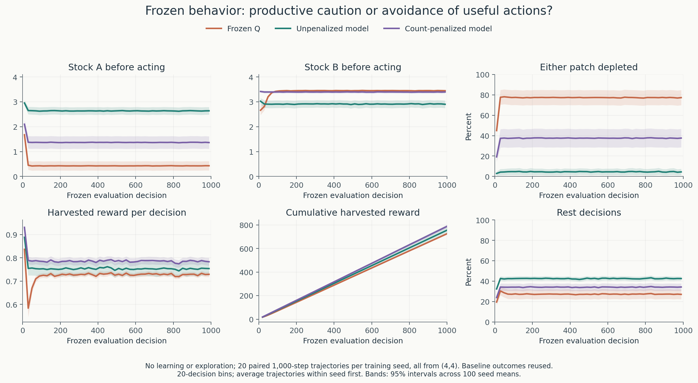

### Seed 0 at `(3,4)`: avoiding the loop can also be too cautious

Seed 0, state `(3,4)`, trajectory 0, and its first 120 decisions were selected
before the experiment. This is an illustration, not a showcase chosen after
seeing the outcomes. The final counts and planning rewards at that state are:

| Action | Visits | Original empirical reward | Penalty | Planning reward | Empirical probability of returning to `(3,4)` |
| --- | ---: | ---: | ---: | ---: | ---: |
| Harvest A | **4** | 1.0 | 0.5000 | **0.5000** | 0 |
| Harvest B | **1** | 1.5 | 1.0000 | **0.5000** | **1.0000** |
| Rest | **65** | 0 | 0.1240 | **−0.1240** | 0.7385 |

That one B observation returned to the same state with reward 1.5. The
unpenalized model consequently imagines a perpetual rewarding self-loop worth
**150**. Its true self-loop probability is only **0.3568875**, a separate
evaluation diagnostic that is never supplied to either planner.

The penalty leaves the false transition probability intact but reduces B's
planning reward to **0.5**. Repeating B forever would now score **50**.
The new policy instead chooses **harvest A**: its action scores, taking the
indicated first action and then following the new policy, are **73.7980**
for A, **73.5600** for B, and **73.4538** for rest. Thus it avoids acting on
the apparent B loop at this state. These comparisons include future scores;
they are not just a comparison of today's penalized rewards.

| Seed-0 policy | Action at `(3,4)` | A: internal score from `(3,4)` | B: original-model predicted return | C: actual return from `(3,4)` |
| --- | --- | ---: | ---: | ---: |
| Frozen Q | Rest | — | **62.9460** | **62.6431** |
| Unpenalized model | Harvest B | — | **150.0000** | **84.9582** |
| Count-penalized model | Harvest A | **73.7980** | **75.5628** | **75.2194** |

The Q row's B value is a diagnostic evaluation of that frozen policy in the
empirical model, not the Q table's own estimate. All rows evaluate continuation
under their respective complete policies, so they do not isolate the causal
effect of changing just one action.

From the primary start `(4,4)`, seed 0's penalized policy has **A = 75.7980**,
**B = 79.5580**, and **C = 76.7914**. Its actual value falls from the unpenalized
policy's **85.1536**, a loss of **8.3622**, despite much smaller prediction error.
The true-model oracle still chooses B at `(3,4)`: the original model's reason
for favoring B was inaccurate, but B can be a good real action. The penalty
changes other states too; in the preselected trace, its policy consumes stock A
down to zero while keeping B productive. The maps show fewer waits in states
where the unpenalized policy preserved both stocks.

This is concrete evidence of **excessive caution about evidence in some
decisions**, alongside the population benefit in the lower tail. It is not
evidence that a lower coefficient would be better, and no coefficient was
changed after inspecting it.

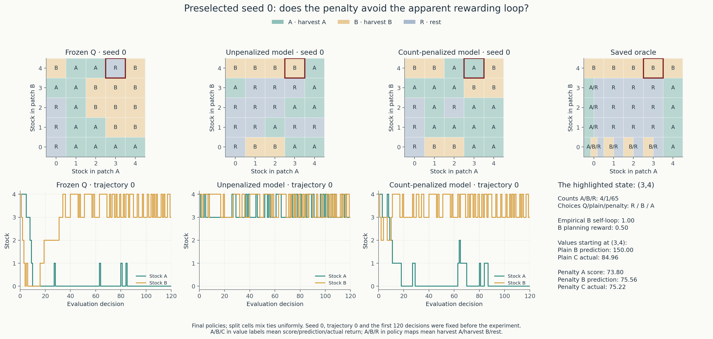

### Runtime and reproduction

This single run used the same Python 3.10.12, NumPy 1.26.4, and Matplotlib
3.10.9 WSL CPU environment, with one OpenBLAS thread. It took **0.329 s** for
empirical reconstruction, penalty calculation, policy iteration, and original-
reward predictions at all checkpoints; **0.103 s** for exact true evaluation
and diagnostics; and **1.236 s** for the new frozen simulation and aggregation.
The full invocation, including archive I/O, checks, and initial plotting, took
**6.708 s**. There were **zero collection transitions** and **2 million new
evaluation transitions**. Planning needed **1–10** policy-iteration rounds;
the maximum optimality residual was **$4.97\times10^{-14}$**.

```bash
source .venv/bin/activate
python check_count_penalized_planning.py
OPENBLAS_NUM_THREADS=1 python run_count_penalized_planning.py
# Plot saved data only, without planning or simulation:
python run_count_penalized_planning.py --plot-only
# Intentional reproduction; preserves the published outputs and still uses old counts:
OPENBLAS_NUM_THREADS=1 python run_count_penalized_planning.py --output results/count_penalized_planning_repeat
```

The default invocation reuses completed results. Saved policy selection can
also be reused after an interrupted evaluation if source/input hashes and
configuration match. Brief synthetic checks verify the fixed count formula,
unchanged original rewards, negative scores, and A/B accounting. Runtime checks
confirm final empirical arrays exactly match experiment 3, and saved evaluation
seeds and illustration draws match. No extended tests, parameter sweeps, or
additional training experiments were run.

[results/count_penalized_planning/](results/count_penalized_planning/) contains
about **4.4 MiB**:

| File | Contents |
| --- | --- |
| `planning.npz` | New checkpoint policies, A scores, B predictions, planning rounds/residuals/times, final counts and unchanged empirical model, penalties, planning rewards, and discounted penalty values. |
| `results.npz` | All three checkpoint policies and true values, both model-policy B predictions, new A scores, saved oracle, and state/method labels. |
| `frozen_behavior.npz` | Reused baseline outcomes plus new trajectory metrics, within-seed means/curves, evaluation seed IDs, and full preselected traces. |
| `summary.json` | Seed-level uncertainty summaries, paired comparisons, improved/worsened/tied counts, lower quantiles, prediction error, and frozen behavior. |
| `seed_0.json` | Counts, penalties, action scores/choices, A/B/C values, and empirical/true self-loop diagnostics for the fixed illustration. |
| `manifest.json`, `run.log`, four PNGs | Fixed configuration, source/input hashes, runtime, reproduction instructions, progress, and figures. |

Open with `numpy.load(path, allow_pickle=False)`. In `planning.npz`, policy
and value arrays begin **checkpoint × seed**. In `results.npz`, policies and
true values begin **checkpoint × method × seed**, with methods `[Q,
unpenalized, penalized]`; prediction arrays use only `[unpenalized, penalized]`.
Frozen metrics use **method × seed × trajectory × metric**, and curves use
**method × seed × bin × metric**. Axes and metric names are saved. The original
counts archive remains the source for all checkpoint models.

Read [run_count_penalized_planning.py](run_count_penalized_planning.py) for the
intervention and separate evaluation, and
[count_penalized_figures.py](count_penalized_figures.py) for plots. Existing
estimation, policy iteration, evaluation, statistics, and plotting utilities
are reused without changing their source.

### What this supports, and one next experiment

The fixed penalty **improved mean decisions, raised the lower tail, and reduced
prediction error**, while also sacrificing useful decisions for many seeds.
It did not improve threshold attainment or ecological preservation uniformly.
Count alone does not express which transition outcomes were observed or how
uncertain the relevant long-term consequences are. The coefficient is tied to
these reward units, and results are conditional on this small fixed world,
the existing Q-controlled data distribution, and this one heuristic.

**Next experiment:** at the same 200,000-transition budget, compare the existing
`(4,4)` collection starts with a fixed schedule cycling through all 25 starting
states, then apply the **same coefficient-1 penalty** and evaluate from `(4,4)`.
The hypothesis is that broader state coverage will reduce both fictitious
rewarding loops and avoidance of genuinely useful, sparsely observed actions.
Fix that protocol before running; the proposed experiment has not been run.

## Experiment 5: can a world model improve through its own actions?

**Scientific question:** does model-guided experience collection improve
subsequent planning compared with continuing Q-controlled collection? In
experiments 3–4, a model could change a decision but could not influence the
data it received. Here its policy acts in the world, receives new evidence,
updates the empirical model, and plans again. This is our continuation
experiment in the same unchanged world.

### A common history, then three equal additional budgets

Each of the **100 seeds** starts from its final experiment-3 Q table,
$N(s,a,s')$, $N(s,a)$, and reward sums after **200,000 transitions**. We load
`results/learned_world_model/collection.npz`; the original collection is **not
repeated**. Independent copies create three conditions:

| Collector | Exploitation action rule | What updates during new collection |
| --- | --- | --- |
| **A: Q-controlled** | Greedy in its current Q table | Original Q update with $\alpha=0.1$, plus its empirical counts and reward sums |
| **B: model-controlled** | Policy planned from its own empirical dynamics and original empirical rewards | Its empirical counts/rewards; unpenalized replanning after each rollout |
| **C: penalty-controlled** | Policy planned with the existing coefficient-1 count penalty | Its empirical counts/rewards; count-penalized replanning after each rollout |

All use **$\gamma=0.99$, $\epsilon=0.1$ uniform action exploration**, and
uniform greedy ties within absolute tolerance $10^{-10}$, with zero relative
tolerance. Each receives **exactly 50,000 additional transitions** in 50
rollouts of 1,000 steps from `(4,4)`: **250,000 total per condition per seed**.
The experiment adds **15 million collection transitions** across all three
conditions. B/C retain their copied historical Q tables but never use or
update them; their observed model statistics determine their actions.

B and C plan before the first new rollout and after every 1,000 transitions,
holding the planned policy fixed within that rollout apart from epsilon
exploration. C always subtracts $1/\sqrt{\max(N(s,a),1)}$ from the observed
reward mean for planning; negative scores are not clipped. There is no tuning.
Unknown empirical rows retain the documented **zero-reward self-loop**
assumption. Models use only their own condition's and seed's observations.

Fresh environment and action-selection RNG streams are derived from
`SeedSequence([20260929, 5, seed, role])`, using roles 0 and 100. Within a
seed, **all three conditions share the same draws**, applying them to their
own stocks, regeneration probabilities, and action distributions. The action
draw convention matches Q-learning: one uniform selects either the greedy
mixture or a uniform action; an independent uniform selects exploration.
These streams are distinct from both historical collection and frozen
evaluation streams. Different seeds remain independent.

Resets are collection boundaries. The final real successor is counted; Q
bootstraps from that actual successor before resetting. A reset generates
neither a transition nor a terminal event. Environmental rewards and the
world's growth rules remain unchanged.

### Hold the final planning rule fixed when comparing collectors

At **0 and every 5,000 additional transitions**, each condition's dataset
produces **both** an unpenalized and a count-penalized planned policy. This is
a **three-collector × two-planner** comparison. No rule is selected per seed
using true values. The main comparison was fixed in advance:

> At **250,000 total transitions**, compare **B's dataset with A's dataset**,
> using the **same unpenalized planning rule**, by exact true-environment
> $V_\pi(4,4)$ at $\gamma=0.99$.

Thus “A / unpenalized” below is a model-planned policy trained on the new
Q-controlled dataset; it is **not** the continued Q table's greedy policy.
This comparison asks how useful the collected data are for the same planner.
Collector C and penalized-extraction comparisons are secondary.

Collection and all checkpoint policy selection finish before true-model
arrays are loaded for evaluation. The saved oracle supplies a reference only.
At the common starting point, all three datasets reproduce the historical
unpenalized value **78.0710** and penalized value **81.5510** exactly within
numerical tolerance. Those are starting references, not the equal-budget
competitors. The final endpoint is used even where an earlier checkpoint
looks better.

### Final values: model-controlled collection improves subsequent planning

Intervals are **mean ± 1.96 SEM across the 100 training seeds**. Paired
differences are formed within seed first. Threshold fractions use Wilson
95% intervals, and 10th percentiles are descriptive sample quantiles.
Checkpoint bands and secondary intervals are pointwise and unadjusted.

| Collector / extraction rule | Mean true value (95% CI) | 10th percentile | Seeds ≥90% oracle (Wilson 95% CI) |
| --- | ---: | ---: | ---: |
| A / unpenalized | **81.1092 [78.9452, 83.2731]** | **68.0033** | **63/100 [53.22%, 71.82%]** |
| A / penalized | **82.7010 [81.6269, 83.7751]** | **76.5401** | **62/100 [52.21%, 70.90%]** |
| B / unpenalized | **89.9962 [89.8973, 90.0951]** | **88.8865** | **100/100 [96.30%, 100%]** |
| B / penalized | **89.9561 [89.8508, 90.0615]** | **88.8865** | **100/100 [96.30%, 100%]** |
| C / unpenalized | **84.0760 [81.8138, 86.3381]** | **67.6898** | **77/100 [67.85%, 84.16%]** |
| C / penalized | **86.4023 [85.3706, 87.4339]** | **77.2582** | **80/100 [71.12%, 86.66%]** |

The saved oracle is **90.2235**, and its 90% threshold is **81.2011**.
The **primary paired B-minus-A gain is 8.8871 [6.7258, 11.0483]** with
unpenalized extraction. **67 seeds improve, 1 worsens, and 32 tie** within
$10^{-10}$ in true value. Individual differences range from **−1.3370 to
+51.0945**. The loss is retained. Tied values from `(4,4)` need not mean
identical policies at all states.

B's final unpenalized values range from **88.8865 to 90.2235**, versus
**37.7920 to 90.2235** for A. All 100 B-derived policies cross the threshold
in this sample; that does not guarantee success for every future seed or world.

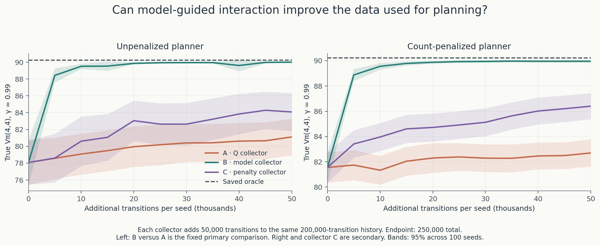

Secondary comparisons also favor B's data. With penalized extraction, B − A
is **7.2551 [6.2008, 8.3094]**. C improves over A by **2.9668 [0.9913, 4.9423]**
under unpenalized extraction and **3.7013 [2.6558, 4.7467]** under penalized
extraction, but trails B by **5.9203 [3.6737, 8.1669]** and **3.5539
[2.5329, 4.5748]**, respectively.

The final penalty's effect depends on the dataset. Penalized minus
unpenalized value is **1.5918 [−0.4226, 3.6063]** for A, **−0.0401
[−0.0850, 0.0048]** for B, and **2.3263 [0.4114, 4.2412]** for C. B's
well-performing data leave little room for the penalty to help; C's data
still support some poor unpenalized policies. We do not turn these six
outcomes into a per-seed “best of both planners” result.

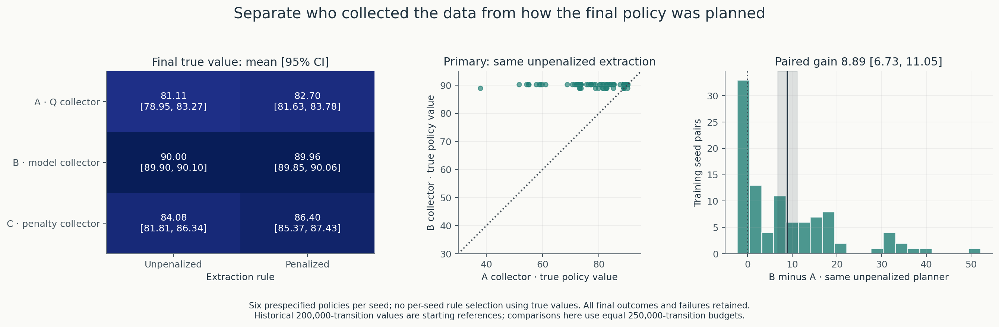

### Prediction accuracy is policy-dependent

Every prediction below evaluates the selected policy with **original
empirical rewards and empirical transitions**. Actual return uses the true
environment. For penalized policies, the internal score uses penalized rewards
and is saved separately; subtracting a penalty is not evidence of calibration.

| Collector / extraction | Mean original-reward prediction | Mean prediction − actual (95% CI) | Mean absolute error |
| --- | ---: | ---: | ---: |
| A / unpenalized | **103.5667** | **22.4575 [17.1702, 27.7449]** | **23.2804** |
| A / penalized | **89.7355** | **7.0345 [3.9204, 10.1485]** | **7.3737** |
| B / unpenalized | **90.0282** | **0.0320 [−0.0634, 0.1275]** | **0.3838** |
| B / penalized | **90.0238** | **0.0677 [−0.0176, 0.1529]** | **0.3596** |
| C / unpenalized | **93.7287** | **9.6527 [4.9821, 14.3233]** | **10.3389** |
| C / penalized | **86.4158** | **0.0135 [−0.0937, 0.1207]** | **0.4004** |

For the primary unpenalized comparison, B − A in absolute prediction error
is **−22.8967 [−28.0329, −17.7604]**. RMSE falls from **34.9969 to 0.4855**;
B's mean absolute error is **0.3838 [0.3252, 0.4424]**. The small signed mean
is therefore accompanied by small individual errors, not just cancellation.
Nevertheless, these are predictions for selected policies from `(4,4)`, not
a claim that all counterfactual actions are accurately modeled.

Mean **internal penalized scores** are **79.9322** for A's data, **88.8827**
for B's, and **84.9362** for C's. They differ from the original-reward predictions
above. The accounting identity—prediction minus score equals the expected
discounted sum of penalties—is checked at every checkpoint. C's penalized
policy is accurately predicted on average while achieving lower actual value
than B's policies: an accurate forecast need not imply a better decision.

### Coverage: behavior determines what the model gets to learn

We fixed thresholds of **fewer than 1, 10, and 100 observations** before
running. These describe scarcity; they are not guarantees of model accuracy.
Each dataset has 75 state-action rows:

| Dataset | Mean unvisited rows | Mean rows with N < 10 (95% CI) | Mean rows with N < 100 |
| --- | ---: | ---: | ---: |
| Common 200,000-transition history | **5.20** | **22.59 [21.55, 23.63]** | **43.30** |
| A after 50,000 additional | **4.37** | **19.97 [18.85, 21.09]** | **41.53** |
| B after 50,000 additional | **1.05** | **6.81 [6.18, 7.44]** | **23.89** |
| C after 50,000 additional | **2.68** | **12.48 [11.16, 13.80]** | **31.14** |

Of the 50,000 new transitions, mean observations of rows that initially had
**N < 10** are **27.09 [21.08, 33.10]** for A, **16,307.95 [14,328.59,
18,287.31]** for B, and **5,999.44 [4,352.12, 7,646.76]** for C. The same
epsilon does not imply the same coverage: a random action can only be taken
in a state the current behavior reaches.

B fills in many productive high-stock rows, but does not learn the entire
world uniformly. For example, **rest at `(4,0)`** remains below ten observations
in **77%** of B seeds, and **harvest B at `(4,0)`** in **71%**. Corresponding
fractions are **83% / 85%** for A and **83% / 85%** for C. At `(3,4)`, by
contrast, harvest B remains below ten observations in **29%** of A seeds,
**0%** of B seeds, and **14%** of C seeds. Every count and per-state scarcity
fraction is recoverable from the saved checkpoints.

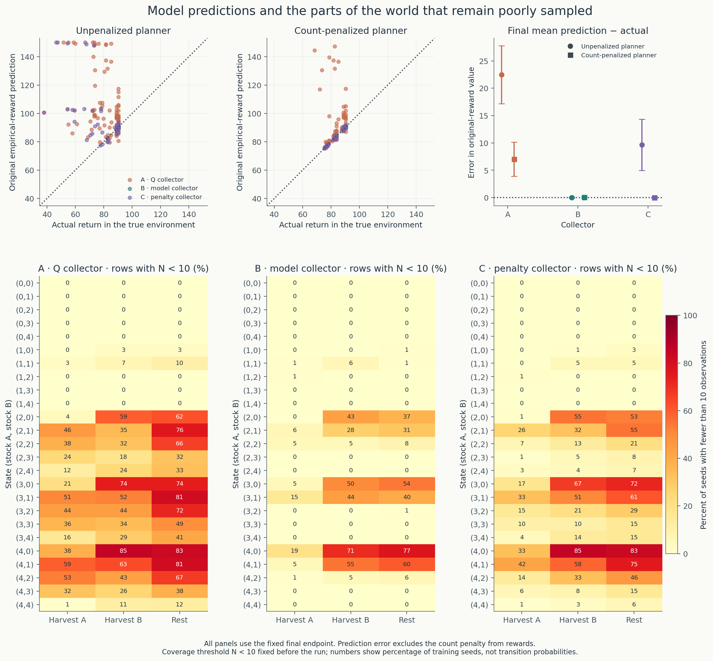

These measurements support a feedback mechanism: the model's policy changes
where it spends time; the new observations change the empirical probabilities;
replanning then changes subsequent behavior. They do not isolate coverage as
the only cause of the value gain. Which rows are sampled, their realized
outcomes, and the evolving policy all change together.

### New collection behavior versus frozen final behavior

During all 50 new rollouts, updates and $\epsilon=0.1$ exploration remain
active. Average each seed's rollouts first, then compute intervals over the
100 seeds:

| New collection measurement | A: Q-controlled | B: model-controlled | C: penalty-controlled |
| --- | ---: | ---: | ---: |
| Reward per decision (95% CI) | **0.6744 [0.6703, 0.6786]** | **0.8231 [0.8198, 0.8264]** | **0.7700 [0.7598, 0.7801]** |
| Mean stock A (95% CI) | **0.2121 [0.1601, 0.2641]** | **2.6226 [2.5373, 2.7079]** | **1.4759 [1.2667, 1.6850]** |
| Mean stock B (95% CI) | **3.2719 [3.2578, 3.2861]** | **3.3758 [3.3705, 3.3810]** | **3.3942 [3.3906, 3.3979]** |
| Either patch depleted (95% CI) | **85.97% [83.15%, 88.78%]** | **8.81% [7.83%, 9.80%]** | **40.56% [34.05%, 47.07%]** |

The model-controlled collector spends much more time with A still productive.
Its last-five-rollout mean stock A is **2.7854**, compared with **0.2487** for
A and **1.7942** for C. These training measurements are not the exact policy
values in the primary table.

For **each of the six final policies**, frozen evaluation uses **20 independent
1,000-step trajectories per training seed**, all starting at `(4,4)`, with
learning and epsilon exploration off and the established uniform tie rule.
We reuse the established evaluation seed recipe, independent of new collection,
and pair the regeneration and action uniforms across all six policies. This
adds **12 million evaluation transitions**. The 20 trajectories are averaged
within training seed before calculating uncertainty across seeds.

| Frozen policy | Mean stock A (95% CI) | Mean stock B (95% CI) | Either depleted (95% CI) | 1,000-step harvested reward (95% CI) |
| --- | ---: | ---: | ---: | ---: |
| A / unpenalized | **2.6786 [2.5382, 2.8191]** | **3.0483 [2.9123, 3.1843]** | **2.20% [0.12%, 4.29%]** | **788.76 [764.62, 812.90]** |
| A / penalized | **1.5203 [1.2863, 1.7543]** | **3.4256 [3.3888, 3.4624]** | **28.14% [19.75%, 36.52%]** | **802.07 [789.68, 814.46]** |
| B / unpenalized | **3.1974 [3.1255, 3.2694]** | **3.4656 [3.4649, 3.4663]** | **0% [0%, 0%]** | **888.27 [886.28, 890.26]** |
| B / penalized | **3.1682 [3.0915, 3.2449]** | **3.4656 [3.4649, 3.4663]** | **0% [0%, 0%]** | **887.59 [885.45, 889.73]** |
| C / unpenalized | **2.9063 [2.7670, 3.0455]** | **3.1874 [3.0581, 3.3167]** | **3.42% [0.43%, 6.40%]** | **822.26 [797.16, 847.36]** |
| C / penalized | **2.2213 [1.9732, 2.4693]** | **3.4655 [3.4644, 3.4667]** | **18.65% [11.30%, 25.99%]** | **844.59 [832.32, 856.87]** |

For the primary B-minus-A comparison with unpenalized extraction, frozen
harvest increases by **99.51 [75.46, 123.56]** reward, mean stock A by **0.5188
[0.3707, 0.6669]**, and mean stock B by **0.4173 [0.2813, 0.5533]**. Either-patch
depletion falls by **2.20 [0.12, 4.29] percentage points**. Stocks and depletion
use pre-action states. All harvest rewards are environmental rewards, with no
planning penalty subtracted.

Zero observed depletion is a statement about these frozen evaluations, not
a general guarantee. Per-patch depletion, rest, failed and successful harvests,
and discounted trajectory returns are also saved. Normal mean intervals are
left untruncated, so very rare outcomes can have a negative lower bound in the
summary. During collection, epsilon actions can still damage stocks that a
frozen policy preserves.

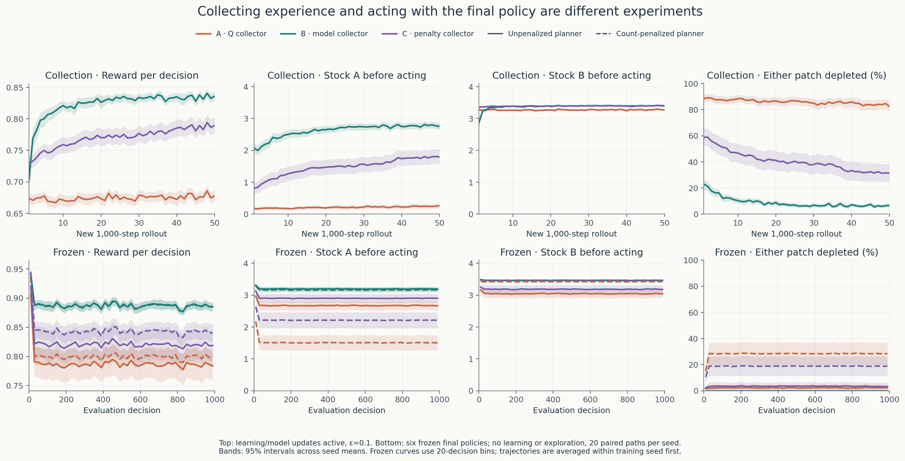

### Seed 0: acting corrects the apparent rewarding loop, with a delay under caution

The illustration stays fixed at **seed 0, state `(3,4)`, harvest B**. All three
copies begin with **one observation**, which returned to `(3,4)`, so the
empirical self-loop probability is **1.0**. The true probability **0.3568875**
is used only as a later diagnostic. Initial collector probabilities of B at
this state, including epsilon, are **3.33% for A**, **93.33% for B**, and
**3.33% for C**.

| Additional transitions | A: B visits / estimated loop probability | B: B visits / estimated loop probability | C: B visits / estimated loop probability |
| --- | ---: | ---: | ---: |
| 0 | **1 / 1.00000** | **1 / 1.00000** | **1 / 1.00000** |
| 5,000 | **1 / 1.00000** | **819 / 0.34799** | **1 / 1.00000** |
| 10,000 | **1 / 1.00000** | **1,925 / 0.35532** | **621 / 0.37037** |
| 50,000 | **1 / 1.00000** | **10,511 / 0.35696** | **9,019 / 0.35869** |

A collects no additional example of this action in this state, so the
incorrect row survives despite 50,000 new transitions elsewhere. B executes
the initially attractive action and observes that the promised loop frequently
fails to occur. Its model learns the stochastic outcome frequencies instead
of treating the original sample as certainty. B continues favoring this action
after its prediction is corrected; an overoptimistic justification did not
make the action itself bad.

C's penalty initially favors harvest A at `(3,4)` and its B-action probability
stays at the 3.33% exploration floor through the +5,000 checkpoint. By +10,000,
it favors B with probability 93.33% and has begun correcting the belief. The
5,000-step snapshots bracket this change; they do not locate the exact
1,000-step replanning event. At the final checkpoint, both B- and C-derived
seed-0 datasets yield **90.2235** under either extraction rule. A's dataset
yields **85.1536** unpenalized and **76.7914** penalized.

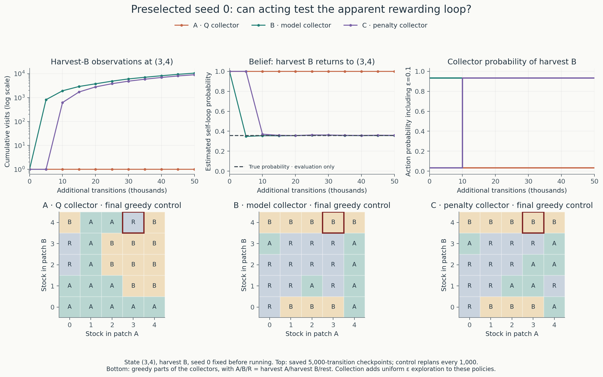

The preselected example therefore shows **delayed evidence gathering under
the penalty, not permanent avoidance**. Across the population, C visits fewer
initially scarce rows and leaves more poorly sampled regions than B. This is
consistent with caution slowing useful learning here, but the illustration
does not prove that one loop explains every seed's outcome. B's final maps
also need not match the oracle at poorly visited states outside its productive
region.

### What learned, chapter connections, and limits

The model does not learn by imagining more transitions from its current
belief. It learns from **new actual successors and rewards**: those increment
its counts and change the estimated transition probabilities and reward means.
Planning reuses those estimates to choose actions; those actions then affect
which observations become available. In this fixed world, letting the
unpenalized model guide interaction produced a dataset from which the **same
final planning rule** obtained higher value than from continued Q interaction.

**Chapter 3** supplies the MDP framework: actions change state distributions,
rewards define returns, and a policy determines its value function.
**Policy iteration previews Chapter 4**. Online interaction between acting,
model learning, and planning previews **Chapter 8, Planning and Learning with
Tabular Methods** ([Sutton and Barto, second-edition author draft](https://www.incompleteideas.net/book/bookdraft2018mar21.pdf)).
This implementation is **not a reproduction of Dyna-Q**: B/C solve their
empirical MDP by policy iteration at rollout boundaries, rather than making
simulated Q-learning updates. A continues the earlier §6.5 Q-learning preview.

The primary result supports model-guided **collection** in this experiment,
not a general ranking of model-based and model-free algorithms. It does not
compare equal computation: B/C plan repeatedly while A uses incremental Q
updates. All conditions inherit the same Q-generated history; the world is
small, stationary, fully observed, and repeatedly restarted for collection.
We did not test learning from scratch, changing worlds, other penalties,
other replanning schedules, or larger state spaces. The one primary loss,
poor secondary policies, and nonmonotonic checkpoint curves are retained.

### Saved checkpoints, runtime, and reproduction

Measured on the same Python 3.10.12 / NumPy 1.26.4 / Matplotlib 3.10.9 WSL CPU
environment with one OpenBLAS thread:

| Phase | Wall time |
| --- | ---: |
| New collection, Q updates, count/reward accumulation, and rollout measurements | **35.243 s** |
| B/C control-policy planning before collection and after each rollout | **1.836 s** |
| Both-rule extraction and reward-accounting checks at the 11 checkpoints | **1.568 s** |
| Exact evaluation, historical-reference checks, and seed-0 diagnostics | **3.118 s** |
| Frozen evaluation of the six final policies | **9.189 s** |
| Complete experiment invocation, including saving and initial plotting | **65.231 s** |

Collection time excludes planning and checkpoint I/O. The largest checkpoint
optimality residual was **$5.68\times10^{-14}$**. These are implementation-
and machine-specific times. Equal environmental experience does not make the
computational or storage costs equal.

```bash
source .venv/bin/activate
python check_model_guided_collection.py
OPENBLAS_NUM_THREADS=1 python run_model_guided_collection.py
# Regenerate the five figures from saved results; no collection or evaluation:
python run_model_guided_collection.py --plot-only
# Intentional reproduction from the old 200,000-transition histories:
OPENBLAS_NUM_THREADS=1 python run_model_guided_collection.py --output results/model_guided_collection_repeat
```

The default command reuses completed outputs. If interrupted during collection,
the same command resumes from the latest complete **5,000-additional-transition
checkpoint**, after validating configuration and source/history hashes. Each
checkpoint is written through an atomic file replacement and includes model
statistics, Q copies, the next rollout's collector policies, RNG states,
accumulated runtimes, and prior rollout metrics. Collection resumes at a reset
boundary. Any unsaved tail after an interruption is deterministically repeated
from the saved RNG state and is not counted twice. The original history is
never replayed.

The fixed experiment ran **once, without interruption or tuning**. Brief checks
covered independent copied condition state, paired action-draw conventions,
transition counting and the actual-successor Q bootstrap, and RNG restoration.
Saved-data checks confirmed the common initial histories, exactly 250,000
visits per condition/seed, unchanged B/C Q copies, fresh collection seed IDs,
the within-seed frozen aggregation, and that resuming the completed checkpoint
made **zero** further environment calls. The original world and all previously
tracked source/results files, except this README, were preserved byte for byte.

[results/model_guided_collection/](results/model_guided_collection/) contains
about **13.5 MiB**:

| File | Contents |
| --- | --- |
| `checkpoint_000000.npz` through `checkpoint_050000.npz` | Additional/total budgets, all sufficient statistics, Q copies, both extracted policies and predicted/internal values, collector greedy/epsilon policies, rollout measurements, RNG states, times, and planning diagnostics. |
| `results.npz` | All checkpoint policies, true values, original-reward predictions, internal scores, visits, collector action probabilities, collection measurements, labels, and the saved oracle reference. |
| `frozen_behavior.npz` | Six policies' per-trajectory outcomes, within-training-seed averages/curves, evaluation seed IDs, and seed-0 trajectory-0 full traces. |
| `seed_0.json` | Checkpoint counts for harvest B at `(3,4)`, observed loops and estimated probabilities, all collector action probabilities, and predicted/actual values. |
| `summary.json` | Primary and secondary paired comparisons, value quantiles, oracle-threshold fractions, prediction errors, coverage/poorly sampled rows, collection and frozen behavior. |
| `manifest.json`, `run.log`, five PNGs | Fixed protocol, fresh collection seeds, source/history hashes, runtime, reproduction commands, progress, and figures. |

Open archives with `numpy.load(path, allow_pickle=False)`. Checkpoint counts
start with **collector × seed**, with successor counts ending in **state ×
action × next state**. Result policies/values start with **checkpoint ×
collector × planner × seed**. Collectors are `[A, B, C]`; planners are
`[unpenalized, count-penalized]`. Frozen trajectory metrics use **collector ×
planner × seed × trajectory × metric**; frozen curves use **collector ×
planner × seed × bin × metric**. Collection measurements use **collector ×
rollout × seed × metric**. Names and checkpoint budgets are saved explicitly.

[model_guided_collection.py](model_guided_collection.py) handles independent
continuations, action selection, planning, and resumable checkpoints;
[run_model_guided_collection.py](run_model_guided_collection.py) performs the
separate evaluation and summaries;
[model_guided_figures.py](model_guided_figures.py) uses saved arrays only.
The existing environment, Q update, model estimation, policy iteration,
count penalty, statistics, and frozen-evaluation routines are reused.

**One next task:** compare adaptive collector B with a collector that keeps
its **initial experiment-3 unpenalized policy fixed** throughout the same
50,000 additional transitions, retaining epsilon 0.1 and updating counts.
Use the same paired fresh streams and final unpenalized extraction. This
would test whether repeated replanning is needed, or whether that initial
policy already visits enough useful states to explain most of the gain.
The current result changes both behavior and its subsequent adaptation;
this proposed ablation has not been run.

## Textbook connection

We consulted Sutton and Barto, *Reinforcement Learning: An Introduction*,
second edition, **Sections 3.1, 3.3, 3.5, and 3.6** for the agent–environment
interface, discounted returns, policies, state/action values, and Bellman
equations ([book text](https://studylib.net/doc/27814306/reinforcement-learning--an-introduction)).
Value iteration previews **Section 4.4**. The numerical world and experiments
in this repository are original; they are not the book's recycling-robot or
gridworld examples.
