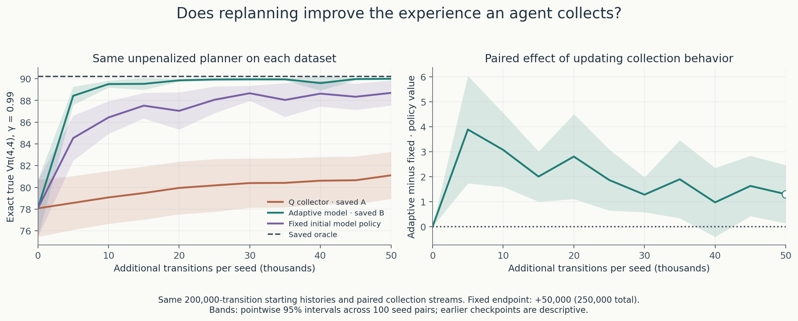

# Learning to leave something for tomorrow

**Does replanning improve the experience an agent collects?**

In this small foraging world, harvesting changes what can be harvested later.
The agent observes two resource stocks and chooses harvest A, harvest B, or rest.
We use NumPy experiments to connect Sutton and Barto’s Chapter 3 MDP framework
to learning models and choosing actions from them.

**Our strongest current result:** model-controlled collection produces much
better data for subsequent planning than continued Q-controlled collection.
At the same **250,000 transitions per seed**, mean true policy value is
**90.00 versus 81.11**, a paired gain of **8.89 [6.73, 11.05]** across 100 seeds.
This is the completed Experiment 5 comparison, reused here without rerunning it.

**Experiment 6 isolates the added benefit of replanning.** Keeping the initial
model policy fixed during the additional 50,000 transitions already achieves
**88.69**. Updating behavior every 1,000 transitions raises that to **90.00**:
paired gain **1.30 [0.14, 2.47]**, with **26 seeds improved, 9 worsened, 65 tied**.
The initial policy accomplishes much of the improvement; replanning adds
reliability and improves behavior while collecting experience.



All policies in this figure are extracted by the **same unpenalized empirical-model
planner**. The Q label identifies who collected the data, not the final planning
rule. The left panel shows means; the right shows paired differences. Shading is
95% uncertainty across training seeds. The primary endpoint is fixed at
**+50,000 transitions, 250,000 total**; earlier checkpoints are descriptive.

| Collector | Final true value, mean [95% interval] | 10th percentile | At least 90% of oracle |
| --- | ---: | ---: | ---: |
| Continued Q-learning, saved A | 81.11 [78.95, 83.27] | 68.00 | 63/100 |
| Fixed initial model policy, new | 88.69 [87.54, 89.85] | 88.89 | 95/100 |
| Adaptive model policy, saved B | 90.00 [89.90, 90.10] | 88.89 | 100/100 |

The saved oracle value is **90.2235**. Values are exact discounted returns
$V_\pi(4,4)$ at $\gamma=0.99$ in the unchanged true environment, evaluated only
after policy selection. The new collector starts from Experiment 3’s **200,000**
observations and Experiment 5’s **initial** policy, with the exact same paired
collection streams as Experiment 5. Its behavior policy never changes, but its
model keeps learning. Only this one condition was collected: **5 million new
transitions**, followed by frozen evaluation of its newly extracted final policies.

The extra gain from replanning is uneven. The median paired difference is zero;
five fixed-collector policies miss the 90%-oracle threshold, with a minimum value
of **37.25**, while adaptive B’s minimum is **88.89**. Both have the same 10th
percentile, so that statistic alone misses these failures. The approximate mean
interval is sensitive to the skewed seed distribution; all failures remain in it.
At +5,000 transitions, the descriptive gain was **3.89 [1.74, 6.04]**. This earlier
advantage does not replace the final comparison.


**Better data is more specific than broader coverage.** Fixed collection leaves
slightly fewer rows below ten observations than adaptive collection: **6.33 versus
6.81** of 75 state-action rows, on average. Yet its final policies have larger
mean absolute prediction error: **2.79 versus 0.38**. The paired adaptive-minus-fixed
change is **−2.41 [−3.78, −1.04]**. These predictions use the original empirical
rewards, not a penalty. Coverage totals alone do not identify which evidence is
useful for the policy being chosen.

**Seed 0 explains what the initial policy already accomplishes.** At `(3,4)`,
harvest B initially appeared to return to the same state with probability one,
based on a single observation. Fixed collection increases its count to **13,967**
and estimates **0.3553**, close to the true **0.3569**. Adaptive collection gets
**10,511** observations and estimates **0.3570**. Both choose harvest B with
probability **0.9333** at the displayed collection checkpoints. Fixed behavior
can test and correct this belief without changing that action.


The fixed collector’s final extracted policy differs from its collection policy.
For seed 0, it reaches value **88.89**, compared with **85.15** for the initial
greedy policy. Adaptive B reaches **90.22**. Their final policies differ only at
`(3,3)`: harvest A for the fixed dataset, rest for the adaptive dataset. Correcting
the original apparent loop is therefore not enough to explain the remaining gap.

During collection, adaptive B earns **0.823** reward per decision versus **0.705**
for fixed behavior; either stock is depleted **8.81% versus 24.11%** of the time.
After collection, the extracted final policies earn **888.27 versus 872.63** reward
over 1,000 frozen decisions: paired gain **15.65 [2.11, 29.18]**. These are separate
measurements: collection includes exploration; frozen evaluation has none.
[Resource curves](results/replanning_ablation/collection_and_frozen_resources.png)
and [coverage curves](results/replanning_ablation/coverage_and_error.png) show both
learning and behavior. Twenty evaluation trajectories are averaged within each
training seed before computing uncertainty across seeds.

**What learned?** A Q table estimates how valuable an action is. A learned world
model records how often each successor followed an action and the rewards that
were observed, then plans through those estimates. In this ablation both models
learn new dynamics from experience; only one updates the policy that gathers it.
Chapter 3 explains the connection: **a policy changes the state distribution and
therefore the experience available for learning**. Policy iteration previews
Chapter 4; using updated models to guide interaction previews Chapter 8.
Q-learning remains a §6.5 preview. This is our original experiment, not Dyna-Q.

The result is limited to this small, fully observed, stationary world, these
histories, this exploration rate and budget. It supports a modest additional
benefit from adaptive behavior, not a universal advantage or an explanation of
every Q-learning shortfall. An interval containing zero at another checkpoint
would not establish equivalence. **Next hypothesis:** one early replan at +5,000,
then fixed behavior for the remaining 45,000 transitions, may retain much of the
adaptive collector’s reliability. That single new condition would test whether
repeated updating is needed after the initial correction; it has not been run.

Detailed protocols, seed-level uncertainty, resource tables, runtime, archive
layout, and reproduction commands are in the
[Experiment 6 notes](notes/replanning_ablation.md). The completed run took **8.73 s**
for collection and **0.23 s** for evaluation-policy extraction, with no new control
planning; runtime comparisons across runs are descriptive, not benchmarks.

To rebuild only the figures from saved results, from the repository root:

```bash
python run_replanning_ablation.py --plot-only
```

All previous code and numerical results are preserved. The earlier detailed
README now lives in [Experiments 1–5 notes](notes/experiments_1_to_5.md):

| Experiment | Question and measured result |
| --- | --- |
| [1: Supplied model](notes/experiments_1_to_5.md#exact-results-when-preferences-change) | At γ=0.99, planning preserves resources and reaches value 90.22 versus myopic 23.72. |
| [2: Q-learning](notes/experiments_1_to_5.md#experiment-2-learning-from-transitions) | A long horizon raises learned-policy value to 72.10, but only 7/100 seeds reach 90% of oracle. |
| [3: Same experience, learned model](notes/experiments_1_to_5.md#experiment-3-same-experience-learned-world-model) | Planning from Q’s observations gains 5.97 [3.12, 8.82], with large overprediction. |
| [4: Count penalty](notes/experiments_1_to_5.md#experiment-4-does-caution-about-scarce-evidence-improve-model-based-decisions) | Fixed caution gains 3.48 [0.91, 6.05] on average, but worsens 40 seeds. |
| [5: Model-guided collection](notes/experiments_1_to_5.md#experiment-5-can-a-world-model-improve-through-its-own-actions) | Adaptive model collection gains 8.89 [6.73, 11.05] over Q collection with the same final planner. |
| [6: Replanning ablation](notes/replanning_ablation.md) | Most of that improvement survives fixed initial behavior; adaptation adds 1.30 [0.14, 2.47]. |

The [world definition and Chapter 3 derivation](notes/experiments_1_to_5.md#the-world-harvest-first-then-regenerate)
remain unchanged. This is a stylized MDP, not an ecological calibration or a
textbook-environment reproduction. It follows our
[Chapter 2 bandit experiments](https://github.com/ReloadLightly/rl-changing-worlds).
