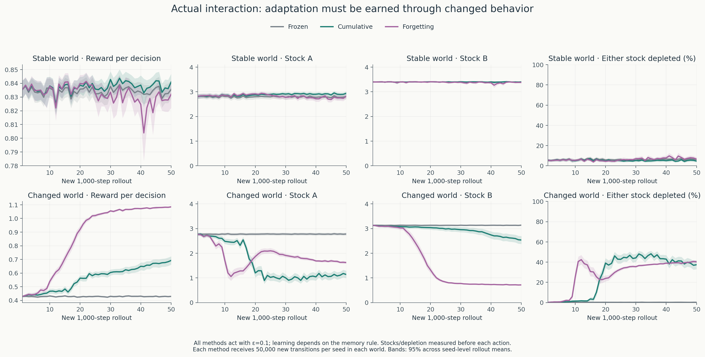

# Experiment 7: when a successful world model becomes outdated

[Overview and explanatory figures](../README.md) ·
[Saved evidence](../results/changing_regeneration/) ·
[Experiment 5 starting history](../results/model_guided_collection/checkpoint_050000.npz)

**Question:** does discounting older observations improve adaptation after an
unannounced dynamics change, and what does it cost when the world stays unchanged?
The hypothesis is a tradeoff: less influence from obsolete observations may speed
adaptation but discard useful evidence in a stable world.

The single fixed experiment supports that tradeoff. Forgetting reduces the
changed-world time-averaged oracle gap by **36.5648 [34.9434, 38.1861]**, improving
all 100 seeds. It increases the corresponding stable-world gap by **0.3115
[0.2081, 0.4149]**, worsening 83 seeds. Stable-world failures and prediction error
increase. The half-life and schedules were fixed before observing these results.

## Same successful history, two different worlds

All methods start from each seed’s **final model-controlled B history in
Experiment 5**, `checkpoint_050000.npz`: 250,000 observations per seed. The source
is collector index 1, with its unpenalized policy at planner index 0. Successor
counts, visits, reward sums, policy and model predictions are inherited. There is
no Q-learning update, historical replay, retraining, or pooling across seeds.
Each method/world combination owns independent copies of its statistics.

The agent observes stocks `(A,B)`, each in `{0,1,2,3,4}`, and chooses harvest A,
harvest B, or rest. Successful harvests remove one item and pay 1 or 1.5; rest and
failed harvests pay zero. Both patches regenerate independently **after harvesting**.
The original world and default functions are unchanged.

For post-harvest stock $m_i<4$ and $g=(0.3,0.6)$:

\[
p_i^{\text{stable}}(m_i)=g_i(0.1+0.9m_i/4),\qquad
p_i^{\text{changed}}(m_i)=g_i(1-0.9m_i/4).
\]

At capacity, both rules give zero regeneration. In the changed condition the
new rule applies from the **first additional transition**, and remains fixed
thereafter. Agents receive stocks and observed rewards/successors, with no regime
label, notification, true probabilities, or oracle values. This is a stylized
regime reversal, not an ecological claim.

Both learning methods use the same schedule in both worlds. A stable-world
agent does not receive an artificial signal telling it to retain its memory;
a changed-world agent does not receive a signal telling it to forget.

## Memory rules, interaction, and information boundaries

| Method | Model update | Behavior policy |
| --- | --- | --- |
| Frozen | Inherited statistics remain unchanged | Inherited policy remains unchanged |
| Cumulative | Add all new observations with unit weight | Replan after each 1,000 new transitions |
| Forgetting | Decay all evidence before each rollout, then add unit-weight observations | Replan after each 1,000 new transitions |

Each method gets fifty 1,000-step rollouts per seed per world, beginning at `(4,4)`.
That is **50,000 new observations and 300,000 total historical-plus-new observations**
per method/world/seed; **30 million new transitions** across six combinations.
All use γ=0.99, ε=0.1 uniform exploration, and the established uniform tie rule
with absolute tolerance `1e-10`. The actual last successor is counted. A reset is
a collection boundary, not a transition or terminal event.

For forgetting, before **every** new rollout, including the first:

\[
\rho=2^{-1000/5000}=0.8705505633,\qquad
(W_{sas'},W_{sa},R_{sa})\leftarrow\rho(W_{sas'},W_{sa},R_{sa}).
\]

Then each of the rollout’s observations contributes unit weight. This is
**blockwise exponential forgetting**, with a fixed evidence half-life of 5,000
new transitions. Historical observations are initially weighted equally; their
individual ages are not reconstructed. A block’s samples also receive the same
weight regardless of their position within that block. Discounting evidence is
different from γ=0.99 discounting future rewards.

Every positive row uses its **actual** weight:

\[
\hat p(s'|s,a)=W_{sas'}/W_{sa},\qquad
\hat r(s,a)=R_{sa}/W_{sa}\quad (W_{sa}>0).
\]

The denominator is not `max(weight,1)`. Only zero-weight rows use the established
zero-reward self-loop assumption; they remain unknown. The existing estimator
used by earlier experiments is untouched. There is no count penalty or clipping.
Separate cumulative actual successor counts, visits and reward sums record
observations for all methods, including Frozen; these diagnostic counts do not
enter Frozen or Forgetting model updates.

After 50 rollouts, forgetting’s total evidence weight is **7,961.6206**:

\[
250000\rho^{50}+1000\frac{1-\rho^{50}}{1-\rho}.
\]

Only **244.1406**, or **3.0665%**, of that total comes from the original history.
This is a sum of evidence weights, **not an effective sample-size estimate**.
Actual observations remain 300,000. A row can retain a much higher historical
fraction than the model-wide fraction if behavior stops visiting it. Positive
weights below one occur in a mean of **13.90 stable-world rows** and **9.15
changed-world rows** at the endpoint, making correct fractional normalization
substantive in this run.

Fresh per-seed streams use
`SeedSequence([20260929, 7, training_seed, role])`, with roles 0 for regeneration
and 100 for actions. The exact IDs are saved. In each rollout each environment
RNG draws `(1000,2)`, followed by each action RNG drawing `(1000,2)`, stacked along
the seed axis. The same draws are shared across all six combinations and applied
to each method’s own state. The first action draw samples either the policy CDF
or a uniform exploratory action; the second selects exploration. Different
worlds/policies therefore have paired randomness, not identical trajectories.
The initial rollout is identical across methods within a world, before replanning.

Existing empirical-model policy iteration selects policies using only that
method’s weighted statistics. All collection and policy selection finish **before**
true models are enumerated and separate oracles computed. `Memory` receives its
memory rule, not an environmental condition label. True-model arrays never feed
back into collection, fitting, planning, or stopping decisions.

## Primary tracking result and final policies

For each policy snapshot we solve the Bellman expectation equations exactly
from `(4,4)` in the **actual regime for that condition**, at γ=0.99. Policies are
frozen greedy policies with the established tie mixtures; evaluation has no ε
exploration. Each evaluated future assumes that condition’s regime continues,
without rollout resets. True oracle values are **90.2234993** in the stable world
and **118.7088417** in the changed world.

The fixed grid is the **51 policy snapshots at 0, 1,000, …, 50,000 new transitions**.
Resumable storage checkpoints every 5,000 retain all intervening snapshots. The
primary measure is

\[
L=\frac{1}{50000}\sum_{k=0}^{49}1000\,
\frac{[V^*(4,4)-V_{\pi_k}(4,4)]+[V^*(4,4)-V_{\pi_{k+1}}(4,4)]}{2}.
\]

This is a **policy-value tracking measure**, not realized online regret or the
sum of the rewards collected. The prespecified contrast is **Changed:
Forgetting − Cumulative in L**, with lower better. Endpoints have half weight
in this trapezoidal calculation. No favorable snapshot is selected.

| World | Method | Time-averaged oracle gap [95% interval] | Final true value [95% interval] |
| --- | --- | ---: | ---: |
| Stable | Frozen | 0.2273 [0.1284, 0.3262] | 89.9962 [89.8973, 90.0951] |
| Stable | Cumulative | 0.1548 [0.0774, 0.2322] | 90.1165 [90.0451, 90.1880] |
| Stable | Forgetting | 0.4663 [0.3744, 0.5582] | 89.6771 [89.0964, 90.2578] |
| Changed | Frozen | 76.7148 [76.1682, 77.2614] | 41.9940 [41.4474, 42.5406] |
| Changed | Cumulative | 63.6316 [61.5677, 65.6955] | 69.1005 [64.9673, 73.2336] |
| Changed | Forgetting | 27.0668 [26.2703, 27.8634] | 114.2245 [113.8794, 114.5696] |

| Forgetting − Cumulative | Paired difference [95% interval] | Improved / worsened / tied |
| --- | ---: | ---: |
| Changed time-averaged gap, primary; lower better | −36.5648 [−38.1861, −34.9434] | 100 / 0 / 0 |
| Stable time-averaged gap; lower better | +0.3115 [0.2081, 0.4149] | 12 / 83 / 5 |
| Changed final value; higher better | +45.1240 [41.0074, 49.2407] | 100 / 0 / 0 |
| Stable final value; higher better | −0.4394 [−1.0272, 0.1483] | 7 / 13 / 80 |

| World | Method | Final ≥90% oracle, Wilson 95% interval | Minimum final value |
| --- | --- | ---: | ---: |
| Stable | Frozen | 100/100 [96.30%, 100.00%] | 88.8865 |
| Stable | Cumulative | 100/100 [96.30%, 100.00%] | 88.8865 |
| Stable | Forgetting | 98/100 [93.00%, 99.45%] | 62.7810 |
| Changed | Frozen | 0/100 [0.00%, 3.70%] | 40.7382 |
| Changed | Cumulative | 6/100 [2.78%, 12.48%] | 40.7382 |
| Changed | Forgetting | 100/100 [96.30%, 100.00%] | 107.7227 |

Mean intervals follow the existing mean ±1.96 SEM convention across 100 training
seeds, with paired contrasts subtracted within seed before uncertainty. Ties
use absolute tolerance `1e-10`. Fractions use Wilson intervals. Seed-level arrays
are saved, and no failures are removed. Curve intervals are pointwise and
unadjusted. Normal mean intervals are not clipped to physical or oracle bounds;
this does not imply an individual policy exceeded its oracle. An interval
containing zero, such as stable final value, does not prove equivalence.


## The stable-world cost includes transient failures

Forgetting produces **35.97 [33.96, 37.98] state-level policy changes per seed**
over the 50 replans in the stable world, compared with **4.28 [3.29, 5.27]** for
cumulative memory. This counts changes in a state’s action distribution, not
randomly sampled exploratory actions. The paired increase is **31.69
[29.85, 33.53]**. Mean absolute changes in true value between snapshots are
**0.6441** versus **0.0465**; paired increase **0.5976 [0.4411, 0.7542]**.

At one or more post-start snapshots, **37/100 forgetting seeds** fall below 90%
of stable oracle value, versus **2/100 cumulative** and **0/100 frozen**. At the
final endpoint only two forgetting seeds remain below it. The worst snapshot
values are **34.4153** for forgetting and **40.8907** for cumulative. These
transient failures are retained in the primary integration, prediction curves,
and interaction outcomes. Cumulative memory also has occasional failures;
forgetting substantially increases their incidence here.

In the changed world both updating methods alter their behavior frequently:
55.01 versus 58.85 state-level policy changes for forgetting and cumulative,
respectively. More policy changes by themselves are not a measure of improvement;
their effects depend on the world and the resulting true values.

## Predictions under each agent’s own model

Predictions use the current policy’s own empirical transition probabilities and
**original observed rewards**. Frozen predictions retain the inherited model;
cumulative and forgetting predictions change. Rewards never acquire a penalty.
We compare these predictions with actual true-environment values of the same
selected policies.

| World | Method | Mean final prediction | Mean predicted − actual [95% interval] | Mean absolute error [95% interval] |
| --- | --- | ---: | ---: | ---: |
| Stable | Frozen | 90.0282 | 0.0320 [−0.0634, 0.1275] | 0.3838 [0.3252, 0.4424] |
| Stable | Cumulative | 90.1083 | −0.0082 [−0.0710, 0.0545] | 0.2493 [0.2102, 0.2884] |
| Stable | Forgetting | 90.3121 | 0.6350 [−0.0206, 1.2906] | 1.1127 [0.4822, 1.7431] |
| Changed | Frozen | 90.0282 | 48.0342 [47.3994, 48.6690] | 48.0342 [47.3994, 48.6690] |
| Changed | Cumulative | 81.2648 | 12.1643 [9.5857, 14.7428] | 12.7708 [10.3086, 15.2329] |
| Changed | Forgetting | 114.4013 | 0.1768 [0.0293, 0.3243] | 0.5628 [0.4595, 0.6661] |

Forgetting minus cumulative final absolute error is **−12.2080 [−14.6648, −9.7512]**
in the changed world, but **+0.8633 [0.2370, 1.4896]** in the stable world. Integrated
absolute prediction error uses the same fixed trapezoidal grid: its paired change
is **−15.0883 [−16.0320, −14.1445]** after the reversal and **+0.6012
[0.4888, 0.7136]** without it. Policy-specific prediction accuracy does not show
that every transition row became accurate.


For clarity, we also evaluate every selected policy under the **unchanged original
inherited model**. These are a separate set of predictions, not the current-model
predictions above. They were calculated from saved policies after the experiment,
without further interaction or policy selection. Mean errors can cancel, so
absolute errors are retained too.

| World | Final policy selected by | Original inherited-model prediction [95% interval] | Original prediction − actual [95% interval] | Mean absolute error |
| --- | --- | ---: | ---: | ---: |
| Stable | Frozen | 90.0282 [89.9042, 90.1523] | 0.0320 [-0.0634, 0.1275] | 0.3838 |
| Stable | Cumulative | 89.9702 [89.8183, 90.1220] | -0.1464 [-0.2933, 0.0006] | 0.5040 |
| Stable | Forgetting | 89.2419 [88.5509, 89.9328] | -0.4352 [-0.7021, -0.1683] | 0.7850 |
| Changed | Frozen | 90.0282 [89.9042, 90.1523] | 48.0342 [47.3994, 48.6690] | 48.0342 |
| Changed | Cumulative | 68.6987 [64.3028, 73.0947] | -0.4017 [-8.7365, 7.9330] | 34.3590 |
| Changed | Forgetting | 25.4673 [23.9639, 26.9708] | -88.7572 [-90.3740, -87.1403] | 88.7572 |

The inherited model predicts only **25.47** for the final changed-world forgetting
policies, whose actual value is **114.22**. The current forgetting models predict
**114.40**. The original model gives poor advice about which futures are valuable
after the reversal; adapting the model changes this assessment.


## Reward, stocks and depletion during actual interaction

These measurements include ε=0.1 exploration and the method’s prescribed model
updates. Stocks are measured before acting; depletion means either stock is zero.
The fifty rollout summaries are averaged **within seed** before across-seed
uncertainty. They are different outcomes from exact greedy-policy values.

| World | Method | Reward/decision [95% interval] | Stock A [95% interval] | Stock B [95% interval] | Either depleted %, [95% interval] |
| --- | --- | ---: | ---: | ---: | ---: |
| Stable | Frozen | 0.8342 [0.8309, 0.8375] | 2.7963 [2.7081, 2.8844] | 3.4008 [3.3992, 3.4023] | 6.206 [5.295, 7.117] |
| Stable | Cumulative | 0.8372 [0.8346, 0.8397] | 2.8823 [2.8172, 2.9473] | 3.3997 [3.3976, 3.4018] | 5.299 [4.620, 5.979] |
| Stable | Forgetting | 0.8322 [0.8305, 0.8339] | 2.8242 [2.7869, 2.8615] | 3.3848 [3.3804, 3.3893] | 6.264 [5.866, 6.662] |
| Changed | Frozen | 0.4283 [0.4239, 0.4327] | 2.7757 [2.7163, 2.8351] | 3.1332 [3.1326, 3.1338] | 0.232 [0.192, 0.272] |
| Changed | Cumulative | 0.5627 [0.5466, 0.5788] | 1.6000 [1.5345, 1.6655] | 2.9309 [2.8480, 3.0138] | 28.027 [26.755, 29.298] |
| Changed | Forgetting | 0.8721 [0.8650, 0.8792] | 1.8676 [1.8369, 1.8983] | 1.5356 [1.5030, 1.5682] | 28.941 [28.301, 29.580] |

| Paired Forgetting − Cumulative | Stable [95% interval] | Changed [95% interval] |
| --- | ---: | ---: |
| Reward per decision | −0.00494 [−0.00673, −0.00315] | +0.30938 [0.29700, 0.32176] |
| Stock A | −0.0581 [−0.1039, −0.0122] | +0.2676 [0.2121, 0.3231] |
| Stock B | −0.0149 [−0.0191, −0.0107] | −1.3953 [−1.4590, −1.3316] |
| Either depleted, percentage points | +0.9645 [0.4722, 1.4568] | +0.9139 [−0.3602, 2.1881] |

Frozen keeps stocks high in the changed world but earns little reward. The new
rule rewards a different resource-use pattern because regeneration is faster
at low post-harvest stocks. Higher depletion is not automatically a failure of
adaptation. There is no separate ecological welfare objective in this MDP.



## Preselected seed 0 and state (3,3)

This example was specified before the run. All three inherited policies favor
rest. The inherited model’s predicted action values `[harvest A, harvest B, rest]`
are **[87.51687, 87.10691, 87.58308]**. The rest row has 11,706 observations and
estimated self-loop probability 0.412096. The true probability is 0.410613 in
the stable world but 0.726513 after the reversal.

The table shows **all four possible successors of rest at (3,3)**; probabilities
are ordered `[(3,3), (3,4), (4,3), (4,4)]`. Full 25-state probability vectors for
all three actions at every snapshot are also archived.

| Model/rule | Rest successor probabilities |
| --- | --- |
| Inherited model / frozen throughout | [0.412096, 0.352896, 0.123954, 0.111054] |
| Stable true rule | [0.410613, 0.356888, 0.124388, 0.108113] |
| Stable cumulative, final | [0.408165, 0.356910, 0.125570, 0.109355] |
| Stable forgetting, final | [0.431935, 0.348313, 0.109764, 0.109988] |
| Changed true rule | [0.726513, 0.175988, 0.078488, 0.019013] |
| Changed cumulative, +10,000 | [0.503171, 0.300854, 0.110976, 0.085000] |
| Changed forgetting, +10,000 | [0.553815, 0.270923, 0.104639, 0.070622] |
| Changed cumulative, final | [0.572350, 0.261872, 0.102377, 0.063402] |
| Changed forgetting, final | [0.559533, 0.267856, 0.103259, 0.069352] |

Initially, rest is slightly ahead of harvest A. As evidence accumulates after
the reversal, both updating methods sometimes choose harvest A; forgetting
first does so at +2,000 and cumulative at +6,000, but both reverse those early
choices. **From +17,000 onward, forgetting selects harvest B** at this state.
Cumulative keeps alternating between rest and harvest A and finishes on rest.
The changed-world oracle favors harvest B; the stable-world oracle favors rest.

| Condition/method and snapshot | Predicted Q(A) | Predicted Q(B) | Predicted Q(rest) | Greedy action |
| --- | ---: | ---: | ---: | --- |
| Both / initial | 87.51687 | 87.10691 | 87.58308 | Rest |
| Changed cumulative / +10,000 | 79.37533 | 79.12261 | 79.42882 | Rest |
| Changed forgetting / +10,000 | 74.43859 | 74.23467 | 74.42337 | Harvest A |
| Changed cumulative / final | 70.67933 | 70.62307 | 70.69992 | Rest |
| Changed forgetting / final | 112.60131 | 112.78760 | 112.02117 | Harvest B |
| Stable cumulative / final | 87.89354 | 87.49507 | 87.95731 | Rest |
| Stable forgetting / final | 87.11965 | 86.83788 | 87.08322 | Harvest A |

These are action values calculated from each method’s model and planned
continuation values; they are not Q-learning table entries. While a deterministic
greedy action is chosen here, collection gives that action probability 0.9333
and each other action probability 0.0333. Full mixed-policy probabilities are
saved without collapsing ties.

**An important retained surprise:** forgetting’s final rest self-loop estimate
in the changed world is less accurate than cumulative memory’s. Forgetting’s
actual rest count stops at **15,906** by +30,000, while its evidence weight then
falls from **334.74 to 20.92** by +50,000. Normalized probabilities stay constant
when all existing evidence is multiplied by the same factor and no new sample
arrives. Of the final rest weight, **11.4316** still comes from the original
11,706 samples. Thus historical evidence remains over half this row’s weight,
even though it is only 3.07% of the entire model’s weight. Forgetting alone does
not discover an unobserved successor.

Cumulative memory finishes with **24,195 rest observations**, including all
11,706 historical ones. Frozen actually observes rest **38,128** times including
history, but deliberately keeps its fitted row at the original 11,706. This
illustrates why actual observation counts and model evidence must be distinguished.

In the stable world, forgetting first leaves rest at +13,000, reverses several
times, then chooses harvest A from +28,000 onward. Cumulative and frozen retain
rest throughout for this seed/state. Seed-0 final true values from `(4,4)` are
**90.2235 cumulative versus 88.8865 forgetting** in the stable world, and
**40.7382 versus 113.7745** after the change. The example illustrates both the
adaptation gain and stable-world cost without choosing a showcase seed afterward.
Action values depend on successors and future policies throughout the model;
this one row does not isolate the cause of every seed’s result.


## Chapter connections and limits

Chapter 3 supplies states, actions, transition dynamics, rewards, policies,
returns, and value functions. **Each constant regime is its own finite MDP.**
Across the hidden reversal, the same stock observation no longer has one
stationary transition law. The histories straddle two regimes, so treating all
observations as samples from one unchanged kernel is incorrect. Post-change
exact evaluations use the new fixed regime; they do not erase this distinction.
This is not presented as an unchanged stationary-MDP experiment.

A learned transition model estimates what comes next and what immediate reward
is observed, while a learned Q table estimates returns after actions. Discounting
old evidence changes the transition/reward estimates used for planning. Changed
policies then change the state distribution and which new evidence is collected.
Policy iteration previews Chapter 4; online model-guided adaptation previews
Chapter 8. Historical Q-learning remains a §6.5 preview. This is not Dyna-Q and
there are no simulated Q updates.

This single fixed half-life trades stale-history influence against sample
variability. The large initial memory slows even the forgetting agent: old
history still has substantial total weight for many rollouts. Smaller effective
row weights later permit noisy action rankings and policy changes in the stable
world. The measurements support the tradeoff but do not independently isolate
all paths through model error, visitation changes, and planning.

Limits include one stationary regime on either side of one abrupt hidden
change, a small fully observed stock space, shared inherited histories, ε=0.1,
and one fixed half-life. The change time and rule are fixed by the experiment,
not randomized ecological events. No half-life sweep, change detector, privileged
reset, or best-checkpoint selection was used. All 100 successes after the reversal
refer to this sampled set of seeds and this 90% threshold, not universal optimality.
Forgetting’s remaining gap to the new oracle and its unstable-world-model rows
are retained. Computation is not equalized with the frozen reference.

One evidence-based next question is whether an observation-based prediction-error
signal can control forgetting without a regime label, retaining adaptation while
reducing stable-world failures. Such a rule would need to be fixed before a new
experiment; no detector or tuning was added here.

## Runtime, saved evidence, and reproduction

The run used Python **3.10.12**, NumPy **1.26.4**, Matplotlib **3.10.9**, one
OpenBLAS thread, and a local CPU. Timings cover all six method/world combinations:

| Stage | Seconds |
| --- | ---: |
| Interaction, observations and rollout metrics; 30 million transitions | 39.4166 |
| Empirical planning and snapshot diagnostics | 3.1827 |
| Separate true-model enumeration, both oracles and exact policy evaluation | 5.0036 |
| Full invocation including saving and plotting | 60.5967 |

Explicit inherited-model predictions were added from saved policies in a separate
**2.45 s** analysis pass; no collection, policy selection, or primary outcome was
changed. The manifest preserves the original run’s source hashes and the final
analysis source hashes. These are descriptive runtime measurements, not a hardware benchmark. Frozen
receives the same environmental experience but performs no model updates or
replanning. The brief deterministic checks cover the reversed probabilities,
harvest-before-regeneration, unchanged original rule, positive fractional and
zero-weight normalization, the five-block half-life, and independent memories.
During collection, assertions check frozen evidence, actual transition/reward
totals, successor-row sums, predicted total discounted mass, and identical first
rollouts across methods. Existing policy-iteration residual checks also pass.
No extended test suite or repeated experiment was run.

[`results/changing_regeneration/`](../results/changing_regeneration/) contains
approximately **61.6 MiB**, compressed sufficient statistics and snapshots rather
than raw transition logs:

- Eleven `checkpoint_*.npz` files, at 0 and every 5,000 new transitions: learned
  successor/visit weights and reward sums, separate actual observation statistics,
  all preceding policy/prediction snapshots, rollout metrics, RNG states and
  accumulated runtimes. Integer cumulative statistics are losslessly promoted to
  float when stacked with forgetting weights in the archive; `actual_*` counts
  retain integer types. Frozen fitted statistics remain the inherited values.
- `results.npz`: all 51 snapshots, exact true values, original-reward predictions,
  inherited-model predictions, integrated seed-level gaps, policies, interaction metrics, final actual counts
  and weights, and both true models/oracles. Policy arrays are
  `[snapshot,condition,method,training_seed,state,action]`; value arrays omit the
  action axis. Condition order is `[Stable, Changed]`; methods are
  `[Frozen, Cumulative, Forgetting]`; training seeds are indices 0–99. State index
  is `5*A+B`, actions are `[harvest A, harvest B, rest]`.
- `seed_0.json`: full successor distributions for every action at `(3,3)`,
  predicted action values, selected and exploratory behavior probabilities,
  actual counts, evidence weights, and true diagnostic probabilities for every
  snapshot. The NPZ holds the same numerical evidence compactly.
- `summary.json`: seed-aggregated outcomes and uncertainty, primary/stable paired
  comparisons, final values and fractions, prediction errors, policy changes,
  interaction outcomes, fractional-row counts, and inherited evidence mass.
- `manifest.json`: fixed configuration, decay factor, seed IDs, input/source
  hashes, information boundaries, runtime, software versions and reproduction
  commands. `run.log` records live checkpoint reward, stocks, depletion and the
  seed-0 count/weight/belief, followed by final results.
- Four PNG figures: adaptation, prediction error, interaction resources, and
  seed-0 beliefs/action values/choices, with both worlds visible.

From the repository root with `requirements.txt` installed, regenerate figures
without interaction, planning, or evaluation:

```bash
python run_changing_regeneration.py --plot-only
```

To reproduce this fixed experiment in a **different output directory**:

```bash
python check_changing_regeneration.py
OPENBLAS_NUM_THREADS=1 python run_changing_regeneration.py \
  --output results/changing_regeneration_repeat
```

The second command intentionally collects another 30 million transitions; it
was not used for this delivery. Running against completed output defaults to
plot-only behavior. To resume an interrupted run, repeat its original command.
The last atomic checkpoint restores statistics, all accumulated snapshots,
metrics and RNG states. Decay is applied before the next unsaved rollout, not
again to a completed one. An interrupted unsaved tail is deterministically
repeated from the checkpoint without double counting. Config/source/input hashes
must match. Evaluation follows only after the collection endpoint is complete.

Code: [regeneration_regimes.py](../regeneration_regimes.py) provides the opt-in
new environment rule; [changing_regeneration.py](../changing_regeneration.py)
collects with three memories; [run_changing_regeneration.py](../run_changing_regeneration.py)
evaluates and summarizes; [changing_regeneration_figures.py](../changing_regeneration_figures.py)
plots saved arrays. Existing environments, numerical utilities, prior archives,
and earlier experiment notes were not edited.
