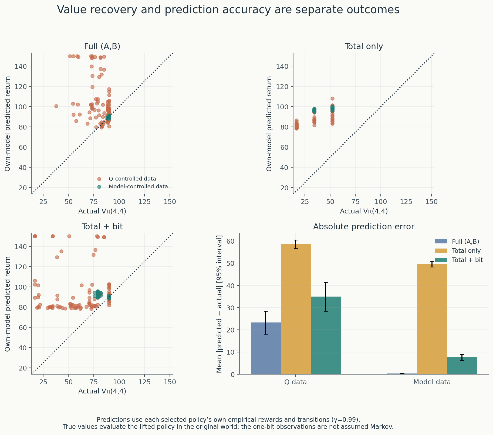
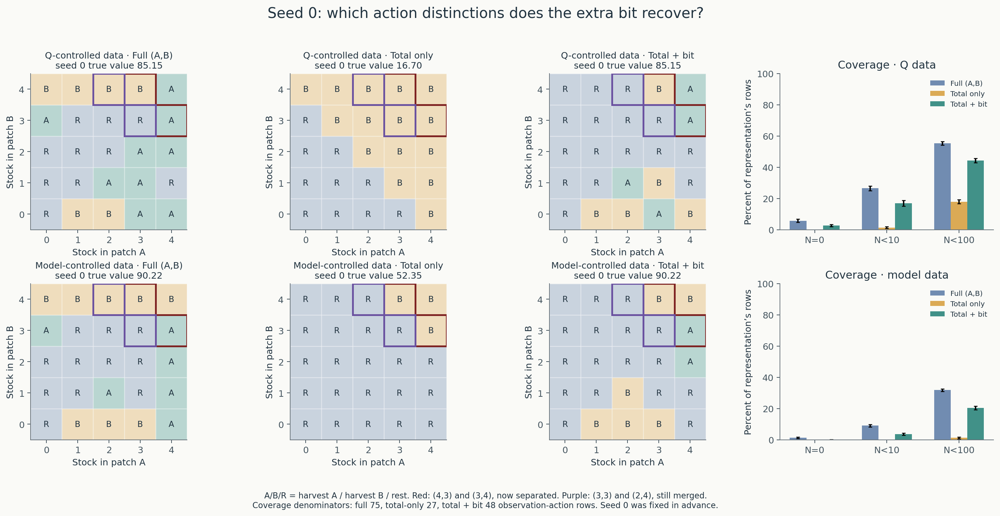
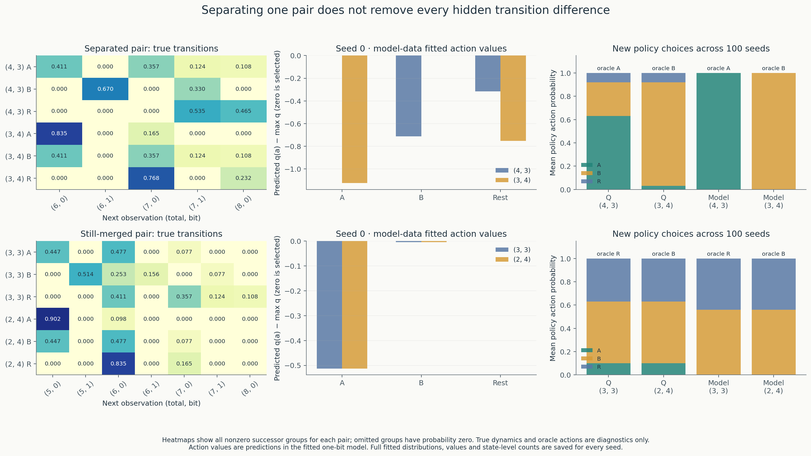

# Experiment 9: how much can one extra observation bit recover?

[Overview and figures](../README.md) · [Chapter map](chapter_map.md) ·
[Saved results](../results/one_bit_observation/)

**Question:** does adding the bit `A>B` to total stock recover much of Experiment
8’s lost policy value and prediction accuracy?

**Measured answer:** both improve substantially with model-controlled histories.
True start-state value gains **35.1315 [33.7494, 36.5137]** over total-only, and
mean absolute prediction error falls by **41.9415 [40.7183, 43.1647]**. Every seed
improves on both comparisons. Full-state performance is not completely restored:
the remaining value gap is **6.1027 [5.0223, 7.1830]**. Q-controlled histories
produce average improvements with individual value and prediction failures.

This is a fixed, hand-designed follow-up motivated by Experiment 8 on the same
histories, **not an independent replication**. No alternative bit was searched,
and this representation was not learned.

## Protocol fixed before the run

Load Experiment 5’s `results/model_guided_collection/checkpoint_050000.npz`,
collectors A (Q-controlled, index 0) and B (unpenalized model-controlled, index 1),
seeds **0–99**, at **250,000 observations per seed per collector**. Both collectors
observed full `(A,B)` while interacting. No historical observations are repeated,
no Q-learning updates performed, no new interaction streams drawn, and no data
shared across seeds. Collector C is not used.

Fit **only** the new mapping `h(A,B)=(A+B, int(A>B))`. In lexicographic order, its
16 reachable observation pairs are:

```text
(0,0), (1,0), (1,1), (2,0), (2,1), (3,0), (3,1), (4,0),
(4,1), (5,0), (5,1), (6,0), (6,1), (7,0), (7,1), (8,0)
```

Only reachable groups are enumerated; `(0,1)` and `(8,1)` are absent. The saved
mapping covers all 25 original states in order `s=5*A+B`. The prespecified
mechanism examples are `(4,3)` versus `(3,4)`, and `(3,3)` versus `(2,4)`.
Seed 0 remains the illustration fixed before fitting.

For each action separately, aggregate successor counts on **both state axes**:

\[
N_h(z,a,z')=\sum_{s:h(s)=z}\sum_{s':h(s')=z'}N(s,a,s'),
\quad N_h(z,a)=\sum_{s:h(s)=z}N(s,a),
\quad R_h(z,a)=\sum_{s:h(s)=z}R_{\rm sum}(s,a).
\]

The three action identities remain harvest A, harvest B and rest. For each
positive-count row, estimate `P̂(z'|z,a)=N_h(z,a,z')/N_h(z,a)` and
`r̂(z,a)=R_h(z,a)/N_h(z,a)`. Use the existing estimator and **zero-reward self-loop
assumption for unvisited rows**, retaining unknown-row masks. That default is
not knowledge of the environment. There is no penalty or reward clipping.

Plan at **γ=0.99** using the existing policy iteration and uniform tie convention
(absolute tolerance 1e-10), starting from a uniform policy as before. Planning
receives empirical counts and rewards, never regeneration rules, true transition
probabilities, oracle values or other seeds’ data. Save all new policies and
predictions to `selected.npz` before loading evaluation inputs.

Lift the new policy by `π(a|A,B)=π_h(a|h(A,B))`. Exact true-environment evaluation
then solves the Bellman policy equations in the unchanged 25-state world. It uses
no exploration. Predicted return is the value in the fitted 16-group model,
starting at `(8,0)`; actual return starts at `(4,4)` under the lifted policy.
The original empirical rewards are used throughout prediction.

Reuse Experiment 8’s full-state and total-only policies, predictions, exact
values and coverage from `results/state_representation/results.npz`. **Neither
baseline is refitted, replanned or reevaluated.** Input hashes confirm this uses
the same historical data as Experiment 8. True dynamics enter only after new
policy selection, for evaluation and the prespecified mechanism diagnostics.

## Comparisons and uncertainty

The primary endpoint is **new representation minus total-only true `Vπ(4,4)`
with model-controlled histories**, at the fixed 250,000-observation endpoint.
Secondary comparisons cover the remaining full-state gap, the same comparisons
with Q-controlled histories, prediction error, oracle fraction and coverage.
No checkpoint or planning rule is selected by true value.

Intervals use `mean ± 1.96 × sample SD / sqrt(100)` across training seeds.
Differences are paired within seed. These quantify historical sampling variation,
not numerical evaluation noise or independent replication. Secondary intervals
are descriptive, with no multiplicity adjustment. Fractions use Wilson intervals.
Improved/worsened/tied counts use absolute tolerance 1e-10. All 100 seeds remain
in every analysis. Ratios of mean gaps below are descriptive, not mean per-seed
recovery fractions or separate inferential endpoints.

| History / representation | True value [95% interval] | 10th percentile | Minimum | ≥90% of oracle [Wilson interval] |
| --- | ---: | ---: | ---: | ---: |
| Q / total only | 25.9583 [23.1303, 28.7864] | 16.7041 | 16.7041 | 0/100 [0%, 3.70%] |
| Q / total + bit | 60.3405 [55.5065, 65.1744] | 20.4753 | 16.7041 | 25/100 [17.55%, 34.30%] |
| Q / full | 81.1092 [78.9452, 83.2731] | 68.0033 | 37.7920 | 63/100 [53.22%, 71.82%] |
| Model / total only | 48.7620 [47.3489, 50.1751] | 34.4153 | 34.4153 | 0/100 [0%, 3.70%] |
| Model / total + bit | 83.8935 [82.7790, 85.0081] | 78.8126 | 75.6115 | 47/100 [37.51%, 56.71%] |
| Model / full | 89.9962 [89.8973, 90.0951] | 88.8865 | 88.8865 | 100/100 [96.30%, 100%] |

The full-state oracle value is **90.2234993**; the 90% threshold is **81.2011494**.
It is a shared reference, not a proven optimal value for either compressed
representation’s policy class.

| Paired value contrast | Mean [95% interval] | Positive / negative / tied seeds |
| --- | ---: | ---: |
| **Model history: bit − total (primary)** | **35.1315 [33.7494, 36.5137]** | **100 / 0 / 0** |
| Model history: full − bit | 6.1027 [5.0223, 7.1830] | 56 / 0 / 44 |
| Q history: bit − total | 34.3821 [29.9161, 38.8481] | 90 / 5 / 5 |
| Q history: full − bit | 20.7687 [15.9993, 25.5381] | 69 / 11 / 20 |

For model-controlled histories, the fraction of the mean full-minus-total gap
recovered is `35.1315 / 41.2342 = 85.20%`; for Q-controlled histories it is
**62.34%**. The new policy is worse than total-only on Q-history seeds
**5, 31, 55, 75, 85**. It exceeds the corresponding full-state learned policy on
11 Q-history seeds; this does not exceed the oracle or show that compression is
universally beneficial. The new policies fall below the oracle threshold on 53
model-history seeds and 75 Q-history seeds. Failure IDs and all values are saved.

## Prediction accuracy is a separate outcome

Here “calibration” refers to predicted policy return versus actual policy return,
not a claim of calibrated confidence bounds or accurate transition probabilities
everywhere. There are no penalized internal rewards or scores in this experiment.

| History / representation | Predicted value [95% interval] | Predicted − actual [95% interval] | Mean absolute error [95% interval] |
| --- | ---: | ---: | ---: |
| Q / total | 84.5192 [83.2564, 85.7819] | 58.5608 [56.6519, 60.4698] | 58.5608 [56.6519, 60.4698] |
| Q / bit | 94.7938 [90.5295, 99.0581] | 34.4533 [27.8467, 41.0599] | 34.9652 [28.4638, 41.4666] |
| Q / full | 103.5667 [99.4624, 107.6709] | 22.4575 [17.1702, 27.7449] | 23.2804 [18.1330, 28.4278] |
| Model / total | 98.3528 [98.1266, 98.5789] | 49.5908 [48.3325, 50.8491] | 49.5908 [48.3325, 50.8491] |
| Model / bit | 91.3113 [90.9718, 91.6508] | 7.4178 [6.0638, 8.7717] | 7.6493 [6.3462, 8.9523] |
| Model / full | 90.0282 [89.9042, 90.1523] | 0.0320 [−0.0634, 0.1275] | 0.3838 [0.3252, 0.4424] |

| Paired absolute-error contrast | Mean [95% interval] | New representation reduces / increases error |
| --- | ---: | ---: |
| Model: bit − total | −41.9415 [−43.1647, −40.7183] | 100 / 0 |
| Model: bit − full | 7.2655 [5.9726, 8.5584] | 22 / 78 |
| Q: bit − total | −23.5956 [−29.6682, −17.5231] | 82 / 18 |
| Q: bit − full | 11.6848 [5.1741, 18.1954] | 34 / 64 (2 ties) |

The bit overpredicts on **76 model-history seeds** and **92 Q-history seeds**;
24 and 8 respectively underpredict. The Q-history seeds with increased absolute
error relative to total-only are **0, 4, 5, 6, 7, 8, 23, 26, 31, 46, 55, 63, 64,
76, 80, 85, 92, 95**. A lower mean error does not erase these failures.



## Coverage and policy maps

Mean row counts per seed, with 95% intervals. Denominators differ: **27 total-only,
48 one-bit, 75 full-state observation-action rows**. The figure uses percentages.

| History / representation | Unknown N=0 | Rows N<10 | Rows N<100 |
| --- | ---: | ---: | ---: |
| Q / total | 0 | 0.37 [0.21, 0.53] | 4.85 [4.50, 5.20] |
| Q / bit | 1.33 [0.98, 1.68] | 8.15 [7.32, 8.98] | 21.31 [20.67, 21.95] |
| Q / full | 4.37 [3.60, 5.14] | 19.97 [18.85, 21.09] | 41.53 [40.70, 42.36] |
| Model / total | 0 | 0 | 0.34 [0.19, 0.49] |
| Model / bit | 0.05 [0.01, 0.09] | 1.75 [1.46, 2.04] | 9.85 [9.30, 10.40] |
| Model / full | 1.05 [0.74, 1.36] | 6.81 [6.18, 7.44] | 23.89 [23.27, 24.51] |

Splitting a group recovers distinctions but divides its evidence. The extra bit
improves value here despite producing more sparse rows than total-only. More
pooled observations alone do not establish a sufficient state representation.



For seed 0, model-history true values are **90.2235 full, 52.3487 total,
90.2235 bit**. Q-history values are **85.1536 full, 16.7041 total, 85.1536 bit**.
But the Q-history one-bit prediction is still **149.2844**. At `(3,4)`, the same
single harvest-B observation supports a fitted rewarding self-loop and action
value 150. Separating states does not manufacture missing evidence.

## Mechanism: true transitions after policy selection

The following list gives **all nonzero true next-observation probabilities** for
the four prespecified states. Observation labels are `(total, bit)`. Immediate
rewards are deterministic: harvest A pays 1, harvest B 1.5 and rest 0 at all four
states. Thus each row also specifies the joint reward/next-observation distribution.
All omitted successors have probability zero.

| Full state | Action | Next observation : true probability |
| --- | --- | --- |
| (4,3) | A | (6,0): .4106125; (7,0): .3568875; (7,1): .1243875; (8,0): .1081125 |
| (4,3) | B | (6,1): .6700000; (7,1): .3300000 |
| (4,3) | Rest | (7,1): .5350000; (8,0): .4650000 |
| (3,4) | A | (6,0): .8350000; (7,0): .1650000 |
| (3,4) | B | (6,0): .4106125; (7,0): .3568875; (7,1): .1243875; (8,0): .1081125 |
| (3,4) | Rest | (7,0): .7675000; (8,0): .2325000 |
| (3,3) | A | (5,0): .4467250; (6,0): .4765500; (7,0): .0767250 |
| (3,3) | B | (5,1): .5142250; (6,0): .2532750; (6,1): .1557750; (7,1): .0767250 |
| (3,3) | Rest | (6,0): .4106125; (7,0): .3568875; (7,1): .1243875; (8,0): .1081125 |
| (2,4) | A | (5,0): .9025000; (6,0): .0975000 |
| (2,4) | B | (5,0): .4467250; (6,0): .4765500; (7,0): .0767250 |
| (2,4) | Rest | (6,0): .8350000; (7,0): .1650000 |

The first pair maps to distinct singleton groups `(7,1)` and `(7,0)`. The second
pair still shares `(6,0)`, yet its rows differ for every action. In particular,
rest can lead to `(8,0)` from `(3,3)` but cannot do so from `(2,4)` in one step.
There is no single next-observation law that matches both underlying states for
the same current observation and action. Markov sufficiency has not been restored.

| State | New observation | Full-state oracle action | Q-history new-policy fractions A/B/Rest | Model-history fractions A/B/Rest |
| --- | --- | --- | --- | --- |
| (4,3) | (7,1) | A | 63% / 29% / 8% | 100% / 0% / 0% |
| (3,4) | (7,0) | B | 3% / 89% / 8% | 0% / 100% / 0% |
| (3,3) | (6,0) | Rest | 10% / 53% / 37% | 0% / 56% / 44% |
| (2,4) | (6,0) | B | 10% / 53% / 37% | 0% / 56% / 44% |

Fractions average the policy probabilities across seeds. Both full-state optimal
actions at total seven are recovered by every model-history policy. At total six,
the new policy must compromise between different optimal actions.

## Mechanism: fitted predictions and remaining mixtures

The following are seed 0’s **model-history** fitted next-observation rows. The
new model gives `(3,3)` and `(2,4)` exactly the same fitted rows. Empirical rewards
are again 1 / 1.5 / 0 for these observed rows.

| New observation | Action | Next observation : fitted probability (rounded) |
| --- | --- | --- |
| (7,1) | A | (6,0): .413537; (7,0): .350999; (7,1): .127801; (8,0): .107662 |
| (7,1) | B | (6,1): .670330; (7,1): .329670 |
| (7,1) | Rest | (7,1): .489879; (8,0): .510121 |
| (7,0) | A | (6,0): .833760; (7,0): .166240 |
| (7,0) | B | (6,0): .417182; (7,0): .356959; (7,1): .119399; (8,0): .106460 |
| (7,0) | Rest | (7,0): .781971; (8,0): .218029 |
| (6,0) | A | (5,0): .524515; (6,0): .410490; (7,0): .064994 |
| (6,0) | B | (5,0): .358875; (5,1): .106555; (6,0): .424723; (6,1): .029931; (7,0): .064951; (7,1): .014966 |
| (6,0) | Rest | (6,0): .415749; (7,0): .351312; (7,1): .122862; (8,0): .110076 |

Within `(6,0)`, seed-0 counts for `(3,3) / (2,4)` are **693 / 184** for A,
**674 / 2,667** for B and **11,706 / 104** for rest. Thus **79.83%** of B evidence
comes from `(2,4)`, where B is optimal, while **99.12%** of rest evidence comes
from `(3,3)`, where rest is optimal. Different actions still inherit different
hidden-state mixtures from the fully observing collector. Across seeds, mean
within-seed fractions are **85.86%** for B from `(2,4)` and **89.71%** for rest
from `(3,3)`. These are not ratios of pooled counts.

| History, seed 0 | Full state | Fitted q(A), q(B), q(Rest) | Chosen action | Predicted v | Actual v of lifted policy |
| --- | --- | --- | --- | ---: | ---: |
| Model | (4,3) | 88.3890, 87.6765, 88.0736 | A | 88.3890 | 89.0949 |
| Model | (3,4) | 87.7622, 88.8870, 88.1336 | B | 88.8870 | 89.5949 |
| Model | (3,3) | 86.8770, 87.3850, 87.3896 | Rest | 87.3896 | 88.0949 |
| Model | (2,4) | 86.8770, 87.3850, 87.3896 | Rest | 87.3896 | 84.4265 |
| Q | (4,3) | 146.7858, 143.8838, 146.6042 | A | 146.7858 | 84.4582 |
| Q | (3,4) | 143.4083, 150.0000, 148.3099 | B | 150.0000 | 84.9582 |
| Q | (3,3) | 135.3164, 138.8496, 143.8467 | Rest | 143.8467 | 83.4582 |
| Q | (2,4) | 135.3164, 138.8496, 143.8467 | Rest | 143.8467 | 80.0572 |

These fitted action values use the selected policy’s empirical continuation
values; they are not oracle action values. True action values under each new
lifted policy and full fitted distributions for both histories/all seeds are
also archived. The new model’s identical predicted values at the still-merged
pair can hide different actual returns even when its selected action is the same.

The 44 model-history seeds choosing rest at `(6,0)` all achieve oracle value from
`(4,4)`; the 56 choosing B there average **78.9200**. This is a descriptive
association, not a new intervention isolating a causal contribution. In seed 0,
rest at `(3,3)` and the recovered A/B actions keep both stocks at least three
from the starting state. Its mistake at `(2,4)` is therefore outside this policy’s
reachable set from `(4,4)`. High value from one starting state does not establish
correct decisions at all states, nor a correct model of all observations.



## Interpretation and Chapter 3 connection

The bit restores useful action distinctions and much of measured return
prediction accuracy, **without restoring Markov sufficiency**. Chapter 3 supplies
the distinction between a full state and an observation that can hide different
reward/transition laws. Our same-action successor distributions give a concrete
counterexample to treating the remaining merged pair as interchangeable.

The policy restriction and the fitted empirical dynamics change together here.
The result does not isolate either as the sole cause of value recovery or of the
remaining shortfall. It is not a bound on the best memoryless or history-dependent
partial-observation policy. No representation was learned, no extra-bit search
performed, and no partially observing collector tested. Policy iteration is a
Chapter 4 preview; the [chapter map](chapter_map.md) retains the Chapter 6 and 8
previews and the continuing-task versus termination example.

An evidence-based next question is whether a short observation/action history
can resolve the remaining `(3,3)` versus `(2,4)` ambiguity without supplying
another full-state feature. The current aggregate archives do not themselves
preserve ordered histories, so that would require an explicitly designed new
protocol. No such collection, fitting or representation search occurred here.

## Outputs, runtime and reproduction

The fixed analysis ran **once**. Zero new transitions, Q updates or random streams;
zero baseline refits or reevaluations. Local Python 3.10.12, NumPy 1.26.4,
Matplotlib 3.10.9, one OpenBLAS thread.

| Work | Seconds |
| --- | ---: |
| Exact count aggregation | 0.0148 |
| New model fitting and planning | 0.0279 |
| Evaluation and mechanism diagnostics | 0.0116 |
| Timed analysis, including archives and figures | 3.4423 |

Timing starts after plotting-module imports. These are local measurements, not
performance benchmarks; there was no environmental collection runtime.

| File under `results/one_bit_observation/` | Contents |
| --- | --- |
| `selected.npz` | New successor/visit counts, reward sums, empirical model, unknown masks, policies, predicted values/action values, solver diagnostics, reachable groups and lifting map; saved before true evaluation |
| `results.npz` | Reused baselines plus new lifted policies, predicted/actual values, coverage, oracle and seed IDs |
| `mechanism.npz` | True/fitted next-observation probabilities and rewards, oracle/selected actions, actual/predicted state and action values, full-state visits and within-observation weights for the four examples |
| `seed_results.csv` | All six start-state values and predictions per seed, plus paired value contrasts |
| `summary.json` | Paired contrasts and uncertainty, success fractions, failure seed IDs, coverage and mechanism summaries |
| `manifest.json` | Fixed configuration, seeds, groups, source/input hashes, software, information boundary, runtime and commands |
| Four `.png` figures and `run.log` | Plots and the original run output |

Combined policy arrays use **collector, representation, seed, full state, action**
axes; value arrays omit action. Collectors are Q then model; representations are
full, total-only, total+bit. New unlifted models/policies in `selected.npz` use
16 observations. Mechanism arrays use **collector, seed, example, action,
successor observation** where applicable; example order is `(4,3)`, `(3,4)`,
`(3,3)`, `(2,4)`. Weights for unobserved rows are encoded as zero and must be
interpreted with the saved `observed_rows` mask, not as measured probabilities.

From the repository root with the existing dependencies:

```bash
# Rebuild figures from saved results; no fitting, evaluation or collection.
python run_one_bit_observation.py --plot-only

# Reproduce this fixed analysis to a fresh destination, preserving the completed run.
OPENBLAS_NUM_THREADS=1 python run_one_bit_observation.py --output results/one_bit_observation_repeat
```

Only plot-only regeneration was exercised after the completed analysis. The
runner also defaults to plotting when `summary.json` is already present, and
can reuse `selected.npz` if interrupted after policy selection.

Brief checks cover conservation of action-specific counts/reward sums, direct
aggregation at the prespecified groups, successor counts summing to visits,
16 reachable groups and policy lifting/normalization. Previous code, environment
defaults and result archives are unchanged. No sweeps, extended test suite,
new frameworks or unrelated refactoring were added.
