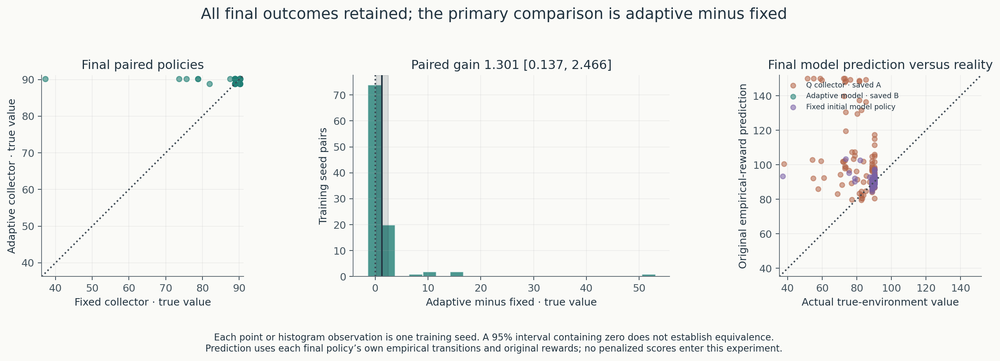
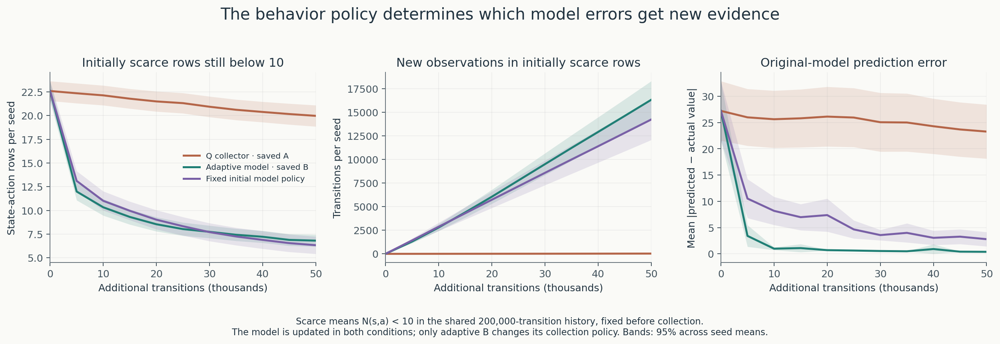
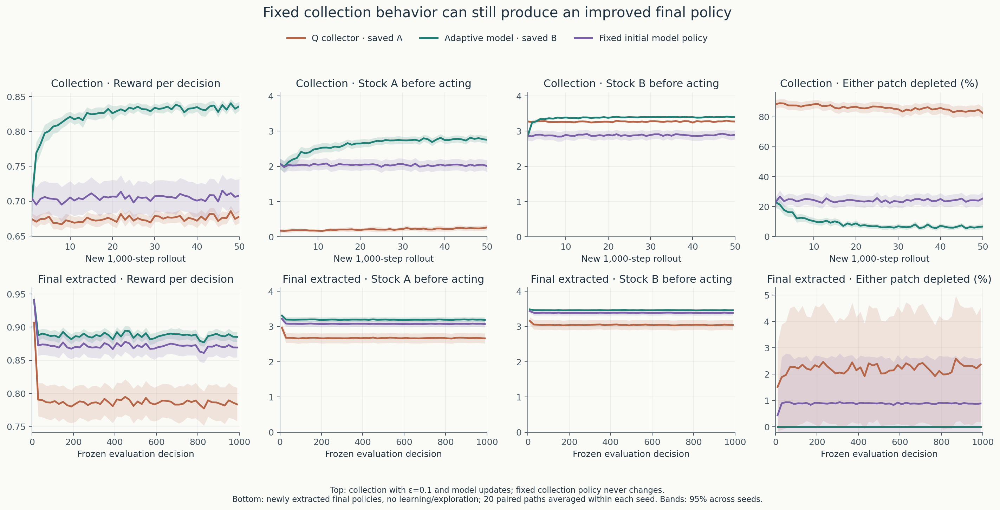
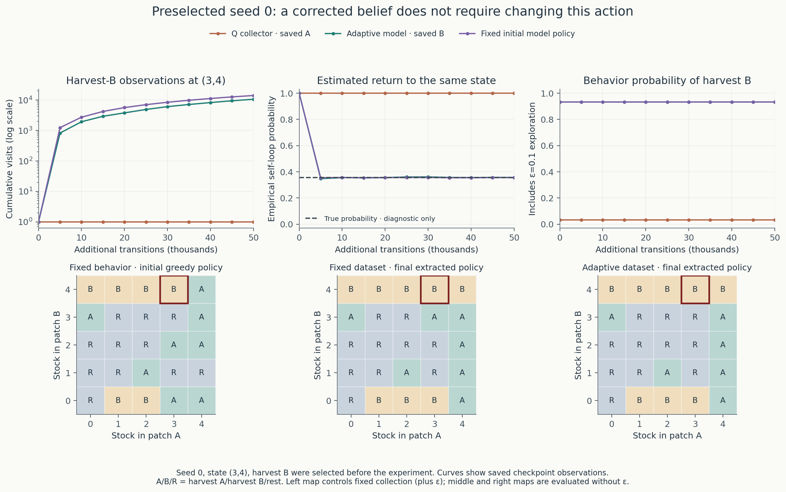

# Experiment 6: does replanning improve the experience an agent collects?

[Research overview and figures](../README.md) ·
[Saved outputs](../results/replanning_ablation/) ·
[Earlier experiment notes](experiments_1_to_5.md)

The question is how much of Experiment 5’s gain requires updating the collection
policy, rather than simply starting with the initial learned-model policy. We
ran **one new condition once**. Adaptive B and Q-controlled A are saved Experiment
5 results. No previous collection, Q training, planning baseline, or frozen
baseline simulation was rerun. The environment and rewards are unchanged.

At the fixed final endpoint, adaptive B improves true value over fixed collection
by **1.3015 [0.1371, 2.4658]**. Fixed collection already improves substantially over
Q collection, by **7.5856 [5.0591, 10.1121]**. The remaining adaptive advantage is
concentrated in a minority of seeds; median paired gain is zero. Replanning also
improves reward and stocks during collection and reduces the final policies’
prediction errors. It does not improve every seed or every coverage statistic.

## Fixed protocol and information flow

Each of the same 100 training seeds starts with successor counts
$N(s,a,s')$, visits $N(s,a)$, and reward sums from the **final 200,000-transition
Experiment 3 history** in
[`collection.npz`](../results/learned_world_model/collection.npz). The history is
copied into independent per-seed arrays. No Experiment 5 endpoint counts enter
initialization. Counts are checked against Experiment 5’s zero-additional-step
checkpoint, collector B.

The fixed behavior policy is loaded directly from
[`checkpoint_000000.npz`](../results/model_guided_collection/checkpoint_000000.npz),
`policies[1, 0]`: collector B, unpenalized extraction. It is read-only throughout
collection. For every rollout, the collector uses
$\mu(a|s)=0.9\pi_0(a|s)+0.1/3$. The empirical model keeps updating; extracted
checkpoint policies are never passed back to action selection.

| Condition | Collection behavior | Final extraction | Source |
| --- | --- | --- | --- |
| Q-controlled A | Continuing Q updates, α=0.1, ε=0.1 | Unpenalized model planning | Experiment 5, reused |
| Adaptive B | Model policy updated every 1,000 transitions, ε=0.1 | Unpenalized model planning | Experiment 5, reused |
| Fixed initial B policy | Initial policy retained throughout, ε=0.1 | Unpenalized model planning | Only new condition |

All conditions receive 50,000 additional transitions per seed, in fifty
1,000-step rollouts beginning at `(4,4)`. Their total experience is 250,000.
This run adds **5,000,000 collection transitions**. Each actual final successor
is counted before the next reset. Resets are boundaries, not observations,
terminal transitions, or rewards. There are no Q updates in the new condition.

**Pairing is exact at the level of exogenous draws.** The new run loads the 100
environment and 100 action seed IDs from Experiment 5’s manifest, whose recipe
was `SeedSequence([20260929, 5, seed, role])`, roles 0 and 100. It does not create
an Experiment 6 stream. Each per-seed generator draws `(1000, 2)` per rollout,
first the environment group, then the action group, stacking on axis 1 exactly
as in Experiment 5. The first action uniform samples either the policy CDF or a
uniform random action; the second selects exploration. Uniform ties use the
existing absolute tolerance `1e-10`. Different policies apply the same draws to
their own states, so paired randomness does not imply identical trajectories.

At 0 and every 5,000 new transitions, empirical probabilities are
$\hat p(s'|s,a)=N(s,a,s')/N(s,a)$ and empirical rewards are observed reward sums
divided by visits. Unknown rows have a saved boolean mask and assume a zero-reward
self-loop. This remains an assumption, not observed knowledge. Existing policy
iteration at γ=0.99 extracts an unpenalized policy separately for each seed.
There is no count penalty, pooling across seeds, coefficient tuning, or checkpoint
selection. The original environment rewards are used for all predictions.

Only after every new dataset and policy has been collected/selected does the
runner load true-model arrays for exact evaluation:
$V_\pi=(I-\gamma P_\pi)^{-1}r_\pi$. The saved oracle is a reference, not a planner
input. Environment interaction uses the unchanged `step` function; estimation
and planning receive observations only. No regeneration parameters, true
transitions, counterfactual rewards, or oracle values enter those calculations.

## Primary endpoint and uncertainty

The prespecified endpoint is **adaptive B minus fixed collection**, using the
same unpenalized extraction rule on each final dataset, exact true-environment
$V_\pi(4,4)$ at γ=0.99 and **250,000 total transitions**.

| Collector | Mean value [95% interval] | 10th percentile | Minimum | ≥90% oracle, Wilson 95% interval |
| --- | ---: | ---: | ---: | ---: |
| Q-controlled A, saved | 81.1092 [78.9452, 83.2731] | 68.0033 | 37.7920 | 63/100 [53.22%, 71.82%] |
| Adaptive B, saved | 89.9962 [89.8973, 90.0951] | 88.8865 | 88.8865 | 100/100 [96.30%, 100.00%] |
| Fixed initial policy, new | 88.6947 [87.5383, 89.8511] | 88.8865 | 37.2510 | 95/100 [88.82%, 97.85%] |

Oracle value is **90.2234993**; the 90% threshold is **81.2011494**.

| Paired final comparison | Mean difference [95% interval] | Improved / worsened / tied |
| --- | ---: | ---: |
| Adaptive B − fixed, primary | 1.3015 [0.1371, 2.4658] | 26 / 9 / 65 |
| Fixed − Q-controlled A, contextual | 7.5856 [5.0591, 10.1121] | 65 / 9 / 26 |
| Adaptive B − Q-controlled A, saved context | 8.8871 [6.7258, 11.0483] | 67 / 1 / 32 |

Mean intervals use the established mean ±1.96 SEM across 100 training seeds;
paired comparisons first subtract within seed. Ties mean absolute value
difference ≤`1e-10`. Fractions use Wilson intervals. The 10th percentiles are
empirical point estimates. Seed-level outcomes remain in `results.npz`.

The paired gains range from **−1.3370 to +52.9725**; median gain is **0**. The five
fixed policies below the 90% threshold account for 107.03 of the total 130.15
value units gained across all 100 pairs. This is a description of the full
retained distribution, not an exclusion or a new primary subgroup. The normal
mean interval is approximate and the distribution is skewed, with a large
contribution from one severe failure. Matching 10th percentiles does not imply
matching lower tails or equivalence.



At +5,000, adaptive B’s descriptive advantage is **3.8893 [1.7352, 6.0433]**;
at +10,000 it is **3.0729 [1.5930, 4.5528]**. The gap narrows overall but fluctuates.
All eleven checkpoint comparisons, including +40,000’s interval containing
zero, are saved in `summary.json`. These are pointwise, unadjusted intervals,
not grounds to choose a checkpoint. An interval containing zero does not prove
equivalence. The fixed endpoint remains +50,000.

## Prediction accuracy and coverage

Predictions evaluate each extracted policy under **its own empirical transitions
and original empirical rewards**, with the same discount as true evaluation.
No penalized internal score is involved. A better policy-specific prediction
error does not establish that every transition-model row became more accurate.

| Collector | Mean predicted return | Mean predicted − actual [95% interval] | Mean absolute error [95% interval] | RMSE |
| --- | ---: | ---: | ---: | ---: |
| Q-controlled A | 103.5667 | 22.4575 [17.1702, 27.7449] | 23.2804 [18.1330, 28.4278] | 34.9969 |
| Adaptive B | 90.0282 | 0.0320 [−0.0634, 0.1275] | 0.3838 [0.3252, 0.4424] | 0.4855 |
| Fixed initial policy | 90.6862 | 1.9914 [0.5769, 3.4060] | 2.7904 [1.4293, 4.1516] | 7.4519 |

Adaptive-minus-fixed mean prediction error changes by **−1.9594 [−3.3757, −0.5431]**;
absolute error changes by **−2.4067 [−3.7780, −1.0354]**.

We define initially scarce rows as those with **fewer than 10 observations in
the shared 200,000-transition history**, before examining new data. There are
75 state-action rows per seed; initially 22.59 are scarce on average. The
thresholds 1, 10, and 100 follow Experiment 5.

| Coverage measure, mean per seed | Q-controlled A | Adaptive B | Fixed initial policy |
| --- | ---: | ---: | ---: |
| Final unknown rows (N=0) | 4.37 | 1.05 | 0.80 |
| Final rows with N<10 | 19.97 | 6.81 | 6.33 |
| Final rows with N<100 | 41.53 | 23.89 | 24.51 |
| Initially scarce rows receiving any new observation | 9.51 | 19.71 | 20.44 |
| Initially scarce rows reaching ten observations | 2.62 | 15.78 | 16.26 |
| New observations in initially scarce rows | 27.09 | 16,307.95 | 14,220.30 |

Adaptive minus fixed in the number of initially scarce rows reaching ten is
**−0.48 [−1.35, 0.39]**. Fixed collection is not simply worse at broad coverage.
Adaptive collection gathers more total observations in initially scarce rows,
but this aggregate does not identify which transitions explain the policy gap.
Both change the data distribution substantially relative to Q control.

For the fixed collector, `(4,0)/rest` remains below ten visits in **57%** of seeds,
and `(4,0)/harvest B` in **54%**. The corresponding adaptive fractions are **77%**
and **71%**. A high mean count can coexist with many scarce seeds: for fixed
`(4,0)/rest`, the mean count is 241.37. Counts stay independent across seeds;
these observations are never pooled. The archive contains every row and the
summary lists the ten most frequently scarce rows in each condition.



## Collection behavior and frozen behavior are different measurements

The following collection results average all fifty new rollouts within seed
before estimating uncertainty. Stocks and depletion are measured **before the
action**; depletion means either stock equals zero. Collection uses ε=0.1, model
updates, and the condition’s prescribed behavior policy.

| Collection outcome, mean [95% interval] | Q-controlled A | Adaptive B | Fixed initial policy |
| --- | ---: | ---: | ---: |
| Reward per decision | 0.6744 [0.6703, 0.6786] | 0.8231 [0.8198, 0.8264] | 0.7050 [0.6828, 0.7272] |
| Stock A | 0.2121 [0.1601, 0.2641] | 2.6226 [2.5373, 2.7079] | 2.0391 [1.8878, 2.1904] |
| Stock B | 3.2719 [3.2578, 3.2861] | 3.3758 [3.3705, 3.3810] | 2.8850 [2.7605, 3.0095] |
| Either depleted (%) | 85.965 [83.152, 88.779] | 8.812 [7.825, 9.798] | 24.107 [20.587, 27.627] |

The paired adaptive-minus-fixed collection differences are **+0.1181
[0.0970, 0.1393] reward per decision**, **+0.5835 [0.4290, 0.7381] stock A**,
**+0.4908 [0.3689, 0.6127] stock B**, and **−15.295 [−18.557, −12.033] percentage
points depleted**. Model updates alone cannot improve the fixed collector’s
behavior because its new information never reaches its action-selection policy.

Frozen evaluation uses the **newly extracted final policies**, with no learning
or exploration: 20 independent 1,000-step trajectories for each training seed,
starting at `(4,4)`. Only the new policies were simulated (**2,000,000 decisions**).
A/B outcomes were copied exactly from Experiment 5. Environment and action seed
IDs are loaded from that saved evaluation archive and checked against the
established recipe, `SeedSequence([20260929,3,seed,trajectory,role])`, roles 0/100.
Uniform ties and action CDF sampling are unchanged. Trajectories are averaged
within training seed, then uncertainty is computed over the 100 seed means.

| Frozen final-policy outcome, mean [95% interval] | Q-controlled dataset | Adaptive dataset | Fixed-policy dataset |
| --- | ---: | ---: | ---: |
| Total reward in 1,000 decisions | 788.76 [764.62, 812.90] | 888.27 [886.28, 890.26] | 872.63 [859.37, 885.88] |
| Stock A | 2.6786 [2.5382, 2.8191] | 3.1974 [3.1255, 3.2694] | 3.0788 [2.9912, 3.1663] |
| Stock B | 3.0483 [2.9123, 3.1843] | 3.4656 [3.4649, 3.4663] | 3.3917 [3.3182, 3.4652] |
| Either depleted (%) | 2.203 [0.116, 4.291] | 0.000 [0.000, 0.000] | 0.885 [−0.849, 2.619] |
| Successful harvest A per decision | 0.1726 [0.1657, 0.1795] | 0.1899 [0.1882, 0.1915] | 0.1876 [0.1853, 0.1899] |
| Successful harvest B per decision | 0.4108 [0.3948, 0.4267] | 0.4656 [0.4649, 0.4663] | 0.4567 [0.4480, 0.4654] |

Harvest A pays 1, harvest B pays 1.5; total reward is not a count of successful
harvest actions. The paired adaptive-minus-fixed gain is **15.648 [2.113, 29.183]**
reward over 1,000 decisions. Its depletion difference is **−0.885 [−2.619, 0.849]**
percentage points. Normal mean intervals are reported without clipping, so an
interval for a nonnegative outcome can extend below zero; that endpoint is not
an observed negative depletion rate. Zero measured depletion here describes
these frozen trajectories, not a general guarantee for all policies or states.
All fourteen frozen metrics, including separate A/B depletion, are saved.



## Preselected seed 0: harvest B at (3,4)

We retain the example chosen before Experiments 5 and 6. The initial estimate
comes from **one observed self-loop**: estimated loop probability 1, reward 1.5,
and an imagined value of 150 from `(3,4)` under the initial unpenalized policy.
Its actual value there is only 84.9582.

| Additional transitions | Adaptive visits | Adaptive self-loop estimate | Fixed visits | Fixed self-loop estimate |
| --- | ---: | ---: | ---: | ---: |
| 0 | 1 | 1.000000 | 1 | 1.000000 |
| 5,000 | 819 | 0.347985 | 1,234 | 0.354133 |
| 10,000 | 1,925 | 0.355325 | 2,714 | 0.357038 |
| 50,000 | 10,511 | 0.356959 | 13,967 | 0.355338 |

The true self-loop probability, used only for this diagnostic, is **0.3568875**.
The saved Q collector gets no further observations of this row: N stays 1 and
the estimate stays 1. Both model collectors keep harvest-B probability **0.9333**
at the displayed checkpoints; Q’s is **0.0333**. Adaptive and fixed curves overlap
in the behavior-probability panel. Adaptive control can change at intervening
1,000-step replans; the plotted observations are the saved 5,000-step checkpoints.
The fixed policy is unchanged at every step, not just the checkpoints.

At the endpoint, the adaptive extracted policy predicts **89.0750** from `(3,4)`
and actually yields **89.5949**. The fixed-dataset policy predicts **88.9549** and
yields **88.2327**. From `(4,4)`, their actual values are **90.2235** and **88.8865**.
The fixed collector’s initial greedy policy had value **85.1536** from `(4,4)`;
its newly extracted final policy improves despite behavior never changing.

The two final seed-0 policies differ at exactly one state, **(3,3)**: the fixed
dataset selects harvest A, adaptive selects rest. The empirical rewards agree
there, `[1, 1.5, 0]`; their visit counts for `[A, B, rest]` are respectively
`[435, 485, 12391]` and `[693, 674, 11706]`. Thus the remaining action difference
arises through transition estimates and the continuation values they induce,
not through a different reward function or an uncorrected `(3,4)` self-loop.
This one prespecified example is illustrative, not proof of the mechanism for
all 100 seeds or an alternative primary endpoint.



## Interpretation and next experiment

The fixed initial policy already moves collection into useful parts of the
world. Its final extracted mean value improves **10.6238 [7.6590, 13.5886]** from
the common historical policy, versus **11.9252 [9.3094, 14.5411]** for adaptive B.
Against the equal-budget Q collector, the respective gains are 7.59 and 8.89.
Replanning adds a smaller but positive measured final advantage, lower
policy-prediction error, and better collection reward and resources. Five
fixed-collector failures and nine seeds favoring fixed collection are retained.

Chapter 3 supplies states, action-dependent dynamics, rewards, policies, returns,
and value functions. **A policy changes the state distribution and therefore
the experience available for learning.** A learned Q table summarizes expected
returns after actions; an empirical world model estimates successors and immediate
rewards, enabling planning through imagined futures. Here both empirical models
update, while only adaptive B uses the updates to change future experience.
Policy iteration previews Chapter 4; repeated model-guided interaction previews
Chapter 8. Q-learning is a §6.5 preview. This implementation is not Dyna-Q: the
new condition has no Q learning or simulated Q updates, and adaptive B uses full
empirical-model policy iteration.

The result does not isolate all causes of the original Q-learning shortfall or
establish that model-based methods always win. Generalization is limited by one
small stationary MDP, 100 particular histories, ε=0.1, uniform ties, the unknown-row
assumption, and a fixed budget. Pairing reduces noise but does not supply
counterfactual observations. A better policy-specific prediction does not mean
the entire empirical model is calibrated. Computation is not equalized.

**One next hypothesis:** replan once after +5,000 transitions, then freeze that
behavior policy for the remaining 45,000, using the same history, streams,
evaluation rule, and total budget. Much of the effect is already present in
initial behavior, the early adaptive advantage is larger, and continued
adaptation chiefly adds reliability at the endpoint. This one condition would
test whether an early correction suffices without a frequency sweep. It is a
proposal, not a completed result or a claim that +5,000 is optimal.

## Runtime, checks, saved evidence, and reproduction

The completed run used Python 3.10.12, NumPy 1.26.4, Matplotlib 3.10.9, and one
OpenBLAS thread on a local CPU. Timings are descriptive:

| Work | Seconds |
| --- | ---: |
| New fixed-policy collection, 5 million transitions | 8.7258 |
| Control replanning | 0.0000 |
| Unpenalized extraction at eleven checkpoints | 0.2308 |
| Exact new-policy evaluation and diagnostics | 0.1184 |
| Frozen new-policy evaluation, 2 million decisions | 0.9273 |
| Whole invocation, including saving and figures | 17.7732 |

For context, the saved Experiment 5 run reported 35.2432 s for all three
collectors together and 1.8362 s for both adaptive control planners together.
Those aggregates and separate run times do not isolate B’s cost or establish a
speedup benchmark. Equal environmental experience does not mean equal computation.

Checks were confined to this new path: correct 200k input and independent copies;
read-only behavior identical to initial B at every checkpoint; exact saved RNG
states at every checkpoint; identical first-rollout summaries to adaptive B
(before it replans); successor-count sums and per-seed transition totals; observed
reward sums matching accumulated rollout rewards; and unchanged saved baseline
frozen outcomes. The existing policy-iteration residual check also passed. No
parameter sweeps, repeated collections, or extended testing were used.

[`results/replanning_ablation/`](../results/replanning_ablation/) contains about
5.1 MiB:

- `checkpoint_000000.npz` through `checkpoint_050000.npz`: eleven compact
  archives containing counts `[100,25,3,25]`, visits and reward sums `[100,25,3]`,
  unknown-row masks, extracted and fixed behavior policies, predicted values,
  planning residuals/iterations, rollout metrics, RNG states, and cumulative
  collection/extraction times. Counts and sums fully specify each empirical
  model, so redundant dense probabilities need not be stored.
- `results.npz`: seed-level exact values, original-model predictions, policies,
  counts, collection behavior and metrics at all checkpoints; condition order
  **Q-controlled A, adaptive B, fixed**. Value arrays are
  `[checkpoint,condition,training_seed,state]`. Policy arrays add an action axis.
  Training-seed indices are 0–99; state index is `5*stock_A+stock_B`, actions are
  `[harvest A, harvest B, rest]`. Saved A/B entries are copied, not recomputed.
- `frozen_behavior.npz`: all new per-trajectory and per-seed metrics, copied A/B
  outcomes, binned resource curves, preselected seed-0 trajectory 0, and the
  shared evaluation seed IDs/uniforms. Metric arrays are
  `[condition,seed,trajectory,metric]` and `[condition,seed,metric]`.
- `summary.json`: primary and contextual paired comparisons, all checkpoint
  comparisons, prediction errors, coverage, collection and frozen metrics,
  uncertainty, and checks.
- `seed_0.json`: every checkpoint’s counts, observed loops, estimated probability,
  behavior probabilities and predicted/actual values for the preselected example.
- `manifest.json`: fixed configuration, all collection seed IDs, input/source
  hashes, software versions, information boundaries, runtime, and commands.
- `run.log` and five figures: live checkpoint rewards, stocks, depletion, seed-0
  count/belief, and the final reported results.

From the repository root, with the dependencies in `requirements.txt` installed,
**plot saved results without collecting, planning, or evaluating again**:

```bash
python run_replanning_ablation.py --plot-only
```

To reproduce the fixed experiment in a **different output directory**:

```bash
OPENBLAS_NUM_THREADS=1 python run_replanning_ablation.py \
  --output results/replanning_ablation_repeat
```

This reproduction command intentionally collects another five million
transitions; it was not run for this delivery. Running the default command
against the completed directory only rebuilds figures. During an interrupted
run, rerun the same command to restore the last atomic checkpoint, including RNG
states, model counts and metrics. Any unsaved tail is deterministically repeated
and not counted twice. Input/config/source hashes are checked before resumption.
The collection policy is always reloaded from the original zero-step archive and
checked against the saved fixed policy. An already completed collection is not
recollected when completing evaluation.

Read [replanning_ablation.py](../replanning_ablation.py) for fixed collection,
[run_replanning_ablation.py](../run_replanning_ablation.py) for separate evaluation,
and [replanning_figures.py](../replanning_figures.py) for saved-data plotting.
Existing estimator, planner, action-draw, simulation and plotting utilities are
reused without edits. The previous README is preserved in
[Experiments 1–5 notes](experiments_1_to_5.md), with only relative links adjusted.
