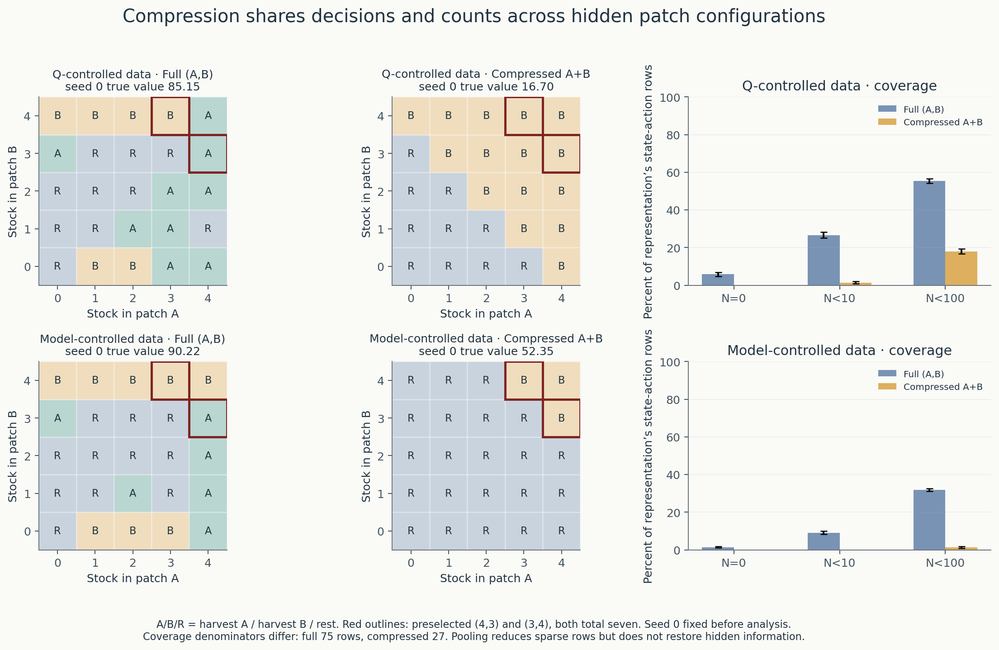

# Experiment 8: can better experience compensate for an incomplete state?

[Scientific overview](../README.md) · [Chapter map](chapter_map.md) ·
[Saved results](../results/state_representation/)

**Question:** does model-guided experience remain useful when planning observes
only total food stock, losing the distinction between patches A and B?

**Finding:** better experience helps both representations. Its benefit is larger
under compression, but model-controlled full-state policies still exceed their
compressed counterparts by **41.2342 [39.9100, 42.5584]** in true value, paired over
100 seeds. The compressed surrogate strongly overpredicts despite dense observed
rows. This evaluates a particular fitted model and planner, not the best possible
policy under partial observation.

## Fixed protocol and information separation

Use only `results/model_guided_collection/checkpoint_050000.npz`: Experiment 5’s
final **250,000-observation histories**, collector A (Q-controlled, index 0) and
collector B (unpenalized model-controlled, index 1), seeds **0–99**. Collector C is
outside this analysis. Both historical collectors had full observations `(A,B)`.
No histories are recollected, Q tables retrained, new streams drawn, or seeds
pooled. No simulated evaluation trajectories are needed for exact values.

For each seed and collector, fit both full observation `(A,B)` (25 states) and
compressed observation `z=h(s)=A+B` (9 observations, integers 0–8). Preserve all
three action identities: harvest A, harvest B, rest. Aggregate the saved sufficient
statistics exactly:

\[
N_c(z,a,z')=\sum_{s:h(s)=z}\sum_{s':h(s')=z'}N(s,a,s'),
\qquad N_c(z,a)=\sum_{s:h(s)=z}N(s,a),
\]
\[
R_c(z,a)=\sum_{s:h(s)=z}R_{\rm sum}(s,a).
\]

For every observed row, divide successor counts and reward sums by its visit
count to obtain the empirical transition probabilities and mean immediate
reward. Full-state fitting uses the same ratios before aggregation. For an
unvisited row, keep the established **zero-reward self-loop assumption**, mark it
unknown, and do not interpret that default as environmental knowledge. No
regeneration parameters, counterfactual rewards or other seeds’ observations enter
fitting. The source counts already exclude collection resets.

Use the existing unpenalized `estimate` and `plan` utilities, γ=0.99, policy
iteration, and uniform greedy ties within absolute tolerance 1e-10. There is no
count penalty, alternative tuning, checkpoint selection, or partial-observation
optimization beyond this fixed planner. Full-state refits recover the saved
Experiment 5 unpenalized policies exactly and recover their predicted values.

Lift each selected compressed policy into the true world by
`π(a | A,B) = π_compressed(a | A+B)`. States with the same total receive identical
action distributions. This adds no full-state information to action selection.
All four sets of policies and model predictions are saved to `selected.npz`
**before** loading `results/first_world/model.npz` for evaluation and diagnostics.
The true model does not guide fitting or policy selection.

Exact evaluation then solves `v_π = r_π + γ P_π v_π` in the unchanged original
25-state world. Predictions solve the corresponding equations in the policy’s own
empirical model, using original empirical rewards. The compressed model is a
**collector-dependent fitted surrogate**; we do not assume the observations are
a genuine MDP. Its predictions need not be achievable in the real world.

## Endpoints and uncertainty

The fixed primary endpoint is **full minus compressed true `V_π(4,4)` with
model-controlled histories**, at 250,000 observations. The secondary comparisons
are model-controlled minus Q-controlled history within each representation, and
the difference of those experience benefits (**full benefit minus compressed
benefit**). Historical Q tables are not the policies evaluated here: all four
policies come from unpenalized empirical-model planning.

Report seed means and 95% intervals `mean ± 1.96 × sample SD / sqrt(100)`; contrasts
are paired within seed. These describe variation across historical training
seeds, not numerical evaluation error. No multiple-comparison adjustment is
applied to secondary diagnostics. Success fractions have Wilson intervals.
Changes use the existing absolute 1e-10 tie tolerance. No seed is excluded.

| History and representation | True value [95% interval] | 10th percentile | Minimum | ≥90% oracle [Wilson interval] |
| --- | ---: | ---: | ---: | ---: |
| Q · full | 81.1092 [78.9452, 83.2731] | 68.0033 | 37.7920 | 63/100 [53.22%, 71.82%] |
| Q · total | 25.9583 [23.1303, 28.7864] | 16.7041 | 16.7041 | 0/100 [0%, 3.70%] |
| Model · full | 89.9962 [89.8973, 90.0951] | 88.8865 | 88.8865 | 100/100 [96.30%, 100%] |
| Model · total | 48.7620 [47.3489, 50.1751] | 34.4153 | 34.4153 | 0/100 [0%, 3.70%] |

The original full-state oracle has value **90.2234993**, with a 90% threshold of
**81.2011494**. It is a common reference, not an attainable optimum established
for the compressed policy class.

| Paired contrast | Mean difference [95% interval] | Positive / negative / tied seeds |
| --- | ---: | ---: |
| **Primary: model history, full − total** | **41.2342 [39.9100, 42.5584]** | **100 / 0 / 0** |
| Full: model history − Q history | 8.8871 [6.7258, 11.0483] | 67 / 1 / 32 |
| Total: model history − Q history | 22.8037 [19.9469, 25.6605] | 79 / 1 / 20 |
| Full experience benefit − total experience benefit | −13.9166 [−17.3344, −10.4988] | 17 / 73 / 10 |

The last row is an interaction contrast, not a count of better or worse policies.
Model-controlled data improves most compressed policies substantially, yet one
seed worsens and all remain below 90% of the full-state oracle. All seed-level
values, including ties and failures, are retained in the CSV and NPZ archives;
`summary.json` also lists the seeds below the threshold for each combination.


## Predictions, coverage and policy failures

| History and representation | Predicted value [95% interval] | Predicted − actual [95% interval] | Mean absolute error [95% interval] |
| --- | ---: | ---: | ---: |
| Q · full | 103.5667 [99.4624, 107.6709] | 22.4575 [17.1702, 27.7449] | 23.2804 [18.1330, 28.4278] |
| Q · total | 84.5192 [83.2564, 85.7819] | 58.5608 [56.6519, 60.4698] | 58.5608 [56.6519, 60.4698] |
| Model · full | 90.0282 [89.9042, 90.1523] | 0.0320 [−0.0634, 0.1275] | 0.3838 [0.3252, 0.4424] |
| Model · total | 98.3528 [98.1266, 98.5789] | 49.5908 [48.3325, 50.8491] | 49.5908 [48.3325, 50.8491] |

Every compressed policy overpredicts. Under model-controlled data, full-state
absolute error is lower by **49.2070 [47.9607, 50.4533]**, paired. The compressed
mean prediction even exceeds the true full-state oracle; that is a consequence
of an inaccurate surrogate, not evidence of exceeding the environmental optimum.

Coverage below is the **mean number of rows per seed**. Full models have **75**
state-action rows and compressed models have **27**, so their raw counts have
different denominators. The figure and archives also show row fractions.

| History and representation | Unknown rows, N=0 [95% interval] | Rows N<10 [95% interval] | Rows N<100 [95% interval] |
| --- | ---: | ---: | ---: |
| Q · full | 4.37 [3.60, 5.14] | 19.97 [18.85, 21.09] | 41.53 [40.70, 42.36] |
| Q · total | 0 | 0.37 [0.21, 0.53] | 4.85 [4.50, 5.20] |
| Model · full | 1.05 [0.74, 1.36] | 6.81 [6.18, 7.44] | 23.89 [23.27, 24.51] |
| Model · total | 0 | 0 | 0.34 [0.19, 0.49] |

Pooling eliminates unknown compressed rows in both histories. All compressed rows
in every model-controlled dataset have at least ten visits. That does not restore
which patch supplied the total, make the representation Markov, or guarantee
reliable predictions when the selected policy changes the hidden-state mixture.



Seed 0 is illustrative, not selected for its outcome. Its Q-history policies have
true values **85.1536 full / 16.7041 total**; its model-history policies have
**90.2235 full / 52.3487 total**. In both seed-0 compressed maps, the policy either
rests or harvests B and never harvests A. Its choices depend only on the diagonal
`A+B`, unlike the full-state policies. Predicted values are **149.2844 / 78.9028**
for Q history and **89.6992 / 98.0319** for model history, respectively. This example
also retains the full Q-history model’s large overprediction.

## Prespecified mechanism: `(4,3)` and `(3,4)`

Both states map to total **seven**. The following are true diagnostic distributions,
computed only after policy selection. Rewards are deterministic for this pair,
so each row also specifies the joint distribution of reward and next observation:
all its probability lies at the displayed reward. Other next totals have probability
zero. Immediate rewards agree between the states; the transition laws do not.

| State | Action | Reward | P(next total=6) | P(next total=7) | P(next total=8) |
| --- | --- | ---: | ---: | ---: | ---: |
| (4,3) | Harvest A | 1 | 0.4106125 | 0.4812750 | 0.1081125 |
| (3,4) | Harvest A | 1 | 0.8350000 | 0.1650000 | 0 |
| (4,3) | Harvest B | 1.5 | 0.6700000 | 0.3300000 | 0 |
| (3,4) | Harvest B | 1.5 | 0.4106125 | 0.4812750 | 0.1081125 |
| (4,3) | Rest | 0 | 0 | 0.5350000 | 0.4650000 |
| (3,4) | Rest | 0 | 0 | 0.7675000 | 0.2325000 |

At γ=0.99 the full-state oracle chooses **harvest A at `(4,3)`** and **harvest B at
`(3,4)`**. In either case it harvests from the full patch, leaving `(3,3)` before
regeneration. The higher immediate reward of B does not by itself determine the
optimal action at both states.

For a given action, the compressed row uses weights
`w(s | z=7,a) = N(s,a) / [N((4,3),a) + N((3,4),a)]`. These are properties of the
collected dataset. The fitted next-total probabilities equal the corresponding
weighted mixture of projected full empirical rows. They need not match the hidden
state distribution encountered by the policy chosen from that mixture.

| History | Action | Mean visits at (4,3) | Mean visits at (3,4) | Mean weight on (4,3) [95% interval] |
| --- | --- | ---: | ---: | ---: |
| Q | Harvest A | 204.68 | 159.58 | 45.02% [37.80%, 52.24%] |
| Q | Harvest B | 164.11 | 524.30 | 43.76% [36.19%, 51.33%] |
| Q | Rest | 390.46 | 25.22 | 51.54% [44.45%, 58.62%] |
| Model | Harvest A | 5,403.41 | 432.49 | 91.29% [90.26%, 92.32%] |
| Model | Harvest B | 344.05 | 9,029.29 | 3.72% [3.30%, 4.14%] |
| Model | Rest | 553.20 | 326.46 | 44.80% [41.53%, 48.07%] |

Weights are computed **within each seed and then averaged**, not formed from
pooled counts; the ratio of mean counts can differ substantially. All these
observation-action rows are observed in all 100 seeds. Count intervals and the
complementary `(3,4)` weights are in `summary.json`.

For seed 0, the actual `(4,3) / (3,4)` visit counts are:

| History | Harvest A | Harvest B | Rest |
| --- | ---: | ---: | ---: |
| Q | 15 / 4 | 370 / 1 | 25 / 82 |
| Model | 6,604 / 391 | 546 / 10,511 | 247 / 477 |

In model-controlled seed 0, the fitted total-seven next-total `(6,7,8)`
distributions for A and B are approximately **(0.4370, 0.4613, 0.1016)** and
**(0.4297, 0.4691, 0.1012)**. Similar fitted successors and B’s larger reward favor
B. Yet B at the actual state `(4,3)` has the less favorable true distribution
**(0.67, 0.33, 0)**. All 100 compressed policies from each collector choose B at
total seven, while the full seed-0 model-history policy chooses A/B appropriately.

This illustrates why the collector’s successful full-state behavior can produce
misleading action-conditioned mixtures when the state is subsequently compressed.
It is not a causal decomposition of the entire value gap: other merged states,
estimation errors and changes in visitation also contribute. The full-state
versus compressed comparison changes both the available policy distinctions and
the model fitted to the observations.

## Interpretation and remaining question

More useful experience survives compression here: mean value nearly doubles
relative to Q-controlled histories. However, aggregation cannot recover omitted
information, and a more densely populated surrogate can remain badly wrong.
The two prespecified states disprove the idea that total alone supplies the same
next-observation law for every hidden state and action. Their mixture can depend
on history and behavior. We have not established a stationary Markov process on
the nine observations.

These fixed results concern one world, two full-observation collectors, one
mapping, one planner and one discount. They do not show that no memoryless
compressed policy could do better, establish an optimal partial-observation
policy, or show that additional data is useless. The measured primary gap is the
gap in this procedure, not an information-theoretic lower bound.

A small next analysis would add **`A>B`** to total stock using the same archives.
That bit separates `(4,3)` from `(3,4)` while leaving some other states merged.
The hypothesis is that recovering a useful action distinction will improve value
and calibration; it is not guaranteed to recover the Markov property. No version
of that next analysis was fitted or evaluated in this run.

See the [chapter map and worked termination example](chapter_map.md) for Chapter 3
connections and the explicitly labeled Chapter 4, 6 and 8 previews.

## Files, runtime and reproduction

The analysis ran **once**, with zero new transitions and zero new Q updates.
The source history and true evaluation archive are hashed in `manifest.json`.
Python 3.10.12, NumPy 1.26.4, Matplotlib 3.10.9; one OpenBLAS thread.

| Work | Seconds |
| --- | ---: |
| Count aggregation | 0.0066 |
| Full-model fitting and planning, both collectors | 0.0410 |
| Compressed fitting and planning, both collectors | 0.0029 |
| Exact evaluation and mechanism diagnostics | 0.0084 |
| Total timed analysis, including archives and figures | 3.3528 |

The total starts after plotting-module imports; timings are local measurements,
not a performance benchmark. No environmental collection time was incurred.

| File under `results/state_representation/` | Contents |
| --- | --- |
| `selected.npz` | Both representations’ sufficient statistics, fitted models, unknown masks, policies, predicted state values, solver diagnostics and observation mapping; saved before true-model access |
| `results.npz` | Four lifted policies, their predicted/actual state values, common oracle, visit counts and seed-level paired contrasts |
| `mechanism.npz` | True rewards and all next-observation probabilities for the two states, oracle actions, per-seed counts/weights, fitted rows and selected actions |
| `seed_results.csv` | One row per seed: all four start-state values, predictions and paired contrasts |
| `summary.json` | Intervals, fractions, coverage, failure seed IDs and brief-check results |
| `manifest.json` | Fixed configuration, seed IDs, input/source hashes, software, runtimes and commands |
| Four `.png` figures; `run.log` | Scientific plots and original run output |

Arrays combining representations use axes **collector, representation, seed,
state, action** for policies (omit action for values); collector order is Q then
model, representation order full then total. The compressed policies are lifted
in `results.npz`. `selected.npz` also retains their original nine-observation
policies, predictions and models. Full-state ordering is `s=5*A+B`; action order
is harvest A, harvest B, rest. No per-seed information is merged during planning.

From the repository root, using the existing NumPy/Matplotlib environment:

```bash
# Rebuild plots only; no fitting, planning, true evaluation or collection.
python run_state_representation.py --plot-only

# Reproduce the fixed analysis into a NEW directory; completed results stay intact.
OPENBLAS_NUM_THREADS=1 python run_state_representation.py --output results/state_representation_repeat
```

Only the first command was used after the completed run, to check plot-only
support. The runner also defaults to plotting when its output already contains
`summary.json`. A saved `selected.npz` can be reused if evaluation was interrupted.

Brief checks verified action-specific count and reward conservation, successor
counts summing to visits, direct aggregation at total seven, policy lifting and
normalization, and exact recovery of saved full-state policies. The selection
module receives only archived observations; all true distributions and oracle
values enter the subsequent evaluator. Original environment defaults, existing
utilities and previous result archives were left unchanged. No sweeps, extended
test suite or new experiment framework were added.
